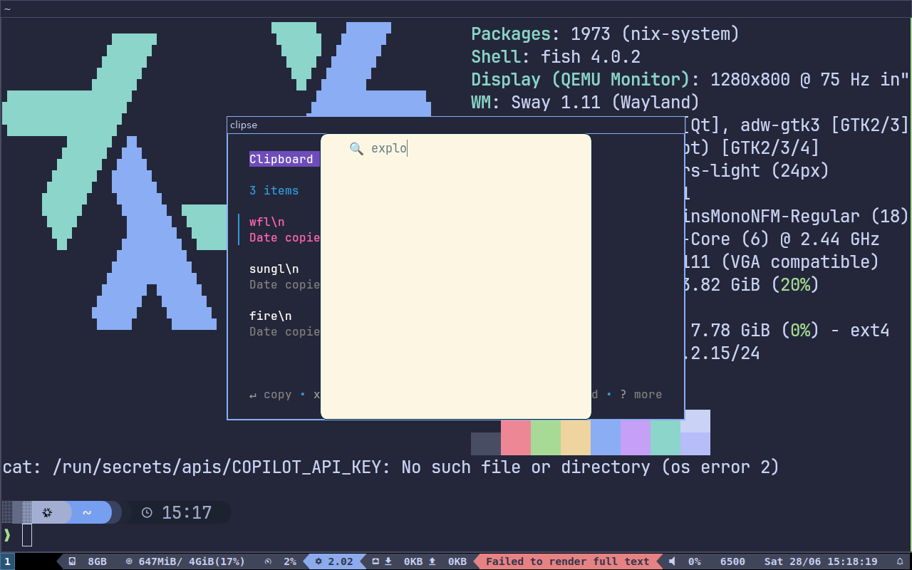
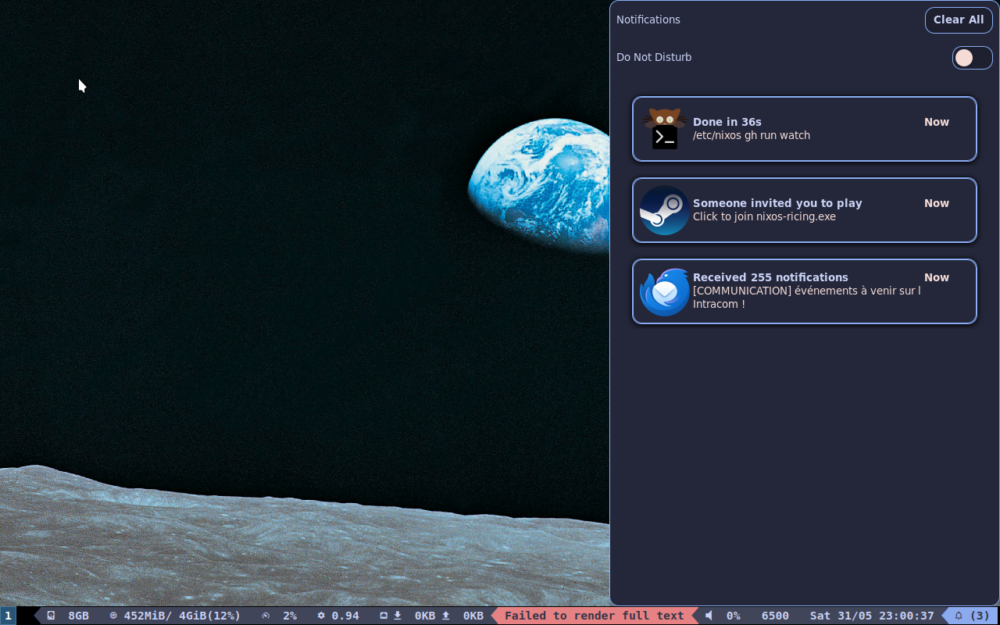
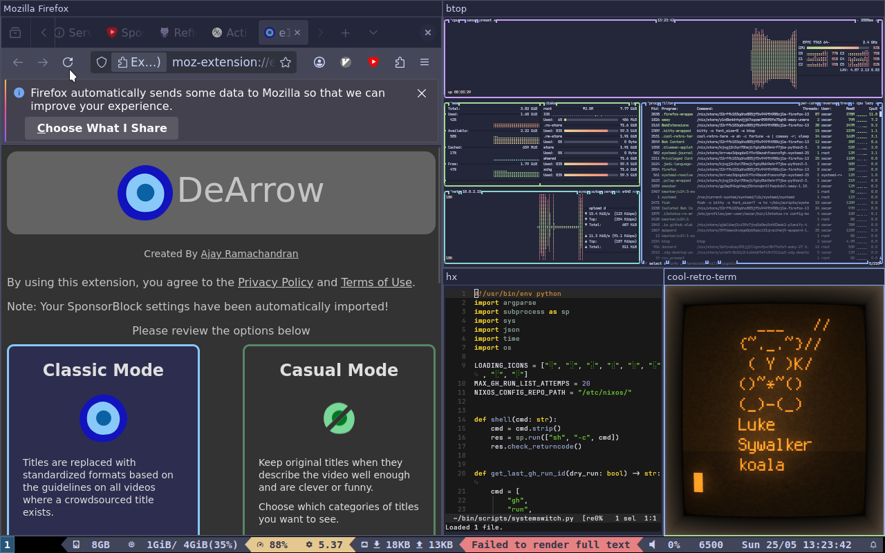
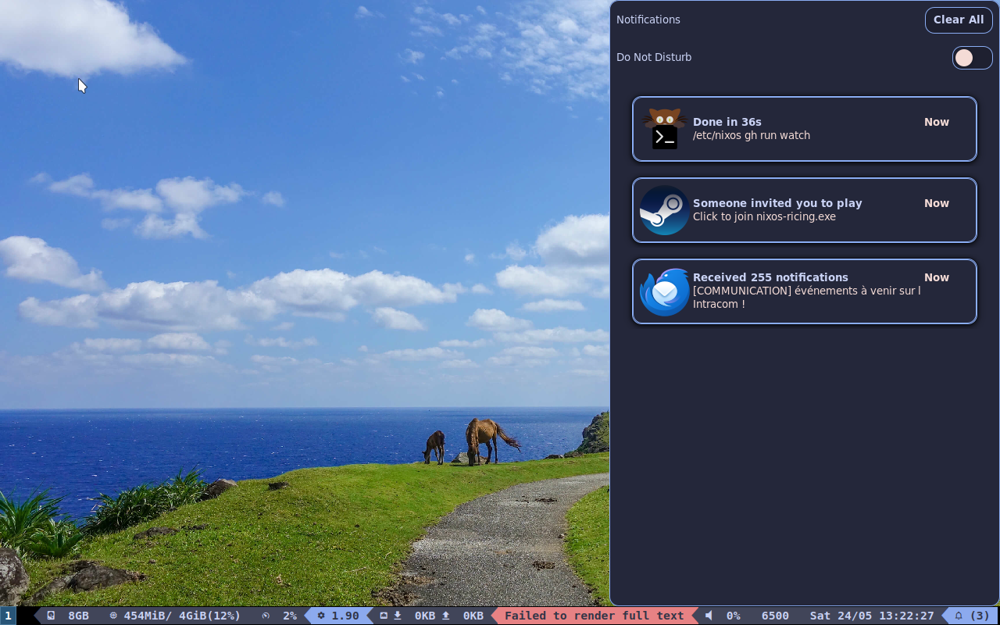
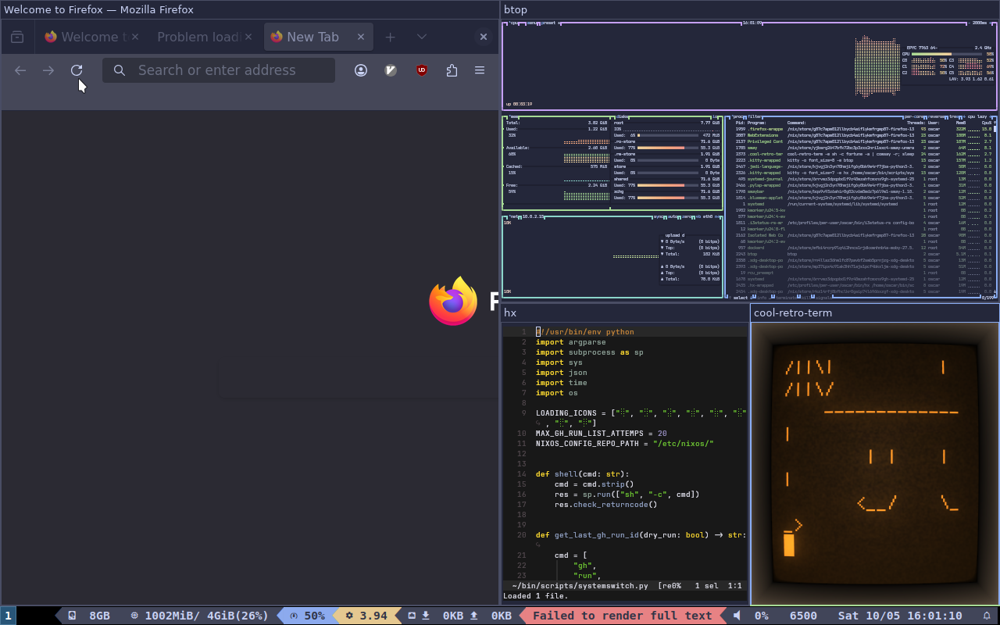
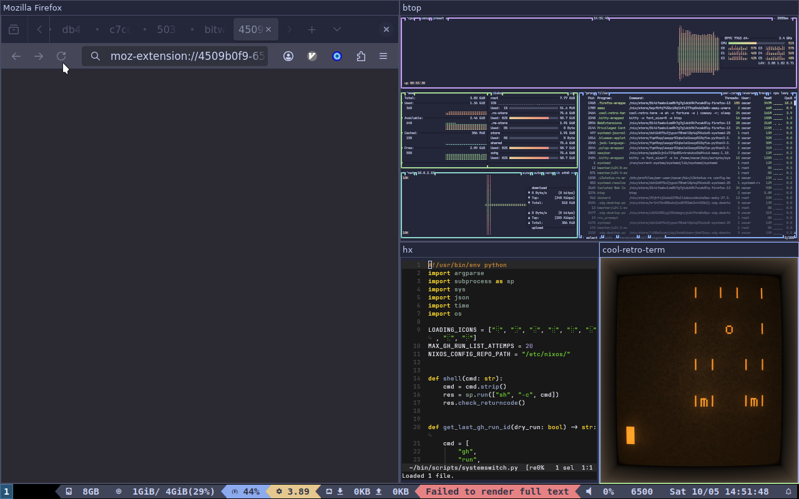
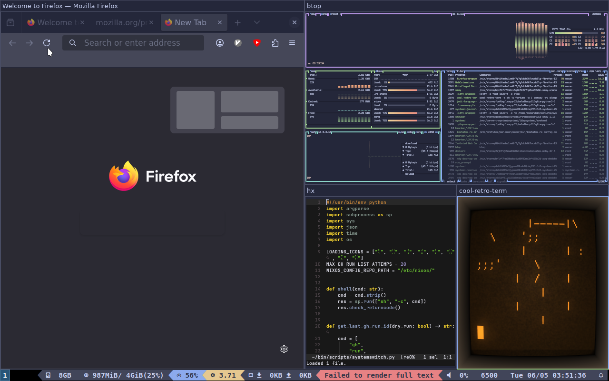
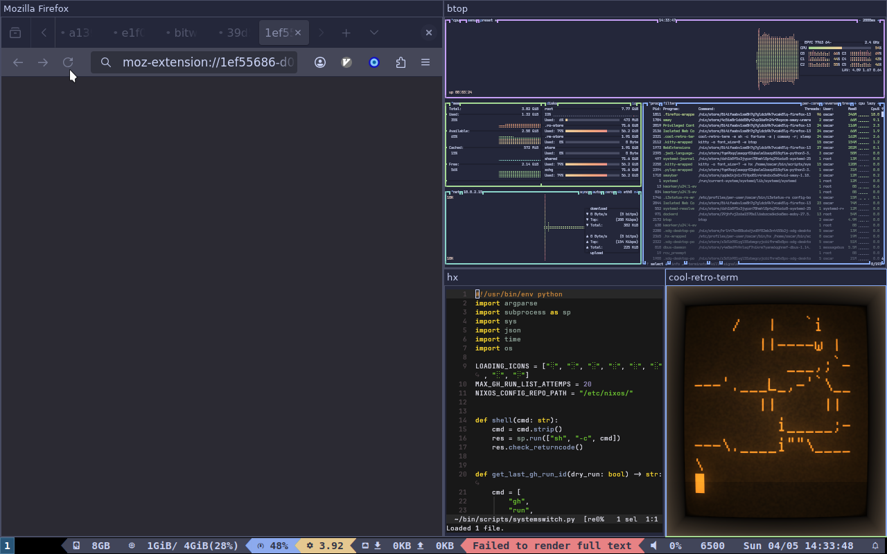

# List of screenshots from the integration tests

## [2025-06-30 23:26:05](https://github.com/Eldolfin/nixos-config/commit/f42f2a65f7530fe114ca396bac2ce9b88a5d57a4)

[clipboard-emojis](https://github.com/Eldolfin/nixos-config/blob/f42f2a65f7530fe114ca396bac2ce9b88a5d57a4/tests/clipboard-emojis.nix)|[fastfetch](https://github.com/Eldolfin/nixos-config/blob/f42f2a65f7530fe114ca396bac2ce9b88a5d57a4/tests/fastfetch.nix)|[firefox-and-terminals](https://github.com/Eldolfin/nixos-config/blob/f42f2a65f7530fe114ca396bac2ce9b88a5d57a4/tests/firefox-and-terminals.nix)|[lock-screen](https://github.com/Eldolfin/nixos-config/blob/f42f2a65f7530fe114ca396bac2ce9b88a5d57a4/tests/lock-screen.nix)|[login-screen](https://github.com/Eldolfin/nixos-config/blob/f42f2a65f7530fe114ca396bac2ce9b88a5d57a4/tests/login-screen.nix)|[notifications](https://github.com/Eldolfin/nixos-config/blob/f42f2a65f7530fe114ca396bac2ce9b88a5d57a4/tests/notifications.nix)
-|-|-|-|-|-
|||||

## [2025-06-23 19:40:10](https://github.com/Eldolfin/nixos-config/commit/e3c285b675cd43cc4d14a9a4d6176bf335f4dcb5)

[clipboard-emojis](https://github.com/Eldolfin/nixos-config/blob/e3c285b675cd43cc4d14a9a4d6176bf335f4dcb5/tests/clipboard-emojis.nix)|[fastfetch](https://github.com/Eldolfin/nixos-config/blob/e3c285b675cd43cc4d14a9a4d6176bf335f4dcb5/tests/fastfetch.nix)|[firefox-and-terminals](https://github.com/Eldolfin/nixos-config/blob/e3c285b675cd43cc4d14a9a4d6176bf335f4dcb5/tests/firefox-and-terminals.nix)|[lock-screen](https://github.com/Eldolfin/nixos-config/blob/e3c285b675cd43cc4d14a9a4d6176bf335f4dcb5/tests/lock-screen.nix)|[login-screen](https://github.com/Eldolfin/nixos-config/blob/e3c285b675cd43cc4d14a9a4d6176bf335f4dcb5/tests/login-screen.nix)|[notifications](https://github.com/Eldolfin/nixos-config/blob/e3c285b675cd43cc4d14a9a4d6176bf335f4dcb5/tests/notifications.nix)
-|-|-|-|-|-
|||||

## [2025-06-22 00:01:49](https://github.com/Eldolfin/nixos-config/commit/1141ac7ae9261fd7e93356123df4469103311e36)

[clipboard-emojis](https://github.com/Eldolfin/nixos-config/blob/1141ac7ae9261fd7e93356123df4469103311e36/tests/clipboard-emojis.nix)|[fastfetch](https://github.com/Eldolfin/nixos-config/blob/1141ac7ae9261fd7e93356123df4469103311e36/tests/fastfetch.nix)|[firefox-and-terminals](https://github.com/Eldolfin/nixos-config/blob/1141ac7ae9261fd7e93356123df4469103311e36/tests/firefox-and-terminals.nix)|[lock-screen](https://github.com/Eldolfin/nixos-config/blob/1141ac7ae9261fd7e93356123df4469103311e36/tests/lock-screen.nix)|[login-screen](https://github.com/Eldolfin/nixos-config/blob/1141ac7ae9261fd7e93356123df4469103311e36/tests/login-screen.nix)|[notifications](https://github.com/Eldolfin/nixos-config/blob/1141ac7ae9261fd7e93356123df4469103311e36/tests/notifications.nix)
-|-|-|-|-|-
|||||

## [2025-06-21 19:26:40](https://github.com/Eldolfin/nixos-config/commit/721b4777c274d969eeb7a24d8ef3c6c422a49f39)

[clipboard-emojis](https://github.com/Eldolfin/nixos-config/blob/721b4777c274d969eeb7a24d8ef3c6c422a49f39/tests/clipboard-emojis.nix)|[fastfetch](https://github.com/Eldolfin/nixos-config/blob/721b4777c274d969eeb7a24d8ef3c6c422a49f39/tests/fastfetch.nix)|[firefox-and-terminals](https://github.com/Eldolfin/nixos-config/blob/721b4777c274d969eeb7a24d8ef3c6c422a49f39/tests/firefox-and-terminals.nix)|[lock-screen](https://github.com/Eldolfin/nixos-config/blob/721b4777c274d969eeb7a24d8ef3c6c422a49f39/tests/lock-screen.nix)|[login-screen](https://github.com/Eldolfin/nixos-config/blob/721b4777c274d969eeb7a24d8ef3c6c422a49f39/tests/login-screen.nix)|[notifications](https://github.com/Eldolfin/nixos-config/blob/721b4777c274d969eeb7a24d8ef3c6c422a49f39/tests/notifications.nix)
-|-|-|-|-|-
|||||

## [2025-06-19 21:40:12](https://github.com/Eldolfin/nixos-config/commit/513905cf4bb3f0c9ec71771b58b53a1cacbcf176)

[clipboard-emojis](https://github.com/Eldolfin/nixos-config/blob/513905cf4bb3f0c9ec71771b58b53a1cacbcf176/tests/clipboard-emojis.nix)|[fastfetch](https://github.com/Eldolfin/nixos-config/blob/513905cf4bb3f0c9ec71771b58b53a1cacbcf176/tests/fastfetch.nix)|[firefox-and-terminals](https://github.com/Eldolfin/nixos-config/blob/513905cf4bb3f0c9ec71771b58b53a1cacbcf176/tests/firefox-and-terminals.nix)|[lock-screen](https://github.com/Eldolfin/nixos-config/blob/513905cf4bb3f0c9ec71771b58b53a1cacbcf176/tests/lock-screen.nix)|[login-screen](https://github.com/Eldolfin/nixos-config/blob/513905cf4bb3f0c9ec71771b58b53a1cacbcf176/tests/login-screen.nix)|[notifications](https://github.com/Eldolfin/nixos-config/blob/513905cf4bb3f0c9ec71771b58b53a1cacbcf176/tests/notifications.nix)
-|-|-|-|-|-
|||||

## [2025-06-17 21:54:57](https://github.com/Eldolfin/nixos-config/commit/7ba1804976686e9f433b82a32aa3d7b2a76f8349)

[clipboard-emojis](https://github.com/Eldolfin/nixos-config/blob/7ba1804976686e9f433b82a32aa3d7b2a76f8349/tests/clipboard-emojis.nix)|[fastfetch](https://github.com/Eldolfin/nixos-config/blob/7ba1804976686e9f433b82a32aa3d7b2a76f8349/tests/fastfetch.nix)|[firefox-and-terminals](https://github.com/Eldolfin/nixos-config/blob/7ba1804976686e9f433b82a32aa3d7b2a76f8349/tests/firefox-and-terminals.nix)|[lock-screen](https://github.com/Eldolfin/nixos-config/blob/7ba1804976686e9f433b82a32aa3d7b2a76f8349/tests/lock-screen.nix)|[login-screen](https://github.com/Eldolfin/nixos-config/blob/7ba1804976686e9f433b82a32aa3d7b2a76f8349/tests/login-screen.nix)|[notifications](https://github.com/Eldolfin/nixos-config/blob/7ba1804976686e9f433b82a32aa3d7b2a76f8349/tests/notifications.nix)
-|-|-|-|-|-
|||||

## [2025-06-17 21:53:14](https://github.com/Eldolfin/nixos-config/commit/6001ba2b503a7ac1a4aaf092368ad4d0233730a0)

[clipboard-emojis](https://github.com/Eldolfin/nixos-config/blob/6001ba2b503a7ac1a4aaf092368ad4d0233730a0/tests/clipboard-emojis.nix)|[fastfetch](https://github.com/Eldolfin/nixos-config/blob/6001ba2b503a7ac1a4aaf092368ad4d0233730a0/tests/fastfetch.nix)|[firefox-and-terminals](https://github.com/Eldolfin/nixos-config/blob/6001ba2b503a7ac1a4aaf092368ad4d0233730a0/tests/firefox-and-terminals.nix)|[lock-screen](https://github.com/Eldolfin/nixos-config/blob/6001ba2b503a7ac1a4aaf092368ad4d0233730a0/tests/lock-screen.nix)|[login-screen](https://github.com/Eldolfin/nixos-config/blob/6001ba2b503a7ac1a4aaf092368ad4d0233730a0/tests/login-screen.nix)|[notifications](https://github.com/Eldolfin/nixos-config/blob/6001ba2b503a7ac1a4aaf092368ad4d0233730a0/tests/notifications.nix)
-|-|-|-|-|-
|||||

## [2025-06-15 19:30:12](https://github.com/Eldolfin/nixos-config/commit/66d1aebd2f0392f4ca67ad814dc224fa0a796a80)

[clipboard-emojis](https://github.com/Eldolfin/nixos-config/blob/66d1aebd2f0392f4ca67ad814dc224fa0a796a80/tests/clipboard-emojis.nix)|[fastfetch](https://github.com/Eldolfin/nixos-config/blob/66d1aebd2f0392f4ca67ad814dc224fa0a796a80/tests/fastfetch.nix)|[firefox-and-terminals](https://github.com/Eldolfin/nixos-config/blob/66d1aebd2f0392f4ca67ad814dc224fa0a796a80/tests/firefox-and-terminals.nix)|[lock-screen](https://github.com/Eldolfin/nixos-config/blob/66d1aebd2f0392f4ca67ad814dc224fa0a796a80/tests/lock-screen.nix)|[login-screen](https://github.com/Eldolfin/nixos-config/blob/66d1aebd2f0392f4ca67ad814dc224fa0a796a80/tests/login-screen.nix)|[notifications](https://github.com/Eldolfin/nixos-config/blob/66d1aebd2f0392f4ca67ad814dc224fa0a796a80/tests/notifications.nix)
-|-|-|-|-|-
|||||

## [2025-06-15 15:18:18](https://github.com/Eldolfin/nixos-config/commit/0092c2896d2d0b7ed4760faef8d7358494d9e5f5)

[clipboard-emojis](https://github.com/Eldolfin/nixos-config/blob/0092c2896d2d0b7ed4760faef8d7358494d9e5f5/tests/clipboard-emojis.nix)|[fastfetch](https://github.com/Eldolfin/nixos-config/blob/0092c2896d2d0b7ed4760faef8d7358494d9e5f5/tests/fastfetch.nix)|[firefox-and-terminals](https://github.com/Eldolfin/nixos-config/blob/0092c2896d2d0b7ed4760faef8d7358494d9e5f5/tests/firefox-and-terminals.nix)|[lock-screen](https://github.com/Eldolfin/nixos-config/blob/0092c2896d2d0b7ed4760faef8d7358494d9e5f5/tests/lock-screen.nix)|[login-screen](https://github.com/Eldolfin/nixos-config/blob/0092c2896d2d0b7ed4760faef8d7358494d9e5f5/tests/login-screen.nix)|[notifications](https://github.com/Eldolfin/nixos-config/blob/0092c2896d2d0b7ed4760faef8d7358494d9e5f5/tests/notifications.nix)
-|-|-|-|-|-
|||||

## [2025-06-15 13:21:50](https://github.com/Eldolfin/nixos-config/commit/b02db6e13e35387c1d34021496b8f8a223681468)

[clipboard-emojis](https://github.com/Eldolfin/nixos-config/blob/b02db6e13e35387c1d34021496b8f8a223681468/tests/clipboard-emojis.nix)|[fastfetch](https://github.com/Eldolfin/nixos-config/blob/b02db6e13e35387c1d34021496b8f8a223681468/tests/fastfetch.nix)|[firefox-and-terminals](https://github.com/Eldolfin/nixos-config/blob/b02db6e13e35387c1d34021496b8f8a223681468/tests/firefox-and-terminals.nix)|[lock-screen](https://github.com/Eldolfin/nixos-config/blob/b02db6e13e35387c1d34021496b8f8a223681468/tests/lock-screen.nix)|[login-screen](https://github.com/Eldolfin/nixos-config/blob/b02db6e13e35387c1d34021496b8f8a223681468/tests/login-screen.nix)|[notifications](https://github.com/Eldolfin/nixos-config/blob/b02db6e13e35387c1d34021496b8f8a223681468/tests/notifications.nix)
-|-|-|-|-|-
|||||

## [2025-06-15 10:33:30](https://github.com/Eldolfin/nixos-config/commit/861aec32d037cc59698450b7e85ec947f8620007)

[clipboard-emojis](https://github.com/Eldolfin/nixos-config/blob/861aec32d037cc59698450b7e85ec947f8620007/tests/clipboard-emojis.nix)|[fastfetch](https://github.com/Eldolfin/nixos-config/blob/861aec32d037cc59698450b7e85ec947f8620007/tests/fastfetch.nix)|[firefox-and-terminals](https://github.com/Eldolfin/nixos-config/blob/861aec32d037cc59698450b7e85ec947f8620007/tests/firefox-and-terminals.nix)|[lock-screen](https://github.com/Eldolfin/nixos-config/blob/861aec32d037cc59698450b7e85ec947f8620007/tests/lock-screen.nix)|[login-screen](https://github.com/Eldolfin/nixos-config/blob/861aec32d037cc59698450b7e85ec947f8620007/tests/login-screen.nix)|[notifications](https://github.com/Eldolfin/nixos-config/blob/861aec32d037cc59698450b7e85ec947f8620007/tests/notifications.nix)
-|-|-|-|-|-
|||||

## [2025-06-15 05:40:58](https://github.com/Eldolfin/nixos-config/commit/729c5e24d40c4a3565b2ca384559942f4c6c9abd)

[clipboard-emojis](https://github.com/Eldolfin/nixos-config/blob/729c5e24d40c4a3565b2ca384559942f4c6c9abd/tests/clipboard-emojis.nix)|[fastfetch](https://github.com/Eldolfin/nixos-config/blob/729c5e24d40c4a3565b2ca384559942f4c6c9abd/tests/fastfetch.nix)|[firefox-and-terminals](https://github.com/Eldolfin/nixos-config/blob/729c5e24d40c4a3565b2ca384559942f4c6c9abd/tests/firefox-and-terminals.nix)|[lock-screen](https://github.com/Eldolfin/nixos-config/blob/729c5e24d40c4a3565b2ca384559942f4c6c9abd/tests/lock-screen.nix)|[login-screen](https://github.com/Eldolfin/nixos-config/blob/729c5e24d40c4a3565b2ca384559942f4c6c9abd/tests/login-screen.nix)|[notifications](https://github.com/Eldolfin/nixos-config/blob/729c5e24d40c4a3565b2ca384559942f4c6c9abd/tests/notifications.nix)
-|-|-|-|-|-
|||||

## [2025-06-15 00:35:37](https://github.com/Eldolfin/nixos-config/commit/1c3018da2eafd7769910571f57c9c98272878c47)

[clipboard-emojis](https://github.com/Eldolfin/nixos-config/blob/1c3018da2eafd7769910571f57c9c98272878c47/tests/clipboard-emojis.nix)|[fastfetch](https://github.com/Eldolfin/nixos-config/blob/1c3018da2eafd7769910571f57c9c98272878c47/tests/fastfetch.nix)|[firefox-and-terminals](https://github.com/Eldolfin/nixos-config/blob/1c3018da2eafd7769910571f57c9c98272878c47/tests/firefox-and-terminals.nix)|[lock-screen](https://github.com/Eldolfin/nixos-config/blob/1c3018da2eafd7769910571f57c9c98272878c47/tests/lock-screen.nix)|[login-screen](https://github.com/Eldolfin/nixos-config/blob/1c3018da2eafd7769910571f57c9c98272878c47/tests/login-screen.nix)|[notifications](https://github.com/Eldolfin/nixos-config/blob/1c3018da2eafd7769910571f57c9c98272878c47/tests/notifications.nix)
-|-|-|-|-|-
|||||

## [2025-06-14 23:38:57](https://github.com/Eldolfin/nixos-config/commit/cb7f032725db3b463e5fb324ecb66ce1d5085228)

[clipboard-emojis](https://github.com/Eldolfin/nixos-config/blob/cb7f032725db3b463e5fb324ecb66ce1d5085228/tests/clipboard-emojis.nix)|[fastfetch](https://github.com/Eldolfin/nixos-config/blob/cb7f032725db3b463e5fb324ecb66ce1d5085228/tests/fastfetch.nix)|[firefox-and-terminals](https://github.com/Eldolfin/nixos-config/blob/cb7f032725db3b463e5fb324ecb66ce1d5085228/tests/firefox-and-terminals.nix)|[lock-screen](https://github.com/Eldolfin/nixos-config/blob/cb7f032725db3b463e5fb324ecb66ce1d5085228/tests/lock-screen.nix)|[login-screen](https://github.com/Eldolfin/nixos-config/blob/cb7f032725db3b463e5fb324ecb66ce1d5085228/tests/login-screen.nix)|[notifications](https://github.com/Eldolfin/nixos-config/blob/cb7f032725db3b463e5fb324ecb66ce1d5085228/tests/notifications.nix)
-|-|-|-|-|-
|||||

## [2025-06-14 11:38:57](https://github.com/Eldolfin/nixos-config/commit/26878fb39fcbabc177dae5f1e4e030acf6321aff)

[clipboard-emojis](https://github.com/Eldolfin/nixos-config/blob/26878fb39fcbabc177dae5f1e4e030acf6321aff/tests/clipboard-emojis.nix)|[fastfetch](https://github.com/Eldolfin/nixos-config/blob/26878fb39fcbabc177dae5f1e4e030acf6321aff/tests/fastfetch.nix)|[firefox-and-terminals](https://github.com/Eldolfin/nixos-config/blob/26878fb39fcbabc177dae5f1e4e030acf6321aff/tests/firefox-and-terminals.nix)|[lock-screen](https://github.com/Eldolfin/nixos-config/blob/26878fb39fcbabc177dae5f1e4e030acf6321aff/tests/lock-screen.nix)|[login-screen](https://github.com/Eldolfin/nixos-config/blob/26878fb39fcbabc177dae5f1e4e030acf6321aff/tests/login-screen.nix)|[notifications](https://github.com/Eldolfin/nixos-config/blob/26878fb39fcbabc177dae5f1e4e030acf6321aff/tests/notifications.nix)
-|-|-|-|-|-
|||||

## [2025-06-07 16:35:42](https://github.com/Eldolfin/nixos-config/commit/e7295fda88a1c0b11a0745465638e0793c802aed)

[clipboard-emojis](https://github.com/Eldolfin/nixos-config/blob/e7295fda88a1c0b11a0745465638e0793c802aed/tests/clipboard-emojis.nix)|[fastfetch](https://github.com/Eldolfin/nixos-config/blob/e7295fda88a1c0b11a0745465638e0793c802aed/tests/fastfetch.nix)|[firefox-and-terminals](https://github.com/Eldolfin/nixos-config/blob/e7295fda88a1c0b11a0745465638e0793c802aed/tests/firefox-and-terminals.nix)|[lock-screen](https://github.com/Eldolfin/nixos-config/blob/e7295fda88a1c0b11a0745465638e0793c802aed/tests/lock-screen.nix)|[login-screen](https://github.com/Eldolfin/nixos-config/blob/e7295fda88a1c0b11a0745465638e0793c802aed/tests/login-screen.nix)|[notifications](https://github.com/Eldolfin/nixos-config/blob/e7295fda88a1c0b11a0745465638e0793c802aed/tests/notifications.nix)
-|-|-|-|-|-
|||||

## [2025-06-06 16:13:48](https://github.com/Eldolfin/nixos-config/commit/b82898e9df237dc7690cfc3605aedca9ecf3cc28)

[clipboard-emojis](https://github.com/Eldolfin/nixos-config/blob/b82898e9df237dc7690cfc3605aedca9ecf3cc28/tests/clipboard-emojis.nix)|[fastfetch](https://github.com/Eldolfin/nixos-config/blob/b82898e9df237dc7690cfc3605aedca9ecf3cc28/tests/fastfetch.nix)|[firefox-and-terminals](https://github.com/Eldolfin/nixos-config/blob/b82898e9df237dc7690cfc3605aedca9ecf3cc28/tests/firefox-and-terminals.nix)|[lock-screen](https://github.com/Eldolfin/nixos-config/blob/b82898e9df237dc7690cfc3605aedca9ecf3cc28/tests/lock-screen.nix)|[login-screen](https://github.com/Eldolfin/nixos-config/blob/b82898e9df237dc7690cfc3605aedca9ecf3cc28/tests/login-screen.nix)|[notifications](https://github.com/Eldolfin/nixos-config/blob/b82898e9df237dc7690cfc3605aedca9ecf3cc28/tests/notifications.nix)
-|-|-|-|-|-
|||||

## [2025-06-06 15:39:58](https://github.com/Eldolfin/nixos-config/commit/0068958d91df0866d47214e55bb855690baad30c)

[clipboard-emojis](https://github.com/Eldolfin/nixos-config/blob/0068958d91df0866d47214e55bb855690baad30c/tests/clipboard-emojis.nix)|[fastfetch](https://github.com/Eldolfin/nixos-config/blob/0068958d91df0866d47214e55bb855690baad30c/tests/fastfetch.nix)|[firefox-and-terminals](https://github.com/Eldolfin/nixos-config/blob/0068958d91df0866d47214e55bb855690baad30c/tests/firefox-and-terminals.nix)|[lock-screen](https://github.com/Eldolfin/nixos-config/blob/0068958d91df0866d47214e55bb855690baad30c/tests/lock-screen.nix)|[login-screen](https://github.com/Eldolfin/nixos-config/blob/0068958d91df0866d47214e55bb855690baad30c/tests/login-screen.nix)|[notifications](https://github.com/Eldolfin/nixos-config/blob/0068958d91df0866d47214e55bb855690baad30c/tests/notifications.nix)
-|-|-|-|-|-
|||||

## [2025-06-05 19:08:32](https://github.com/Eldolfin/nixos-config/commit/ce5931cbd3c44da0c3b41e4fb6bff4ed67c20889)

[clipboard-emojis](https://github.com/Eldolfin/nixos-config/blob/ce5931cbd3c44da0c3b41e4fb6bff4ed67c20889/tests/clipboard-emojis.nix)|[fastfetch](https://github.com/Eldolfin/nixos-config/blob/ce5931cbd3c44da0c3b41e4fb6bff4ed67c20889/tests/fastfetch.nix)|[firefox-and-terminals](https://github.com/Eldolfin/nixos-config/blob/ce5931cbd3c44da0c3b41e4fb6bff4ed67c20889/tests/firefox-and-terminals.nix)|[lock-screen](https://github.com/Eldolfin/nixos-config/blob/ce5931cbd3c44da0c3b41e4fb6bff4ed67c20889/tests/lock-screen.nix)|[login-screen](https://github.com/Eldolfin/nixos-config/blob/ce5931cbd3c44da0c3b41e4fb6bff4ed67c20889/tests/login-screen.nix)|[notifications](https://github.com/Eldolfin/nixos-config/blob/ce5931cbd3c44da0c3b41e4fb6bff4ed67c20889/tests/notifications.nix)
-|-|-|-|-|-
|||||

## [2025-06-05 12:39:35](https://github.com/Eldolfin/nixos-config/commit/1493e350784a8b9f30b37f904285421074426fe4)

[clipboard-emojis](https://github.com/Eldolfin/nixos-config/blob/1493e350784a8b9f30b37f904285421074426fe4/tests/clipboard-emojis.nix)|[fastfetch](https://github.com/Eldolfin/nixos-config/blob/1493e350784a8b9f30b37f904285421074426fe4/tests/fastfetch.nix)|[firefox-and-terminals](https://github.com/Eldolfin/nixos-config/blob/1493e350784a8b9f30b37f904285421074426fe4/tests/firefox-and-terminals.nix)|[lock-screen](https://github.com/Eldolfin/nixos-config/blob/1493e350784a8b9f30b37f904285421074426fe4/tests/lock-screen.nix)|[login-screen](https://github.com/Eldolfin/nixos-config/blob/1493e350784a8b9f30b37f904285421074426fe4/tests/login-screen.nix)|[notifications](https://github.com/Eldolfin/nixos-config/blob/1493e350784a8b9f30b37f904285421074426fe4/tests/notifications.nix)
-|-|-|-|-|-
|||||

## [2025-06-02 17:21:49](https://github.com/Eldolfin/nixos-config/commit/fcb0d9dd23766786580cc6d033c176c5016c3221)

[clipboard-emojis](https://github.com/Eldolfin/nixos-config/blob/fcb0d9dd23766786580cc6d033c176c5016c3221/tests/clipboard-emojis.nix)|[fastfetch](https://github.com/Eldolfin/nixos-config/blob/fcb0d9dd23766786580cc6d033c176c5016c3221/tests/fastfetch.nix)|[firefox-and-terminals](https://github.com/Eldolfin/nixos-config/blob/fcb0d9dd23766786580cc6d033c176c5016c3221/tests/firefox-and-terminals.nix)|[lock-screen](https://github.com/Eldolfin/nixos-config/blob/fcb0d9dd23766786580cc6d033c176c5016c3221/tests/lock-screen.nix)|[login-screen](https://github.com/Eldolfin/nixos-config/blob/fcb0d9dd23766786580cc6d033c176c5016c3221/tests/login-screen.nix)|[notifications](https://github.com/Eldolfin/nixos-config/blob/fcb0d9dd23766786580cc6d033c176c5016c3221/tests/notifications.nix)
-|-|-|-|-|-
|||||

## [2025-06-02 13:46:17](https://github.com/Eldolfin/nixos-config/commit/6ba362da3d065e7a146d26ee4c2574a2632ad696)

[clipboard-emojis](https://github.com/Eldolfin/nixos-config/blob/6ba362da3d065e7a146d26ee4c2574a2632ad696/tests/clipboard-emojis.nix)|[fastfetch](https://github.com/Eldolfin/nixos-config/blob/6ba362da3d065e7a146d26ee4c2574a2632ad696/tests/fastfetch.nix)|[firefox-and-terminals](https://github.com/Eldolfin/nixos-config/blob/6ba362da3d065e7a146d26ee4c2574a2632ad696/tests/firefox-and-terminals.nix)|[lock-screen](https://github.com/Eldolfin/nixos-config/blob/6ba362da3d065e7a146d26ee4c2574a2632ad696/tests/lock-screen.nix)|[login-screen](https://github.com/Eldolfin/nixos-config/blob/6ba362da3d065e7a146d26ee4c2574a2632ad696/tests/login-screen.nix)|[notifications](https://github.com/Eldolfin/nixos-config/blob/6ba362da3d065e7a146d26ee4c2574a2632ad696/tests/notifications.nix)
-|-|-|-|-|-
|||||

## [2025-06-02 12:07:18](https://github.com/Eldolfin/nixos-config/commit/270d488521530a64f4170dc88af7ca3ecc20e546)

[clipboard-emojis](https://github.com/Eldolfin/nixos-config/blob/270d488521530a64f4170dc88af7ca3ecc20e546/tests/clipboard-emojis.nix)|[fastfetch](https://github.com/Eldolfin/nixos-config/blob/270d488521530a64f4170dc88af7ca3ecc20e546/tests/fastfetch.nix)|[firefox-and-terminals](https://github.com/Eldolfin/nixos-config/blob/270d488521530a64f4170dc88af7ca3ecc20e546/tests/firefox-and-terminals.nix)|[lock-screen](https://github.com/Eldolfin/nixos-config/blob/270d488521530a64f4170dc88af7ca3ecc20e546/tests/lock-screen.nix)|[login-screen](https://github.com/Eldolfin/nixos-config/blob/270d488521530a64f4170dc88af7ca3ecc20e546/tests/login-screen.nix)|[notifications](https://github.com/Eldolfin/nixos-config/blob/270d488521530a64f4170dc88af7ca3ecc20e546/tests/notifications.nix)
-|-|-|-|-|-
|||||

## [2025-06-01 23:44:44](https://github.com/Eldolfin/nixos-config/commit/b4b147a90c3dad5324f3eb06aef5e41526faa90c)

[clipboard-emojis](https://github.com/Eldolfin/nixos-config/blob/b4b147a90c3dad5324f3eb06aef5e41526faa90c/tests/clipboard-emojis.nix)|[fastfetch](https://github.com/Eldolfin/nixos-config/blob/b4b147a90c3dad5324f3eb06aef5e41526faa90c/tests/fastfetch.nix)|[firefox-and-terminals](https://github.com/Eldolfin/nixos-config/blob/b4b147a90c3dad5324f3eb06aef5e41526faa90c/tests/firefox-and-terminals.nix)|[lock-screen](https://github.com/Eldolfin/nixos-config/blob/b4b147a90c3dad5324f3eb06aef5e41526faa90c/tests/lock-screen.nix)|[login-screen](https://github.com/Eldolfin/nixos-config/blob/b4b147a90c3dad5324f3eb06aef5e41526faa90c/tests/login-screen.nix)|[notifications](https://github.com/Eldolfin/nixos-config/blob/b4b147a90c3dad5324f3eb06aef5e41526faa90c/tests/notifications.nix)
-|-|-|-|-|-
|||||

## [2025-05-31 20:39:28](https://github.com/Eldolfin/nixos-config/commit/a905d0147ef6e8b4886152576fc7c0cdf4f69b61)

[clipboard-emojis](https://github.com/Eldolfin/nixos-config/blob/a905d0147ef6e8b4886152576fc7c0cdf4f69b61/tests/clipboard-emojis.nix)|[fastfetch](https://github.com/Eldolfin/nixos-config/blob/a905d0147ef6e8b4886152576fc7c0cdf4f69b61/tests/fastfetch.nix)|[firefox-and-terminals](https://github.com/Eldolfin/nixos-config/blob/a905d0147ef6e8b4886152576fc7c0cdf4f69b61/tests/firefox-and-terminals.nix)|[lock-screen](https://github.com/Eldolfin/nixos-config/blob/a905d0147ef6e8b4886152576fc7c0cdf4f69b61/tests/lock-screen.nix)|[login-screen](https://github.com/Eldolfin/nixos-config/blob/a905d0147ef6e8b4886152576fc7c0cdf4f69b61/tests/login-screen.nix)|[notifications](https://github.com/Eldolfin/nixos-config/blob/a905d0147ef6e8b4886152576fc7c0cdf4f69b61/tests/notifications.nix)
-|-|-|-|-|-
|||||

## [2025-05-30 19:06:39](https://github.com/Eldolfin/nixos-config/commit/a8ee0535a9b3f926f47fb1651bb63907363a883d)

[clipboard-emojis](https://github.com/Eldolfin/nixos-config/blob/a8ee0535a9b3f926f47fb1651bb63907363a883d/tests/clipboard-emojis.nix)|[fastfetch](https://github.com/Eldolfin/nixos-config/blob/a8ee0535a9b3f926f47fb1651bb63907363a883d/tests/fastfetch.nix)|[firefox-and-terminals](https://github.com/Eldolfin/nixos-config/blob/a8ee0535a9b3f926f47fb1651bb63907363a883d/tests/firefox-and-terminals.nix)|[lock-screen](https://github.com/Eldolfin/nixos-config/blob/a8ee0535a9b3f926f47fb1651bb63907363a883d/tests/lock-screen.nix)|[login-screen](https://github.com/Eldolfin/nixos-config/blob/a8ee0535a9b3f926f47fb1651bb63907363a883d/tests/login-screen.nix)|[notifications](https://github.com/Eldolfin/nixos-config/blob/a8ee0535a9b3f926f47fb1651bb63907363a883d/tests/notifications.nix)
-|-|-|-|-|-
|||||

## [2025-05-30 12:29:35](https://github.com/Eldolfin/nixos-config/commit/1b05be44f1680d3be7c49001591a4a3895e92cb7)

[clipboard-emojis](https://github.com/Eldolfin/nixos-config/blob/1b05be44f1680d3be7c49001591a4a3895e92cb7/tests/clipboard-emojis.nix)|[fastfetch](https://github.com/Eldolfin/nixos-config/blob/1b05be44f1680d3be7c49001591a4a3895e92cb7/tests/fastfetch.nix)|[firefox-and-terminals](https://github.com/Eldolfin/nixos-config/blob/1b05be44f1680d3be7c49001591a4a3895e92cb7/tests/firefox-and-terminals.nix)|[lock-screen](https://github.com/Eldolfin/nixos-config/blob/1b05be44f1680d3be7c49001591a4a3895e92cb7/tests/lock-screen.nix)|[login-screen](https://github.com/Eldolfin/nixos-config/blob/1b05be44f1680d3be7c49001591a4a3895e92cb7/tests/login-screen.nix)|[notifications](https://github.com/Eldolfin/nixos-config/blob/1b05be44f1680d3be7c49001591a4a3895e92cb7/tests/notifications.nix)
-|-|-|-|-|-
|||||

## [2025-05-29 15:07:59](https://github.com/Eldolfin/nixos-config/commit/0a4228ce91e363105b9d934d9a32b4e08198ad29)

[clipboard-emojis](https://github.com/Eldolfin/nixos-config/blob/0a4228ce91e363105b9d934d9a32b4e08198ad29/tests/clipboard-emojis.nix)|[fastfetch](https://github.com/Eldolfin/nixos-config/blob/0a4228ce91e363105b9d934d9a32b4e08198ad29/tests/fastfetch.nix)|[firefox-and-terminals](https://github.com/Eldolfin/nixos-config/blob/0a4228ce91e363105b9d934d9a32b4e08198ad29/tests/firefox-and-terminals.nix)|[lock-screen](https://github.com/Eldolfin/nixos-config/blob/0a4228ce91e363105b9d934d9a32b4e08198ad29/tests/lock-screen.nix)|[login-screen](https://github.com/Eldolfin/nixos-config/blob/0a4228ce91e363105b9d934d9a32b4e08198ad29/tests/login-screen.nix)|[notifications](https://github.com/Eldolfin/nixos-config/blob/0a4228ce91e363105b9d934d9a32b4e08198ad29/tests/notifications.nix)
-|-|-|-|-|-
|||||

## [2025-05-29 15:04:24](https://github.com/Eldolfin/nixos-config/commit/ee3f6a08b069a391c0df282a94a38ebb19aa7b01)

[clipboard-emojis](https://github.com/Eldolfin/nixos-config/blob/ee3f6a08b069a391c0df282a94a38ebb19aa7b01/tests/clipboard-emojis.nix)|[fastfetch](https://github.com/Eldolfin/nixos-config/blob/ee3f6a08b069a391c0df282a94a38ebb19aa7b01/tests/fastfetch.nix)|[firefox-and-terminals](https://github.com/Eldolfin/nixos-config/blob/ee3f6a08b069a391c0df282a94a38ebb19aa7b01/tests/firefox-and-terminals.nix)|[lock-screen](https://github.com/Eldolfin/nixos-config/blob/ee3f6a08b069a391c0df282a94a38ebb19aa7b01/tests/lock-screen.nix)|[login-screen](https://github.com/Eldolfin/nixos-config/blob/ee3f6a08b069a391c0df282a94a38ebb19aa7b01/tests/login-screen.nix)|[notifications](https://github.com/Eldolfin/nixos-config/blob/ee3f6a08b069a391c0df282a94a38ebb19aa7b01/tests/notifications.nix)
-|-|-|-|-|-
|||||

## [2025-05-27 14:26:06](https://github.com/Eldolfin/nixos-config/commit/c2c5d16f98b8caaf631e2120c71730a7a06677e8)

[clipboard-emojis](https://github.com/Eldolfin/nixos-config/blob/c2c5d16f98b8caaf631e2120c71730a7a06677e8/tests/clipboard-emojis.nix)|[fastfetch](https://github.com/Eldolfin/nixos-config/blob/c2c5d16f98b8caaf631e2120c71730a7a06677e8/tests/fastfetch.nix)|[firefox-and-terminals](https://github.com/Eldolfin/nixos-config/blob/c2c5d16f98b8caaf631e2120c71730a7a06677e8/tests/firefox-and-terminals.nix)|[lock-screen](https://github.com/Eldolfin/nixos-config/blob/c2c5d16f98b8caaf631e2120c71730a7a06677e8/tests/lock-screen.nix)|[login-screen](https://github.com/Eldolfin/nixos-config/blob/c2c5d16f98b8caaf631e2120c71730a7a06677e8/tests/login-screen.nix)|[notifications](https://github.com/Eldolfin/nixos-config/blob/c2c5d16f98b8caaf631e2120c71730a7a06677e8/tests/notifications.nix)
-|-|-|-|-|-
|||||

## [2025-05-27 10:37:25](https://github.com/Eldolfin/nixos-config/commit/a37a8fed438c8d67bfd54c8fdd6c6c97fcf47ad3)

[clipboard-emojis](https://github.com/Eldolfin/nixos-config/blob/a37a8fed438c8d67bfd54c8fdd6c6c97fcf47ad3/tests/clipboard-emojis.nix)|[fastfetch](https://github.com/Eldolfin/nixos-config/blob/a37a8fed438c8d67bfd54c8fdd6c6c97fcf47ad3/tests/fastfetch.nix)|[firefox-and-terminals](https://github.com/Eldolfin/nixos-config/blob/a37a8fed438c8d67bfd54c8fdd6c6c97fcf47ad3/tests/firefox-and-terminals.nix)|[lock-screen](https://github.com/Eldolfin/nixos-config/blob/a37a8fed438c8d67bfd54c8fdd6c6c97fcf47ad3/tests/lock-screen.nix)|[login-screen](https://github.com/Eldolfin/nixos-config/blob/a37a8fed438c8d67bfd54c8fdd6c6c97fcf47ad3/tests/login-screen.nix)|[notifications](https://github.com/Eldolfin/nixos-config/blob/a37a8fed438c8d67bfd54c8fdd6c6c97fcf47ad3/tests/notifications.nix)
-|-|-|-|-|-
|||||

## [2025-05-25 10:56:20](https://github.com/Eldolfin/nixos-config/commit/49f6dba17920384afeb3a938cccf3bd681b0912b)

[clipboard-emojis](https://github.com/Eldolfin/nixos-config/blob/49f6dba17920384afeb3a938cccf3bd681b0912b/tests/clipboard-emojis.nix)|[fastfetch](https://github.com/Eldolfin/nixos-config/blob/49f6dba17920384afeb3a938cccf3bd681b0912b/tests/fastfetch.nix)|[firefox-and-terminals](https://github.com/Eldolfin/nixos-config/blob/49f6dba17920384afeb3a938cccf3bd681b0912b/tests/firefox-and-terminals.nix)|[lock-screen](https://github.com/Eldolfin/nixos-config/blob/49f6dba17920384afeb3a938cccf3bd681b0912b/tests/lock-screen.nix)|[login-screen](https://github.com/Eldolfin/nixos-config/blob/49f6dba17920384afeb3a938cccf3bd681b0912b/tests/login-screen.nix)|[notifications](https://github.com/Eldolfin/nixos-config/blob/49f6dba17920384afeb3a938cccf3bd681b0912b/tests/notifications.nix)
-|-|-|-|-|-
|||||

## [2025-05-24 10:55:21](https://github.com/Eldolfin/nixos-config/commit/542c0d3f1093a77b291869a12077cf87b72729fe)

[clipboard-emojis](https://github.com/Eldolfin/nixos-config/blob/542c0d3f1093a77b291869a12077cf87b72729fe/tests/clipboard-emojis.nix)|[fastfetch](https://github.com/Eldolfin/nixos-config/blob/542c0d3f1093a77b291869a12077cf87b72729fe/tests/fastfetch.nix)|[firefox-and-terminals](https://github.com/Eldolfin/nixos-config/blob/542c0d3f1093a77b291869a12077cf87b72729fe/tests/firefox-and-terminals.nix)|[lock-screen](https://github.com/Eldolfin/nixos-config/blob/542c0d3f1093a77b291869a12077cf87b72729fe/tests/lock-screen.nix)|[login-screen](https://github.com/Eldolfin/nixos-config/blob/542c0d3f1093a77b291869a12077cf87b72729fe/tests/login-screen.nix)|[notifications](https://github.com/Eldolfin/nixos-config/blob/542c0d3f1093a77b291869a12077cf87b72729fe/tests/notifications.nix)
-|-|-|-|-|-
|||||

## [2025-05-23 09:31:51](https://github.com/Eldolfin/nixos-config/commit/25e25f3d32fc4169d129eafd62f7fdad509f5be5)

[clipboard-emojis](https://github.com/Eldolfin/nixos-config/blob/25e25f3d32fc4169d129eafd62f7fdad509f5be5/tests/clipboard-emojis.nix)|[fastfetch](https://github.com/Eldolfin/nixos-config/blob/25e25f3d32fc4169d129eafd62f7fdad509f5be5/tests/fastfetch.nix)|[firefox-and-terminals](https://github.com/Eldolfin/nixos-config/blob/25e25f3d32fc4169d129eafd62f7fdad509f5be5/tests/firefox-and-terminals.nix)|[lock-screen](https://github.com/Eldolfin/nixos-config/blob/25e25f3d32fc4169d129eafd62f7fdad509f5be5/tests/lock-screen.nix)|[login-screen](https://github.com/Eldolfin/nixos-config/blob/25e25f3d32fc4169d129eafd62f7fdad509f5be5/tests/login-screen.nix)|[notifications](https://github.com/Eldolfin/nixos-config/blob/25e25f3d32fc4169d129eafd62f7fdad509f5be5/tests/notifications.nix)
-|-|-|-|-|-
|||||

## [2025-05-23 01:15:32](https://github.com/Eldolfin/nixos-config/commit/7f8b2169a49ac0156e56b9a87ceca0405683af37)

[clipboard-emojis](https://github.com/Eldolfin/nixos-config/blob/7f8b2169a49ac0156e56b9a87ceca0405683af37/tests/clipboard-emojis.nix)|[fastfetch](https://github.com/Eldolfin/nixos-config/blob/7f8b2169a49ac0156e56b9a87ceca0405683af37/tests/fastfetch.nix)|[firefox-and-terminals](https://github.com/Eldolfin/nixos-config/blob/7f8b2169a49ac0156e56b9a87ceca0405683af37/tests/firefox-and-terminals.nix)|[lock-screen](https://github.com/Eldolfin/nixos-config/blob/7f8b2169a49ac0156e56b9a87ceca0405683af37/tests/lock-screen.nix)|[login-screen](https://github.com/Eldolfin/nixos-config/blob/7f8b2169a49ac0156e56b9a87ceca0405683af37/tests/login-screen.nix)|[notifications](https://github.com/Eldolfin/nixos-config/blob/7f8b2169a49ac0156e56b9a87ceca0405683af37/tests/notifications.nix)
-|-|-|-|-|-
|||||

## [2025-05-22 20:16:44](https://github.com/Eldolfin/nixos-config/commit/c947b6005b4996ac138c0346561fa81286fabeab)

[clipboard-emojis](https://github.com/Eldolfin/nixos-config/blob/c947b6005b4996ac138c0346561fa81286fabeab/tests/clipboard-emojis.nix)|[fastfetch](https://github.com/Eldolfin/nixos-config/blob/c947b6005b4996ac138c0346561fa81286fabeab/tests/fastfetch.nix)|[firefox-and-terminals](https://github.com/Eldolfin/nixos-config/blob/c947b6005b4996ac138c0346561fa81286fabeab/tests/firefox-and-terminals.nix)|[lock-screen](https://github.com/Eldolfin/nixos-config/blob/c947b6005b4996ac138c0346561fa81286fabeab/tests/lock-screen.nix)|[login-screen](https://github.com/Eldolfin/nixos-config/blob/c947b6005b4996ac138c0346561fa81286fabeab/tests/login-screen.nix)|[notifications](https://github.com/Eldolfin/nixos-config/blob/c947b6005b4996ac138c0346561fa81286fabeab/tests/notifications.nix)
-|-|-|-|-|-
|||||

## [2025-05-22 20:10:03](https://github.com/Eldolfin/nixos-config/commit/fc994503c4af21de565256c66d5f43c12d0656c9)

[clipboard-emojis](https://github.com/Eldolfin/nixos-config/blob/fc994503c4af21de565256c66d5f43c12d0656c9/tests/clipboard-emojis.nix)|[fastfetch](https://github.com/Eldolfin/nixos-config/blob/fc994503c4af21de565256c66d5f43c12d0656c9/tests/fastfetch.nix)|[firefox-and-terminals](https://github.com/Eldolfin/nixos-config/blob/fc994503c4af21de565256c66d5f43c12d0656c9/tests/firefox-and-terminals.nix)|[lock-screen](https://github.com/Eldolfin/nixos-config/blob/fc994503c4af21de565256c66d5f43c12d0656c9/tests/lock-screen.nix)|[login-screen](https://github.com/Eldolfin/nixos-config/blob/fc994503c4af21de565256c66d5f43c12d0656c9/tests/login-screen.nix)|[notifications](https://github.com/Eldolfin/nixos-config/blob/fc994503c4af21de565256c66d5f43c12d0656c9/tests/notifications.nix)
-|-|-|-|-|-
|||||

## [2025-05-22 19:32:57](https://github.com/Eldolfin/nixos-config/commit/202e71af782b49295eda261d7fb7753407da152f)

[clipboard-emojis](https://github.com/Eldolfin/nixos-config/blob/202e71af782b49295eda261d7fb7753407da152f/tests/clipboard-emojis.nix)|[fastfetch](https://github.com/Eldolfin/nixos-config/blob/202e71af782b49295eda261d7fb7753407da152f/tests/fastfetch.nix)|[firefox-and-terminals](https://github.com/Eldolfin/nixos-config/blob/202e71af782b49295eda261d7fb7753407da152f/tests/firefox-and-terminals.nix)|[lock-screen](https://github.com/Eldolfin/nixos-config/blob/202e71af782b49295eda261d7fb7753407da152f/tests/lock-screen.nix)|[login-screen](https://github.com/Eldolfin/nixos-config/blob/202e71af782b49295eda261d7fb7753407da152f/tests/login-screen.nix)|[notifications](https://github.com/Eldolfin/nixos-config/blob/202e71af782b49295eda261d7fb7753407da152f/tests/notifications.nix)
-|-|-|-|-|-
|||||

## [2025-05-22 15:15:50](https://github.com/Eldolfin/nixos-config/commit/7295bac2301bab04f3b615464e35ad4a462ae3f4)

[clipboard-emojis](https://github.com/Eldolfin/nixos-config/blob/7295bac2301bab04f3b615464e35ad4a462ae3f4/tests/clipboard-emojis.nix)|[fastfetch](https://github.com/Eldolfin/nixos-config/blob/7295bac2301bab04f3b615464e35ad4a462ae3f4/tests/fastfetch.nix)|[firefox-and-terminals](https://github.com/Eldolfin/nixos-config/blob/7295bac2301bab04f3b615464e35ad4a462ae3f4/tests/firefox-and-terminals.nix)|[lock-screen](https://github.com/Eldolfin/nixos-config/blob/7295bac2301bab04f3b615464e35ad4a462ae3f4/tests/lock-screen.nix)|[login-screen](https://github.com/Eldolfin/nixos-config/blob/7295bac2301bab04f3b615464e35ad4a462ae3f4/tests/login-screen.nix)|[notifications](https://github.com/Eldolfin/nixos-config/blob/7295bac2301bab04f3b615464e35ad4a462ae3f4/tests/notifications.nix)
-|-|-|-|-|-
|||||

## [2025-05-21 15:42:58](https://github.com/Eldolfin/nixos-config/commit/134a80ffdda93b0f48d0d24646c501901d257a86)

[clipboard-emojis](https://github.com/Eldolfin/nixos-config/blob/134a80ffdda93b0f48d0d24646c501901d257a86/tests/clipboard-emojis.nix)|[fastfetch](https://github.com/Eldolfin/nixos-config/blob/134a80ffdda93b0f48d0d24646c501901d257a86/tests/fastfetch.nix)|[firefox-and-terminals](https://github.com/Eldolfin/nixos-config/blob/134a80ffdda93b0f48d0d24646c501901d257a86/tests/firefox-and-terminals.nix)|[lock-screen](https://github.com/Eldolfin/nixos-config/blob/134a80ffdda93b0f48d0d24646c501901d257a86/tests/lock-screen.nix)|[login-screen](https://github.com/Eldolfin/nixos-config/blob/134a80ffdda93b0f48d0d24646c501901d257a86/tests/login-screen.nix)|[notifications](https://github.com/Eldolfin/nixos-config/blob/134a80ffdda93b0f48d0d24646c501901d257a86/tests/notifications.nix)
-|-|-|-|-|-
|||||

## [2025-05-21 14:41:28](https://github.com/Eldolfin/nixos-config/commit/0d8765b780e2d65e8ec389bb334e46db4e59aa1d)

[clipboard-emojis](https://github.com/Eldolfin/nixos-config/blob/0d8765b780e2d65e8ec389bb334e46db4e59aa1d/tests/clipboard-emojis.nix)|[fastfetch](https://github.com/Eldolfin/nixos-config/blob/0d8765b780e2d65e8ec389bb334e46db4e59aa1d/tests/fastfetch.nix)|[firefox-and-terminals](https://github.com/Eldolfin/nixos-config/blob/0d8765b780e2d65e8ec389bb334e46db4e59aa1d/tests/firefox-and-terminals.nix)|[lock-screen](https://github.com/Eldolfin/nixos-config/blob/0d8765b780e2d65e8ec389bb334e46db4e59aa1d/tests/lock-screen.nix)|[login-screen](https://github.com/Eldolfin/nixos-config/blob/0d8765b780e2d65e8ec389bb334e46db4e59aa1d/tests/login-screen.nix)|[notifications](https://github.com/Eldolfin/nixos-config/blob/0d8765b780e2d65e8ec389bb334e46db4e59aa1d/tests/notifications.nix)
-|-|-|-|-|-
|||||

## [2025-05-21 10:44:46](https://github.com/Eldolfin/nixos-config/commit/bc6e591dc14ef9b433f4f9b2ea3ce1c95b822dec)

[clipboard-emojis](https://github.com/Eldolfin/nixos-config/blob/bc6e591dc14ef9b433f4f9b2ea3ce1c95b822dec/tests/clipboard-emojis.nix)|[fastfetch](https://github.com/Eldolfin/nixos-config/blob/bc6e591dc14ef9b433f4f9b2ea3ce1c95b822dec/tests/fastfetch.nix)|[firefox-and-terminals](https://github.com/Eldolfin/nixos-config/blob/bc6e591dc14ef9b433f4f9b2ea3ce1c95b822dec/tests/firefox-and-terminals.nix)|[lock-screen](https://github.com/Eldolfin/nixos-config/blob/bc6e591dc14ef9b433f4f9b2ea3ce1c95b822dec/tests/lock-screen.nix)|[login-screen](https://github.com/Eldolfin/nixos-config/blob/bc6e591dc14ef9b433f4f9b2ea3ce1c95b822dec/tests/login-screen.nix)|[notifications](https://github.com/Eldolfin/nixos-config/blob/bc6e591dc14ef9b433f4f9b2ea3ce1c95b822dec/tests/notifications.nix)
-|-|-|-|-|-
|||||

## [2025-05-20 17:39:54](https://github.com/Eldolfin/nixos-config/commit/e265d6ca2a982496f16ab8cc6909af29e7766754)

[clipboard-emojis](https://github.com/Eldolfin/nixos-config/blob/e265d6ca2a982496f16ab8cc6909af29e7766754/tests/clipboard-emojis.nix)|[fastfetch](https://github.com/Eldolfin/nixos-config/blob/e265d6ca2a982496f16ab8cc6909af29e7766754/tests/fastfetch.nix)|[firefox-and-terminals](https://github.com/Eldolfin/nixos-config/blob/e265d6ca2a982496f16ab8cc6909af29e7766754/tests/firefox-and-terminals.nix)|[lock-screen](https://github.com/Eldolfin/nixos-config/blob/e265d6ca2a982496f16ab8cc6909af29e7766754/tests/lock-screen.nix)|[login-screen](https://github.com/Eldolfin/nixos-config/blob/e265d6ca2a982496f16ab8cc6909af29e7766754/tests/login-screen.nix)|[notifications](https://github.com/Eldolfin/nixos-config/blob/e265d6ca2a982496f16ab8cc6909af29e7766754/tests/notifications.nix)
-|-|-|-|-|-
|||||

## [2025-05-20 17:37:09](https://github.com/Eldolfin/nixos-config/commit/a6d6f32b133ff1f3131a073a8eb3badb3f025686)

[clipboard-emojis](https://github.com/Eldolfin/nixos-config/blob/a6d6f32b133ff1f3131a073a8eb3badb3f025686/tests/clipboard-emojis.nix)|[fastfetch](https://github.com/Eldolfin/nixos-config/blob/a6d6f32b133ff1f3131a073a8eb3badb3f025686/tests/fastfetch.nix)|[firefox-and-terminals](https://github.com/Eldolfin/nixos-config/blob/a6d6f32b133ff1f3131a073a8eb3badb3f025686/tests/firefox-and-terminals.nix)|[lock-screen](https://github.com/Eldolfin/nixos-config/blob/a6d6f32b133ff1f3131a073a8eb3badb3f025686/tests/lock-screen.nix)|[login-screen](https://github.com/Eldolfin/nixos-config/blob/a6d6f32b133ff1f3131a073a8eb3badb3f025686/tests/login-screen.nix)|[notifications](https://github.com/Eldolfin/nixos-config/blob/a6d6f32b133ff1f3131a073a8eb3badb3f025686/tests/notifications.nix)
-|-|-|-|-|-
|||||

## [2025-05-20 17:27:37](https://github.com/Eldolfin/nixos-config/commit/1f3d79acc5451d6007eb889ad32e5edaa8f250bd)

[clipboard-emojis](https://github.com/Eldolfin/nixos-config/blob/1f3d79acc5451d6007eb889ad32e5edaa8f250bd/tests/clipboard-emojis.nix)|[fastfetch](https://github.com/Eldolfin/nixos-config/blob/1f3d79acc5451d6007eb889ad32e5edaa8f250bd/tests/fastfetch.nix)|[firefox-and-terminals](https://github.com/Eldolfin/nixos-config/blob/1f3d79acc5451d6007eb889ad32e5edaa8f250bd/tests/firefox-and-terminals.nix)|[lock-screen](https://github.com/Eldolfin/nixos-config/blob/1f3d79acc5451d6007eb889ad32e5edaa8f250bd/tests/lock-screen.nix)|[login-screen](https://github.com/Eldolfin/nixos-config/blob/1f3d79acc5451d6007eb889ad32e5edaa8f250bd/tests/login-screen.nix)|[notifications](https://github.com/Eldolfin/nixos-config/blob/1f3d79acc5451d6007eb889ad32e5edaa8f250bd/tests/notifications.nix)
-|-|-|-|-|-
|||||

## [2025-05-20 16:53:41](https://github.com/Eldolfin/nixos-config/commit/69047a4c176498c8ccb968ce034991cc24bec7d0)

[clipboard-emojis](https://github.com/Eldolfin/nixos-config/blob/69047a4c176498c8ccb968ce034991cc24bec7d0/tests/clipboard-emojis.nix)|[fastfetch](https://github.com/Eldolfin/nixos-config/blob/69047a4c176498c8ccb968ce034991cc24bec7d0/tests/fastfetch.nix)|[firefox-and-terminals](https://github.com/Eldolfin/nixos-config/blob/69047a4c176498c8ccb968ce034991cc24bec7d0/tests/firefox-and-terminals.nix)|[lock-screen](https://github.com/Eldolfin/nixos-config/blob/69047a4c176498c8ccb968ce034991cc24bec7d0/tests/lock-screen.nix)|[login-screen](https://github.com/Eldolfin/nixos-config/blob/69047a4c176498c8ccb968ce034991cc24bec7d0/tests/login-screen.nix)|[notifications](https://github.com/Eldolfin/nixos-config/blob/69047a4c176498c8ccb968ce034991cc24bec7d0/tests/notifications.nix)
-|-|-|-|-|-
|||||

## [2025-05-19 17:43:33](https://github.com/Eldolfin/nixos-config/commit/8b7fafec194633498ed07a091f390bd3ae299587)

[clipboard-emojis](https://github.com/Eldolfin/nixos-config/blob/8b7fafec194633498ed07a091f390bd3ae299587/tests/clipboard-emojis.nix)|[fastfetch](https://github.com/Eldolfin/nixos-config/blob/8b7fafec194633498ed07a091f390bd3ae299587/tests/fastfetch.nix)|[firefox-and-terminals](https://github.com/Eldolfin/nixos-config/blob/8b7fafec194633498ed07a091f390bd3ae299587/tests/firefox-and-terminals.nix)|[lock-screen](https://github.com/Eldolfin/nixos-config/blob/8b7fafec194633498ed07a091f390bd3ae299587/tests/lock-screen.nix)|[login-screen](https://github.com/Eldolfin/nixos-config/blob/8b7fafec194633498ed07a091f390bd3ae299587/tests/login-screen.nix)|[notifications](https://github.com/Eldolfin/nixos-config/blob/8b7fafec194633498ed07a091f390bd3ae299587/tests/notifications.nix)
-|-|-|-|-|-
|||||

## [2025-05-19 17:41:49](https://github.com/Eldolfin/nixos-config/commit/1517dd5890c3b188d9b1c80ea4146f7f5f2061bd)

[clipboard-emojis](https://github.com/Eldolfin/nixos-config/blob/1517dd5890c3b188d9b1c80ea4146f7f5f2061bd/tests/clipboard-emojis.nix)|[fastfetch](https://github.com/Eldolfin/nixos-config/blob/1517dd5890c3b188d9b1c80ea4146f7f5f2061bd/tests/fastfetch.nix)|[firefox-and-terminals](https://github.com/Eldolfin/nixos-config/blob/1517dd5890c3b188d9b1c80ea4146f7f5f2061bd/tests/firefox-and-terminals.nix)|[lock-screen](https://github.com/Eldolfin/nixos-config/blob/1517dd5890c3b188d9b1c80ea4146f7f5f2061bd/tests/lock-screen.nix)|[login-screen](https://github.com/Eldolfin/nixos-config/blob/1517dd5890c3b188d9b1c80ea4146f7f5f2061bd/tests/login-screen.nix)|[notifications](https://github.com/Eldolfin/nixos-config/blob/1517dd5890c3b188d9b1c80ea4146f7f5f2061bd/tests/notifications.nix)
-|-|-|-|-|-
|||||

## [2025-05-19 09:03:54](https://github.com/Eldolfin/nixos-config/commit/6b5fe9691382692396f013db7e9614844e9f5403)

[clipboard-emojis](https://github.com/Eldolfin/nixos-config/blob/6b5fe9691382692396f013db7e9614844e9f5403/tests/clipboard-emojis.nix)|[fastfetch](https://github.com/Eldolfin/nixos-config/blob/6b5fe9691382692396f013db7e9614844e9f5403/tests/fastfetch.nix)|[firefox-and-terminals](https://github.com/Eldolfin/nixos-config/blob/6b5fe9691382692396f013db7e9614844e9f5403/tests/firefox-and-terminals.nix)|[lock-screen](https://github.com/Eldolfin/nixos-config/blob/6b5fe9691382692396f013db7e9614844e9f5403/tests/lock-screen.nix)|[login-screen](https://github.com/Eldolfin/nixos-config/blob/6b5fe9691382692396f013db7e9614844e9f5403/tests/login-screen.nix)|[notifications](https://github.com/Eldolfin/nixos-config/blob/6b5fe9691382692396f013db7e9614844e9f5403/tests/notifications.nix)
-|-|-|-|-|-
|||||

## [2025-05-17 10:03:19](https://github.com/Eldolfin/nixos-config/commit/dd78c52d29ac98a42784fcb0a05a6c7afc5c4ce1)

[clipboard-emojis](https://github.com/Eldolfin/nixos-config/blob/dd78c52d29ac98a42784fcb0a05a6c7afc5c4ce1/tests/clipboard-emojis.nix)|[fastfetch](https://github.com/Eldolfin/nixos-config/blob/dd78c52d29ac98a42784fcb0a05a6c7afc5c4ce1/tests/fastfetch.nix)|[firefox-and-terminals](https://github.com/Eldolfin/nixos-config/blob/dd78c52d29ac98a42784fcb0a05a6c7afc5c4ce1/tests/firefox-and-terminals.nix)|[lock-screen](https://github.com/Eldolfin/nixos-config/blob/dd78c52d29ac98a42784fcb0a05a6c7afc5c4ce1/tests/lock-screen.nix)|[login-screen](https://github.com/Eldolfin/nixos-config/blob/dd78c52d29ac98a42784fcb0a05a6c7afc5c4ce1/tests/login-screen.nix)|[notifications](https://github.com/Eldolfin/nixos-config/blob/dd78c52d29ac98a42784fcb0a05a6c7afc5c4ce1/tests/notifications.nix)
-|-|-|-|-|-
|||||

## [2025-05-16 13:33:17](https://github.com/Eldolfin/nixos-config/commit/55b9a9a66c77dba981644535e39b0a12d55558a1)

[clipboard-emojis](https://github.com/Eldolfin/nixos-config/blob/55b9a9a66c77dba981644535e39b0a12d55558a1/tests/clipboard-emojis.nix)|[fastfetch](https://github.com/Eldolfin/nixos-config/blob/55b9a9a66c77dba981644535e39b0a12d55558a1/tests/fastfetch.nix)|[firefox-and-terminals](https://github.com/Eldolfin/nixos-config/blob/55b9a9a66c77dba981644535e39b0a12d55558a1/tests/firefox-and-terminals.nix)|[lock-screen](https://github.com/Eldolfin/nixos-config/blob/55b9a9a66c77dba981644535e39b0a12d55558a1/tests/lock-screen.nix)|[login-screen](https://github.com/Eldolfin/nixos-config/blob/55b9a9a66c77dba981644535e39b0a12d55558a1/tests/login-screen.nix)|[notifications](https://github.com/Eldolfin/nixos-config/blob/55b9a9a66c77dba981644535e39b0a12d55558a1/tests/notifications.nix)
-|-|-|-|-|-
|||||

## [2025-05-15 10:54:33](https://github.com/Eldolfin/nixos-config/commit/4a007eb6afd934d58655a42dff46d9b8d75970d7)

[clipboard-emojis](https://github.com/Eldolfin/nixos-config/blob/4a007eb6afd934d58655a42dff46d9b8d75970d7/tests/clipboard-emojis.nix)|[fastfetch](https://github.com/Eldolfin/nixos-config/blob/4a007eb6afd934d58655a42dff46d9b8d75970d7/tests/fastfetch.nix)|[firefox-and-terminals](https://github.com/Eldolfin/nixos-config/blob/4a007eb6afd934d58655a42dff46d9b8d75970d7/tests/firefox-and-terminals.nix)|[lock-screen](https://github.com/Eldolfin/nixos-config/blob/4a007eb6afd934d58655a42dff46d9b8d75970d7/tests/lock-screen.nix)|[login-screen](https://github.com/Eldolfin/nixos-config/blob/4a007eb6afd934d58655a42dff46d9b8d75970d7/tests/login-screen.nix)|[notifications](https://github.com/Eldolfin/nixos-config/blob/4a007eb6afd934d58655a42dff46d9b8d75970d7/tests/notifications.nix)
-|-|-|-|-|-
|||||

## [2025-05-15 00:35:57](https://github.com/Eldolfin/nixos-config/commit/7638128484fc52f16444647ccb736495e454519d)

[clipboard-emojis](https://github.com/Eldolfin/nixos-config/blob/7638128484fc52f16444647ccb736495e454519d/tests/clipboard-emojis.nix)|[fastfetch](https://github.com/Eldolfin/nixos-config/blob/7638128484fc52f16444647ccb736495e454519d/tests/fastfetch.nix)|[firefox-and-terminals](https://github.com/Eldolfin/nixos-config/blob/7638128484fc52f16444647ccb736495e454519d/tests/firefox-and-terminals.nix)|[lock-screen](https://github.com/Eldolfin/nixos-config/blob/7638128484fc52f16444647ccb736495e454519d/tests/lock-screen.nix)|[login-screen](https://github.com/Eldolfin/nixos-config/blob/7638128484fc52f16444647ccb736495e454519d/tests/login-screen.nix)|[notifications](https://github.com/Eldolfin/nixos-config/blob/7638128484fc52f16444647ccb736495e454519d/tests/notifications.nix)
-|-|-|-|-|-
|||||

## [2025-05-14 16:18:25](https://github.com/Eldolfin/nixos-config/commit/ae9cbf82c6204a53c64595c1fde448c3566d3639)

[clipboard-emojis](https://github.com/Eldolfin/nixos-config/blob/ae9cbf82c6204a53c64595c1fde448c3566d3639/tests/clipboard-emojis.nix)|[fastfetch](https://github.com/Eldolfin/nixos-config/blob/ae9cbf82c6204a53c64595c1fde448c3566d3639/tests/fastfetch.nix)|[firefox-and-terminals](https://github.com/Eldolfin/nixos-config/blob/ae9cbf82c6204a53c64595c1fde448c3566d3639/tests/firefox-and-terminals.nix)|[lock-screen](https://github.com/Eldolfin/nixos-config/blob/ae9cbf82c6204a53c64595c1fde448c3566d3639/tests/lock-screen.nix)|[login-screen](https://github.com/Eldolfin/nixos-config/blob/ae9cbf82c6204a53c64595c1fde448c3566d3639/tests/login-screen.nix)|[notifications](https://github.com/Eldolfin/nixos-config/blob/ae9cbf82c6204a53c64595c1fde448c3566d3639/tests/notifications.nix)
-|-|-|-|-|-
|||||

## [2025-05-14 12:03:40](https://github.com/Eldolfin/nixos-config/commit/724e6259d9bd4a58f962b66b4014f1977dc8cb78)

[clipboard-emojis](https://github.com/Eldolfin/nixos-config/blob/724e6259d9bd4a58f962b66b4014f1977dc8cb78/tests/clipboard-emojis.nix)|[fastfetch](https://github.com/Eldolfin/nixos-config/blob/724e6259d9bd4a58f962b66b4014f1977dc8cb78/tests/fastfetch.nix)|[firefox-and-terminals](https://github.com/Eldolfin/nixos-config/blob/724e6259d9bd4a58f962b66b4014f1977dc8cb78/tests/firefox-and-terminals.nix)|[lock-screen](https://github.com/Eldolfin/nixos-config/blob/724e6259d9bd4a58f962b66b4014f1977dc8cb78/tests/lock-screen.nix)|[login-screen](https://github.com/Eldolfin/nixos-config/blob/724e6259d9bd4a58f962b66b4014f1977dc8cb78/tests/login-screen.nix)|[notifications](https://github.com/Eldolfin/nixos-config/blob/724e6259d9bd4a58f962b66b4014f1977dc8cb78/tests/notifications.nix)
-|-|-|-|-|-
|||||

## [2025-05-14 10:36:30](https://github.com/Eldolfin/nixos-config/commit/6f60da9b13fa95db1f0695fd995406dfe4b0ad01)

[clipboard-emojis](https://github.com/Eldolfin/nixos-config/blob/6f60da9b13fa95db1f0695fd995406dfe4b0ad01/tests/clipboard-emojis.nix)|[fastfetch](https://github.com/Eldolfin/nixos-config/blob/6f60da9b13fa95db1f0695fd995406dfe4b0ad01/tests/fastfetch.nix)|[firefox-and-terminals](https://github.com/Eldolfin/nixos-config/blob/6f60da9b13fa95db1f0695fd995406dfe4b0ad01/tests/firefox-and-terminals.nix)|[lock-screen](https://github.com/Eldolfin/nixos-config/blob/6f60da9b13fa95db1f0695fd995406dfe4b0ad01/tests/lock-screen.nix)|[login-screen](https://github.com/Eldolfin/nixos-config/blob/6f60da9b13fa95db1f0695fd995406dfe4b0ad01/tests/login-screen.nix)|[notifications](https://github.com/Eldolfin/nixos-config/blob/6f60da9b13fa95db1f0695fd995406dfe4b0ad01/tests/notifications.nix)
-|-|-|-|-|-
|||||

## [2025-05-14 01:40:53](https://github.com/Eldolfin/nixos-config/commit/2bc8cdb1c7462cc88c84ef3e1208a822652a8e52)

[clipboard-emojis](https://github.com/Eldolfin/nixos-config/blob/2bc8cdb1c7462cc88c84ef3e1208a822652a8e52/tests/clipboard-emojis.nix)|[fastfetch](https://github.com/Eldolfin/nixos-config/blob/2bc8cdb1c7462cc88c84ef3e1208a822652a8e52/tests/fastfetch.nix)|[firefox-and-terminals](https://github.com/Eldolfin/nixos-config/blob/2bc8cdb1c7462cc88c84ef3e1208a822652a8e52/tests/firefox-and-terminals.nix)|[lock-screen](https://github.com/Eldolfin/nixos-config/blob/2bc8cdb1c7462cc88c84ef3e1208a822652a8e52/tests/lock-screen.nix)|[login-screen](https://github.com/Eldolfin/nixos-config/blob/2bc8cdb1c7462cc88c84ef3e1208a822652a8e52/tests/login-screen.nix)|[notifications](https://github.com/Eldolfin/nixos-config/blob/2bc8cdb1c7462cc88c84ef3e1208a822652a8e52/tests/notifications.nix)
-|-|-|-|-|-
|||||

## [2025-05-14 01:28:07](https://github.com/Eldolfin/nixos-config/commit/68824aed03dd8da077608b34a1da8e602c831891)

[clipboard-emojis](https://github.com/Eldolfin/nixos-config/blob/68824aed03dd8da077608b34a1da8e602c831891/tests/clipboard-emojis.nix)|[fastfetch](https://github.com/Eldolfin/nixos-config/blob/68824aed03dd8da077608b34a1da8e602c831891/tests/fastfetch.nix)|[firefox-and-terminals](https://github.com/Eldolfin/nixos-config/blob/68824aed03dd8da077608b34a1da8e602c831891/tests/firefox-and-terminals.nix)|[lock-screen](https://github.com/Eldolfin/nixos-config/blob/68824aed03dd8da077608b34a1da8e602c831891/tests/lock-screen.nix)|[login-screen](https://github.com/Eldolfin/nixos-config/blob/68824aed03dd8da077608b34a1da8e602c831891/tests/login-screen.nix)|[notifications](https://github.com/Eldolfin/nixos-config/blob/68824aed03dd8da077608b34a1da8e602c831891/tests/notifications.nix)
-|-|-|-|-|-
|||||

## [2025-05-14 00:59:05](https://github.com/Eldolfin/nixos-config/commit/c6ffe3661a68532e2c3bbaf9f063a8b9112d8f02)

[clipboard-emojis](https://github.com/Eldolfin/nixos-config/blob/c6ffe3661a68532e2c3bbaf9f063a8b9112d8f02/tests/clipboard-emojis.nix)|[fastfetch](https://github.com/Eldolfin/nixos-config/blob/c6ffe3661a68532e2c3bbaf9f063a8b9112d8f02/tests/fastfetch.nix)|[firefox-and-terminals](https://github.com/Eldolfin/nixos-config/blob/c6ffe3661a68532e2c3bbaf9f063a8b9112d8f02/tests/firefox-and-terminals.nix)|[lock-screen](https://github.com/Eldolfin/nixos-config/blob/c6ffe3661a68532e2c3bbaf9f063a8b9112d8f02/tests/lock-screen.nix)|[login-screen](https://github.com/Eldolfin/nixos-config/blob/c6ffe3661a68532e2c3bbaf9f063a8b9112d8f02/tests/login-screen.nix)|[notifications](https://github.com/Eldolfin/nixos-config/blob/c6ffe3661a68532e2c3bbaf9f063a8b9112d8f02/tests/notifications.nix)
-|-|-|-|-|-
|||||

## [2025-05-14 00:14:50](https://github.com/Eldolfin/nixos-config/commit/622d2531bc6a1b56819ad668af63d21945daf127)

[clipboard-emojis](https://github.com/Eldolfin/nixos-config/blob/622d2531bc6a1b56819ad668af63d21945daf127/tests/clipboard-emojis.nix)|[fastfetch](https://github.com/Eldolfin/nixos-config/blob/622d2531bc6a1b56819ad668af63d21945daf127/tests/fastfetch.nix)|[firefox-and-terminals](https://github.com/Eldolfin/nixos-config/blob/622d2531bc6a1b56819ad668af63d21945daf127/tests/firefox-and-terminals.nix)|[lock-screen](https://github.com/Eldolfin/nixos-config/blob/622d2531bc6a1b56819ad668af63d21945daf127/tests/lock-screen.nix)|[login-screen](https://github.com/Eldolfin/nixos-config/blob/622d2531bc6a1b56819ad668af63d21945daf127/tests/login-screen.nix)|[notifications](https://github.com/Eldolfin/nixos-config/blob/622d2531bc6a1b56819ad668af63d21945daf127/tests/notifications.nix)
-|-|-|-|-|-
|||||

## [2025-05-13 16:07:56](https://github.com/Eldolfin/nixos-config/commit/bf38b1753ea7fffd915280340339eac94cfaecc0)

[clipboard-emojis](https://github.com/Eldolfin/nixos-config/blob/bf38b1753ea7fffd915280340339eac94cfaecc0/tests/clipboard-emojis.nix)|[fastfetch](https://github.com/Eldolfin/nixos-config/blob/bf38b1753ea7fffd915280340339eac94cfaecc0/tests/fastfetch.nix)|[firefox-and-terminals](https://github.com/Eldolfin/nixos-config/blob/bf38b1753ea7fffd915280340339eac94cfaecc0/tests/firefox-and-terminals.nix)|[lock-screen](https://github.com/Eldolfin/nixos-config/blob/bf38b1753ea7fffd915280340339eac94cfaecc0/tests/lock-screen.nix)|[login-screen](https://github.com/Eldolfin/nixos-config/blob/bf38b1753ea7fffd915280340339eac94cfaecc0/tests/login-screen.nix)|[notifications](https://github.com/Eldolfin/nixos-config/blob/bf38b1753ea7fffd915280340339eac94cfaecc0/tests/notifications.nix)
-|-|-|-|-|-
|||||

## [2025-05-10 13:45:07](https://github.com/Eldolfin/nixos-config/commit/f24390938606773ecc42f729997a617f9e73ccff)

[clipboard-emojis](https://github.com/Eldolfin/nixos-config/blob/f24390938606773ecc42f729997a617f9e73ccff/tests/clipboard-emojis.nix)|[fastfetch](https://github.com/Eldolfin/nixos-config/blob/f24390938606773ecc42f729997a617f9e73ccff/tests/fastfetch.nix)|[firefox-and-terminals](https://github.com/Eldolfin/nixos-config/blob/f24390938606773ecc42f729997a617f9e73ccff/tests/firefox-and-terminals.nix)|[lock-screen](https://github.com/Eldolfin/nixos-config/blob/f24390938606773ecc42f729997a617f9e73ccff/tests/lock-screen.nix)|[login-screen](https://github.com/Eldolfin/nixos-config/blob/f24390938606773ecc42f729997a617f9e73ccff/tests/login-screen.nix)|[notifications](https://github.com/Eldolfin/nixos-config/blob/f24390938606773ecc42f729997a617f9e73ccff/tests/notifications.nix)
-|-|-|-|-|-
|||||

## [2025-05-10 12:40:10](https://github.com/Eldolfin/nixos-config/commit/a3750f783a2ef2362f0ba0c7ff65ecded306bbf3)

[clipboard-emojis](https://github.com/Eldolfin/nixos-config/blob/a3750f783a2ef2362f0ba0c7ff65ecded306bbf3/tests/clipboard-emojis.nix)|[fastfetch](https://github.com/Eldolfin/nixos-config/blob/a3750f783a2ef2362f0ba0c7ff65ecded306bbf3/tests/fastfetch.nix)|[firefox-and-terminals](https://github.com/Eldolfin/nixos-config/blob/a3750f783a2ef2362f0ba0c7ff65ecded306bbf3/tests/firefox-and-terminals.nix)|[lock-screen](https://github.com/Eldolfin/nixos-config/blob/a3750f783a2ef2362f0ba0c7ff65ecded306bbf3/tests/lock-screen.nix)|[login-screen](https://github.com/Eldolfin/nixos-config/blob/a3750f783a2ef2362f0ba0c7ff65ecded306bbf3/tests/login-screen.nix)|[notifications](https://github.com/Eldolfin/nixos-config/blob/a3750f783a2ef2362f0ba0c7ff65ecded306bbf3/tests/notifications.nix)
-|-|-|-|-|-
|||||

## [2025-05-10 12:24:58](https://github.com/Eldolfin/nixos-config/commit/e6f3e96320cc98ffca94a900747c567df62c3182)

[clipboard-emojis](https://github.com/Eldolfin/nixos-config/blob/e6f3e96320cc98ffca94a900747c567df62c3182/tests/clipboard-emojis.nix)|[fastfetch](https://github.com/Eldolfin/nixos-config/blob/e6f3e96320cc98ffca94a900747c567df62c3182/tests/fastfetch.nix)|[firefox-and-terminals](https://github.com/Eldolfin/nixos-config/blob/e6f3e96320cc98ffca94a900747c567df62c3182/tests/firefox-and-terminals.nix)|[lock-screen](https://github.com/Eldolfin/nixos-config/blob/e6f3e96320cc98ffca94a900747c567df62c3182/tests/lock-screen.nix)|[login-screen](https://github.com/Eldolfin/nixos-config/blob/e6f3e96320cc98ffca94a900747c567df62c3182/tests/login-screen.nix)|[notifications](https://github.com/Eldolfin/nixos-config/blob/e6f3e96320cc98ffca94a900747c567df62c3182/tests/notifications.nix)
-|-|-|-|-|-
|||||

## [2025-05-06 23:17:42](https://github.com/Eldolfin/nixos-config/commit/f7817722e4e525e9e9172f584fc231e9f43de067)

[clipboard-emojis](https://github.com/Eldolfin/nixos-config/blob/f7817722e4e525e9e9172f584fc231e9f43de067/tests/clipboard-emojis.nix)|[fastfetch](https://github.com/Eldolfin/nixos-config/blob/f7817722e4e525e9e9172f584fc231e9f43de067/tests/fastfetch.nix)|[firefox-and-terminals](https://github.com/Eldolfin/nixos-config/blob/f7817722e4e525e9e9172f584fc231e9f43de067/tests/firefox-and-terminals.nix)|[lock-screen](https://github.com/Eldolfin/nixos-config/blob/f7817722e4e525e9e9172f584fc231e9f43de067/tests/lock-screen.nix)|[login-screen](https://github.com/Eldolfin/nixos-config/blob/f7817722e4e525e9e9172f584fc231e9f43de067/tests/login-screen.nix)|[notifications](https://github.com/Eldolfin/nixos-config/blob/f7817722e4e525e9e9172f584fc231e9f43de067/tests/notifications.nix)
-|-|-|-|-|-
|||||

## [2025-05-06 01:34:55](https://github.com/Eldolfin/nixos-config/commit/a1ce9a7d55c6ef60e6f2e5a170aa2ae28e2471e5)

[clipboard-emojis](https://github.com/Eldolfin/nixos-config/blob/a1ce9a7d55c6ef60e6f2e5a170aa2ae28e2471e5/tests/clipboard-emojis.nix)|[fastfetch](https://github.com/Eldolfin/nixos-config/blob/a1ce9a7d55c6ef60e6f2e5a170aa2ae28e2471e5/tests/fastfetch.nix)|[firefox-and-terminals](https://github.com/Eldolfin/nixos-config/blob/a1ce9a7d55c6ef60e6f2e5a170aa2ae28e2471e5/tests/firefox-and-terminals.nix)|[lock-screen](https://github.com/Eldolfin/nixos-config/blob/a1ce9a7d55c6ef60e6f2e5a170aa2ae28e2471e5/tests/lock-screen.nix)|[login-screen](https://github.com/Eldolfin/nixos-config/blob/a1ce9a7d55c6ef60e6f2e5a170aa2ae28e2471e5/tests/login-screen.nix)|[notifications](https://github.com/Eldolfin/nixos-config/blob/a1ce9a7d55c6ef60e6f2e5a170aa2ae28e2471e5/tests/notifications.nix)
-|-|-|-|-|-
|||||

## [2025-05-05 17:57:13](https://github.com/Eldolfin/nixos-config/commit/66c8c23226c6c1c0e354a22c8f32ff195d498f9a)

[clipboard-emojis](https://github.com/Eldolfin/nixos-config/blob/66c8c23226c6c1c0e354a22c8f32ff195d498f9a/tests/clipboard-emojis.nix)|[fastfetch](https://github.com/Eldolfin/nixos-config/blob/66c8c23226c6c1c0e354a22c8f32ff195d498f9a/tests/fastfetch.nix)|[firefox-and-terminals](https://github.com/Eldolfin/nixos-config/blob/66c8c23226c6c1c0e354a22c8f32ff195d498f9a/tests/firefox-and-terminals.nix)|[lock-screen](https://github.com/Eldolfin/nixos-config/blob/66c8c23226c6c1c0e354a22c8f32ff195d498f9a/tests/lock-screen.nix)|[login-screen](https://github.com/Eldolfin/nixos-config/blob/66c8c23226c6c1c0e354a22c8f32ff195d498f9a/tests/login-screen.nix)|[notifications](https://github.com/Eldolfin/nixos-config/blob/66c8c23226c6c1c0e354a22c8f32ff195d498f9a/tests/notifications.nix)
-|-|-|-|-|-
|||||

## [2025-05-04 20:02:00](https://github.com/Eldolfin/nixos-config/commit/e63d56381df455d8fad0cbe9c0be989f6b2c9a90)

[clipboard-emojis](https://github.com/Eldolfin/nixos-config/blob/e63d56381df455d8fad0cbe9c0be989f6b2c9a90/tests/clipboard-emojis.nix)|[fastfetch](https://github.com/Eldolfin/nixos-config/blob/e63d56381df455d8fad0cbe9c0be989f6b2c9a90/tests/fastfetch.nix)|[firefox-and-terminals](https://github.com/Eldolfin/nixos-config/blob/e63d56381df455d8fad0cbe9c0be989f6b2c9a90/tests/firefox-and-terminals.nix)|[lock-screen](https://github.com/Eldolfin/nixos-config/blob/e63d56381df455d8fad0cbe9c0be989f6b2c9a90/tests/lock-screen.nix)|[login-screen](https://github.com/Eldolfin/nixos-config/blob/e63d56381df455d8fad0cbe9c0be989f6b2c9a90/tests/login-screen.nix)|[notifications](https://github.com/Eldolfin/nixos-config/blob/e63d56381df455d8fad0cbe9c0be989f6b2c9a90/tests/notifications.nix)
-|-|-|-|-|-
|||||

## [2025-05-04 12:39:00](https://github.com/Eldolfin/nixos-config/commit/e36cd2f652db823503055a74fd615ec4b65428f2)

[clipboard-emojis](https://github.com/Eldolfin/nixos-config/blob/e36cd2f652db823503055a74fd615ec4b65428f2/tests/clipboard-emojis.nix)|[fastfetch](https://github.com/Eldolfin/nixos-config/blob/e36cd2f652db823503055a74fd615ec4b65428f2/tests/fastfetch.nix)|[firefox-and-terminals](https://github.com/Eldolfin/nixos-config/blob/e36cd2f652db823503055a74fd615ec4b65428f2/tests/firefox-and-terminals.nix)|[lock-screen](https://github.com/Eldolfin/nixos-config/blob/e36cd2f652db823503055a74fd615ec4b65428f2/tests/lock-screen.nix)|[login-screen](https://github.com/Eldolfin/nixos-config/blob/e36cd2f652db823503055a74fd615ec4b65428f2/tests/login-screen.nix)|[notifications](https://github.com/Eldolfin/nixos-config/blob/e36cd2f652db823503055a74fd615ec4b65428f2/tests/notifications.nix)
-|-|-|-|-|-
|||||

## [2025-05-04 12:02:48](https://github.com/Eldolfin/nixos-config/commit/48e886813714c8ab267d647c13116d4e10c1f5c7)

[clipboard-emojis](https://github.com/Eldolfin/nixos-config/blob/48e886813714c8ab267d647c13116d4e10c1f5c7/tests/clipboard-emojis.nix)|[fastfetch](https://github.com/Eldolfin/nixos-config/blob/48e886813714c8ab267d647c13116d4e10c1f5c7/tests/fastfetch.nix)|[firefox-and-terminals](https://github.com/Eldolfin/nixos-config/blob/48e886813714c8ab267d647c13116d4e10c1f5c7/tests/firefox-and-terminals.nix)|[lock-screen](https://github.com/Eldolfin/nixos-config/blob/48e886813714c8ab267d647c13116d4e10c1f5c7/tests/lock-screen.nix)|[login-screen](https://github.com/Eldolfin/nixos-config/blob/48e886813714c8ab267d647c13116d4e10c1f5c7/tests/login-screen.nix)|[notifications](https://github.com/Eldolfin/nixos-config/blob/48e886813714c8ab267d647c13116d4e10c1f5c7/tests/notifications.nix)
-|-|-|-|-|-
|||||

## [2025-05-04 11:36:09](https://github.com/Eldolfin/nixos-config/commit/f0cc015ae48d9018a5f955504483720ff6d692c2)

[clipboard-emojis](https://github.com/Eldolfin/nixos-config/blob/f0cc015ae48d9018a5f955504483720ff6d692c2/tests/clipboard-emojis.nix)|[fastfetch](https://github.com/Eldolfin/nixos-config/blob/f0cc015ae48d9018a5f955504483720ff6d692c2/tests/fastfetch.nix)|[firefox-and-terminals](https://github.com/Eldolfin/nixos-config/blob/f0cc015ae48d9018a5f955504483720ff6d692c2/tests/firefox-and-terminals.nix)|[lock-screen](https://github.com/Eldolfin/nixos-config/blob/f0cc015ae48d9018a5f955504483720ff6d692c2/tests/lock-screen.nix)|[login-screen](https://github.com/Eldolfin/nixos-config/blob/f0cc015ae48d9018a5f955504483720ff6d692c2/tests/login-screen.nix)|[notifications](https://github.com/Eldolfin/nixos-config/blob/f0cc015ae48d9018a5f955504483720ff6d692c2/tests/notifications.nix)
-|-|-|-|-|-
|||||

## [2025-05-04 11:19:43](https://github.com/Eldolfin/nixos-config/commit/430b162be2ecb3f506e2864a067b5f3973e8fa5c)

[fastfetch](https://github.com/Eldolfin/nixos-config/blob/430b162be2ecb3f506e2864a067b5f3973e8fa5c/tests/fastfetch.nix)|[firefox-and-terminals](https://github.com/Eldolfin/nixos-config/blob/430b162be2ecb3f506e2864a067b5f3973e8fa5c/tests/firefox-and-terminals.nix)|[lock-screen](https://github.com/Eldolfin/nixos-config/blob/430b162be2ecb3f506e2864a067b5f3973e8fa5c/tests/lock-screen.nix)|[login-screen](https://github.com/Eldolfin/nixos-config/blob/430b162be2ecb3f506e2864a067b5f3973e8fa5c/tests/login-screen.nix)|[notifications](https://github.com/Eldolfin/nixos-config/blob/430b162be2ecb3f506e2864a067b5f3973e8fa5c/tests/notifications.nix)
-|-|-|-|-
||||

## [2025-05-04 10:59:13](https://github.com/Eldolfin/nixos-config/commit/8471cec9187ee5019d324431979a8cf172432d71)

[fastfetch](https://github.com/Eldolfin/nixos-config/blob/8471cec9187ee5019d324431979a8cf172432d71/tests/fastfetch.nix)|[firefox-and-terminals](https://github.com/Eldolfin/nixos-config/blob/8471cec9187ee5019d324431979a8cf172432d71/tests/firefox-and-terminals.nix)|[lock-screen](https://github.com/Eldolfin/nixos-config/blob/8471cec9187ee5019d324431979a8cf172432d71/tests/lock-screen.nix)|[login-screen](https://github.com/Eldolfin/nixos-config/blob/8471cec9187ee5019d324431979a8cf172432d71/tests/login-screen.nix)|[notifications](https://github.com/Eldolfin/nixos-config/blob/8471cec9187ee5019d324431979a8cf172432d71/tests/notifications.nix)
-|-|-|-|-
||||

## [2025-05-03 19:36:43](https://github.com/Eldolfin/nixos-config/commit/e68c49d169b4f3252612b0ae077a5f828680035a)

[fastfetch](https://github.com/Eldolfin/nixos-config/blob/e68c49d169b4f3252612b0ae077a5f828680035a/tests/fastfetch.nix)|[firefox-and-terminals](https://github.com/Eldolfin/nixos-config/blob/e68c49d169b4f3252612b0ae077a5f828680035a/tests/firefox-and-terminals.nix)|[lock-screen](https://github.com/Eldolfin/nixos-config/blob/e68c49d169b4f3252612b0ae077a5f828680035a/tests/lock-screen.nix)|[login-screen](https://github.com/Eldolfin/nixos-config/blob/e68c49d169b4f3252612b0ae077a5f828680035a/tests/login-screen.nix)|[notifications](https://github.com/Eldolfin/nixos-config/blob/e68c49d169b4f3252612b0ae077a5f828680035a/tests/notifications.nix)
-|-|-|-|-
||||

## [2025-05-03 18:48:30](https://github.com/Eldolfin/nixos-config/commit/580cbd778fc41a3f191ff9eb43a5c14a700aadc7)

[fastfetch](https://github.com/Eldolfin/nixos-config/blob/580cbd778fc41a3f191ff9eb43a5c14a700aadc7/tests/fastfetch.nix)|[firefox-and-terminals](https://github.com/Eldolfin/nixos-config/blob/580cbd778fc41a3f191ff9eb43a5c14a700aadc7/tests/firefox-and-terminals.nix)|[lock-screen](https://github.com/Eldolfin/nixos-config/blob/580cbd778fc41a3f191ff9eb43a5c14a700aadc7/tests/lock-screen.nix)|[login-screen](https://github.com/Eldolfin/nixos-config/blob/580cbd778fc41a3f191ff9eb43a5c14a700aadc7/tests/login-screen.nix)|[notifications](https://github.com/Eldolfin/nixos-config/blob/580cbd778fc41a3f191ff9eb43a5c14a700aadc7/tests/notifications.nix)
-|-|-|-|-
||||

## [2025-05-03 15:55:16](https://github.com/Eldolfin/nixos-config/commit/40b25cd8c72e66155ab990a5d8ba9367bfac2bf7)

[firefox-and-terminals](https://github.com/Eldolfin/nixos-config/blob/40b25cd8c72e66155ab990a5d8ba9367bfac2bf7/tests/firefox-and-terminals.nix)|[lock-screen](https://github.com/Eldolfin/nixos-config/blob/40b25cd8c72e66155ab990a5d8ba9367bfac2bf7/tests/lock-screen.nix)|[login-screen](https://github.com/Eldolfin/nixos-config/blob/40b25cd8c72e66155ab990a5d8ba9367bfac2bf7/tests/login-screen.nix)
-|-|-
||

## [2025-05-03 15:46:33](https://github.com/Eldolfin/nixos-config/commit/697e732b9b0f410931afea4aea867debb38b1c75)

[firefox-and-terminals](https://github.com/Eldolfin/nixos-config/blob/697e732b9b0f410931afea4aea867debb38b1c75/tests/firefox-and-terminals.nix)|[lock-screen](https://github.com/Eldolfin/nixos-config/blob/697e732b9b0f410931afea4aea867debb38b1c75/tests/lock-screen.nix)|[login-screen](https://github.com/Eldolfin/nixos-config/blob/697e732b9b0f410931afea4aea867debb38b1c75/tests/login-screen.nix)
-|-|-
||

## [2025-05-03 15:42:06](https://github.com/Eldolfin/nixos-config/commit/ea0ab69ce42c47819d67b5eb4527b3f22966a266)

[firefox-and-terminals](https://github.com/Eldolfin/nixos-config/blob/ea0ab69ce42c47819d67b5eb4527b3f22966a266/tests/firefox-and-terminals.nix)|[lock-screen](https://github.com/Eldolfin/nixos-config/blob/ea0ab69ce42c47819d67b5eb4527b3f22966a266/tests/lock-screen.nix)|[login-screen](https://github.com/Eldolfin/nixos-config/blob/ea0ab69ce42c47819d67b5eb4527b3f22966a266/tests/login-screen.nix)
-|-|-
||

## [2025-05-03 15:05:48](https://github.com/Eldolfin/nixos-config/commit/a40f61798ab5dfdbfd1793dc386971ee5696219d)

[firefox-and-terminals](https://github.com/Eldolfin/nixos-config/blob/a40f61798ab5dfdbfd1793dc386971ee5696219d/tests/firefox-and-terminals.nix)|[lock-screen](https://github.com/Eldolfin/nixos-config/blob/a40f61798ab5dfdbfd1793dc386971ee5696219d/tests/lock-screen.nix)|[login-screen](https://github.com/Eldolfin/nixos-config/blob/a40f61798ab5dfdbfd1793dc386971ee5696219d/tests/login-screen.nix)
-|-|-
||

## [2025-05-03 15:03:37](https://github.com/Eldolfin/nixos-config/commit/fd19827beeb35a8a2ca325bc54b99f2e598afb15)

[firefox-and-terminals](https://github.com/Eldolfin/nixos-config/blob/fd19827beeb35a8a2ca325bc54b99f2e598afb15/tests/firefox-and-terminals.nix)|[lock-screen](https://github.com/Eldolfin/nixos-config/blob/fd19827beeb35a8a2ca325bc54b99f2e598afb15/tests/lock-screen.nix)|[login-screen](https://github.com/Eldolfin/nixos-config/blob/fd19827beeb35a8a2ca325bc54b99f2e598afb15/tests/login-screen.nix)
-|-|-
||

## [2025-05-03 14:17:09](https://github.com/Eldolfin/nixos-config/commit/81c0e7cdafd7ccb845377a3c21b2710996b64137)

[firefox-and-terminals](https://github.com/Eldolfin/nixos-config/blob/81c0e7cdafd7ccb845377a3c21b2710996b64137/tests/firefox-and-terminals.nix)|[lock-screen](https://github.com/Eldolfin/nixos-config/blob/81c0e7cdafd7ccb845377a3c21b2710996b64137/tests/lock-screen.nix)|[login-screen](https://github.com/Eldolfin/nixos-config/blob/81c0e7cdafd7ccb845377a3c21b2710996b64137/tests/login-screen.nix)
-|-|-
||

## [2025-05-03 12:59:11](https://github.com/Eldolfin/nixos-config/commit/b97a23f63a1fbccbb5b569ebd50efcb3883d655b)

[firefox-and-terminals](https://github.com/Eldolfin/nixos-config/blob/b97a23f63a1fbccbb5b569ebd50efcb3883d655b/tests/firefox-and-terminals.nix)|[lock-screen](https://github.com/Eldolfin/nixos-config/blob/b97a23f63a1fbccbb5b569ebd50efcb3883d655b/tests/lock-screen.nix)|[login-screen](https://github.com/Eldolfin/nixos-config/blob/b97a23f63a1fbccbb5b569ebd50efcb3883d655b/tests/login-screen.nix)
-|-|-
||

## [2025-05-03 12:34:13](https://github.com/Eldolfin/nixos-config/commit/a1ddf0797254d54d5295949ef8cdec1c4cebec55)

[firefox-and-terminals](https://github.com/Eldolfin/nixos-config/blob/a1ddf0797254d54d5295949ef8cdec1c4cebec55/tests/firefox-and-terminals.nix)|[lock-screen](https://github.com/Eldolfin/nixos-config/blob/a1ddf0797254d54d5295949ef8cdec1c4cebec55/tests/lock-screen.nix)|[login-screen](https://github.com/Eldolfin/nixos-config/blob/a1ddf0797254d54d5295949ef8cdec1c4cebec55/tests/login-screen.nix)
-|-|-
||

## [2025-04-04 18:26:11](https://github.com/Eldolfin/nixos-config/commit/33ed678a63fac7f1024f5ecd3a5e08a826e8b6ac)

[firefox-and-terminals](https://github.com/Eldolfin/nixos-config/blob/33ed678a63fac7f1024f5ecd3a5e08a826e8b6ac/tests/firefox-and-terminals.nix)|[lock-screen](https://github.com/Eldolfin/nixos-config/blob/33ed678a63fac7f1024f5ecd3a5e08a826e8b6ac/tests/lock-screen.nix)|[login-screen](https://github.com/Eldolfin/nixos-config/blob/33ed678a63fac7f1024f5ecd3a5e08a826e8b6ac/tests/login-screen.nix)
-|-|-
||

## [2025-03-20 16:26:47](https://github.com/Eldolfin/nixos-config/commit/8dc6c482d9ec01e095dab48bb16a815e6a172057)

[firefox-and-terminals](https://github.com/Eldolfin/nixos-config/blob/8dc6c482d9ec01e095dab48bb16a815e6a172057/tests/firefox-and-terminals.nix)|[lock-screen](https://github.com/Eldolfin/nixos-config/blob/8dc6c482d9ec01e095dab48bb16a815e6a172057/tests/lock-screen.nix)|[login-screen](https://github.com/Eldolfin/nixos-config/blob/8dc6c482d9ec01e095dab48bb16a815e6a172057/tests/login-screen.nix)
-|-|-
||

## [2025-03-03 17:25:16](https://github.com/Eldolfin/nixos-config/commit/6c0fa799561f1ea29024f32811e724c171694b1d)

[firefox-and-terminals](https://github.com/Eldolfin/nixos-config/blob/6c0fa799561f1ea29024f32811e724c171694b1d/tests/firefox-and-terminals.nix)|[lock-screen](https://github.com/Eldolfin/nixos-config/blob/6c0fa799561f1ea29024f32811e724c171694b1d/tests/lock-screen.nix)|[login-screen](https://github.com/Eldolfin/nixos-config/blob/6c0fa799561f1ea29024f32811e724c171694b1d/tests/login-screen.nix)
-|-|-
||

## [2025-03-03 17:10:30](https://github.com/Eldolfin/nixos-config/commit/444e33b8b69490d637955d97838eab251c1a6e91)

[firefox-and-terminals](https://github.com/Eldolfin/nixos-config/blob/444e33b8b69490d637955d97838eab251c1a6e91/tests/firefox-and-terminals.nix)|[lock-screen](https://github.com/Eldolfin/nixos-config/blob/444e33b8b69490d637955d97838eab251c1a6e91/tests/lock-screen.nix)|[login-screen](https://github.com/Eldolfin/nixos-config/blob/444e33b8b69490d637955d97838eab251c1a6e91/tests/login-screen.nix)
-|-|-
||

## [2025-03-01 09:53:44](https://github.com/Eldolfin/nixos-config/commit/03281d41821ab5d56e818e2da4f41a4565431e00)

[firefox-and-terminals](https://github.com/Eldolfin/nixos-config/blob/03281d41821ab5d56e818e2da4f41a4565431e00/tests/firefox-and-terminals.nix)|[lock-screen](https://github.com/Eldolfin/nixos-config/blob/03281d41821ab5d56e818e2da4f41a4565431e00/tests/lock-screen.nix)|[login-screen](https://github.com/Eldolfin/nixos-config/blob/03281d41821ab5d56e818e2da4f41a4565431e00/tests/login-screen.nix)
-|-|-
||

## [2025-02-28 14:20:58](https://github.com/Eldolfin/nixos-config/commit/f892dd67905e9fd69604fa7a5b7d8783886c05fb)

[firefox-and-terminals](https://github.com/Eldolfin/nixos-config/blob/f892dd67905e9fd69604fa7a5b7d8783886c05fb/tests/firefox-and-terminals.nix)|[lock-screen](https://github.com/Eldolfin/nixos-config/blob/f892dd67905e9fd69604fa7a5b7d8783886c05fb/tests/lock-screen.nix)|[login-screen](https://github.com/Eldolfin/nixos-config/blob/f892dd67905e9fd69604fa7a5b7d8783886c05fb/tests/login-screen.nix)
-|-|-
||

## [2025-02-27 20:54:58](https://github.com/Eldolfin/nixos-config/commit/81344a30fda8912e27fe52412e7bad00e998574c)

[firefox-and-terminals](https://github.com/Eldolfin/nixos-config/blob/81344a30fda8912e27fe52412e7bad00e998574c/tests/firefox-and-terminals.nix)|[lock-screen](https://github.com/Eldolfin/nixos-config/blob/81344a30fda8912e27fe52412e7bad00e998574c/tests/lock-screen.nix)|[login-screen](https://github.com/Eldolfin/nixos-config/blob/81344a30fda8912e27fe52412e7bad00e998574c/tests/login-screen.nix)
-|-|-
||

## [2025-02-27 19:49:42](https://github.com/Eldolfin/nixos-config/commit/4bb14cc4ccb1f59cf0e36f5140de5f842f52f396)

[firefox-and-terminals](https://github.com/Eldolfin/nixos-config/blob/4bb14cc4ccb1f59cf0e36f5140de5f842f52f396/tests/firefox-and-terminals.nix)|[lock-screen](https://github.com/Eldolfin/nixos-config/blob/4bb14cc4ccb1f59cf0e36f5140de5f842f52f396/tests/lock-screen.nix)|[login-screen](https://github.com/Eldolfin/nixos-config/blob/4bb14cc4ccb1f59cf0e36f5140de5f842f52f396/tests/login-screen.nix)
-|-|-
||

## [2025-02-27 15:37:26](https://github.com/Eldolfin/nixos-config/commit/c6f23979f112644fe7590e53e78c4b4b67d54ead)

[firefox-and-terminals](https://github.com/Eldolfin/nixos-config/blob/c6f23979f112644fe7590e53e78c4b4b67d54ead/tests/firefox-and-terminals.nix)|[lock-screen](https://github.com/Eldolfin/nixos-config/blob/c6f23979f112644fe7590e53e78c4b4b67d54ead/tests/lock-screen.nix)|[login-screen](https://github.com/Eldolfin/nixos-config/blob/c6f23979f112644fe7590e53e78c4b4b67d54ead/tests/login-screen.nix)
-|-|-
||

## [2025-02-27 15:30:07](https://github.com/Eldolfin/nixos-config/commit/c2e56b490b7a76813a97118078fcd694e446eae6)

[firefox-and-terminals](https://github.com/Eldolfin/nixos-config/blob/c2e56b490b7a76813a97118078fcd694e446eae6/tests/firefox-and-terminals.nix)|[lock-screen](https://github.com/Eldolfin/nixos-config/blob/c2e56b490b7a76813a97118078fcd694e446eae6/tests/lock-screen.nix)|[login-screen](https://github.com/Eldolfin/nixos-config/blob/c2e56b490b7a76813a97118078fcd694e446eae6/tests/login-screen.nix)
-|-|-
||

## [2025-02-26 19:57:44](https://github.com/Eldolfin/nixos-config/commit/36aee8cc5c4c962761365477173c5b33bf5c65d5)

[firefox-and-terminals](https://github.com/Eldolfin/nixos-config/blob/36aee8cc5c4c962761365477173c5b33bf5c65d5/tests/firefox-and-terminals.nix)|[lock-screen](https://github.com/Eldolfin/nixos-config/blob/36aee8cc5c4c962761365477173c5b33bf5c65d5/tests/lock-screen.nix)|[login-screen](https://github.com/Eldolfin/nixos-config/blob/36aee8cc5c4c962761365477173c5b33bf5c65d5/tests/login-screen.nix)
-|-|-
||

## [2025-02-25 15:34:36](https://github.com/Eldolfin/nixos-config/commit/2145b8b9faa74f4d0f2c021ea4fbb6af9efb3664)

[firefox-and-terminals](https://github.com/Eldolfin/nixos-config/blob/2145b8b9faa74f4d0f2c021ea4fbb6af9efb3664/tests/firefox-and-terminals.nix)|[lock-screen](https://github.com/Eldolfin/nixos-config/blob/2145b8b9faa74f4d0f2c021ea4fbb6af9efb3664/tests/lock-screen.nix)|[login-screen](https://github.com/Eldolfin/nixos-config/blob/2145b8b9faa74f4d0f2c021ea4fbb6af9efb3664/tests/login-screen.nix)
-|-|-
||

## [2025-02-24 13:54:36](https://github.com/Eldolfin/nixos-config/commit/c3072945f3b66257b2fdf89fedca0d34a8e6c49e)

[firefox-and-terminals](https://github.com/Eldolfin/nixos-config/blob/c3072945f3b66257b2fdf89fedca0d34a8e6c49e/tests/firefox-and-terminals.nix)|[lock-screen](https://github.com/Eldolfin/nixos-config/blob/c3072945f3b66257b2fdf89fedca0d34a8e6c49e/tests/lock-screen.nix)|[login-screen](https://github.com/Eldolfin/nixos-config/blob/c3072945f3b66257b2fdf89fedca0d34a8e6c49e/tests/login-screen.nix)
-|-|-
||

## [2025-02-23 11:15:44](https://github.com/Eldolfin/nixos-config/commit/26219f0453b5b74c9271ce9b46697c748b1a6ae3)

[firefox-and-terminals](https://github.com/Eldolfin/nixos-config/blob/26219f0453b5b74c9271ce9b46697c748b1a6ae3/tests/firefox-and-terminals.nix)|[lock-screen](https://github.com/Eldolfin/nixos-config/blob/26219f0453b5b74c9271ce9b46697c748b1a6ae3/tests/lock-screen.nix)|[login-screen](https://github.com/Eldolfin/nixos-config/blob/26219f0453b5b74c9271ce9b46697c748b1a6ae3/tests/login-screen.nix)
-|-|-
||

## [2025-02-22 19:30:16](https://github.com/Eldolfin/nixos-config/commit/20cad965794f5dacc84fae705d34d26bd1194ca1)

[firefox-and-terminals](https://github.com/Eldolfin/nixos-config/blob/20cad965794f5dacc84fae705d34d26bd1194ca1/tests/firefox-and-terminals.nix)|[lock-screen](https://github.com/Eldolfin/nixos-config/blob/20cad965794f5dacc84fae705d34d26bd1194ca1/tests/lock-screen.nix)|[login-screen](https://github.com/Eldolfin/nixos-config/blob/20cad965794f5dacc84fae705d34d26bd1194ca1/tests/login-screen.nix)
-|-|-
||

## [2025-02-22 18:10:02](https://github.com/Eldolfin/nixos-config/commit/67cec00ce41dc55848892a9d7f02e419f3791dd5)

[firefox-and-terminals](https://github.com/Eldolfin/nixos-config/blob/67cec00ce41dc55848892a9d7f02e419f3791dd5/tests/firefox-and-terminals.nix)|[lock-screen](https://github.com/Eldolfin/nixos-config/blob/67cec00ce41dc55848892a9d7f02e419f3791dd5/tests/lock-screen.nix)|[login-screen](https://github.com/Eldolfin/nixos-config/blob/67cec00ce41dc55848892a9d7f02e419f3791dd5/tests/login-screen.nix)
-|-|-
||

## [2025-02-20 14:22:33](https://github.com/Eldolfin/nixos-config/commit/e98748c9cdd7046eca1baf0b255bbe68331cfa62)

[firefox-and-terminals](https://github.com/Eldolfin/nixos-config/blob/e98748c9cdd7046eca1baf0b255bbe68331cfa62/tests/firefox-and-terminals.nix)|[lock-screen](https://github.com/Eldolfin/nixos-config/blob/e98748c9cdd7046eca1baf0b255bbe68331cfa62/tests/lock-screen.nix)|[login-screen](https://github.com/Eldolfin/nixos-config/blob/e98748c9cdd7046eca1baf0b255bbe68331cfa62/tests/login-screen.nix)
-|-|-
||

## [2025-02-20 14:04:52](https://github.com/Eldolfin/nixos-config/commit/2e69483de3575c40d3cb494d945cd1e63b6816a8)

[firefox-and-terminals](https://github.com/Eldolfin/nixos-config/blob/2e69483de3575c40d3cb494d945cd1e63b6816a8/tests/firefox-and-terminals.nix)|[lock-screen](https://github.com/Eldolfin/nixos-config/blob/2e69483de3575c40d3cb494d945cd1e63b6816a8/tests/lock-screen.nix)|[login-screen](https://github.com/Eldolfin/nixos-config/blob/2e69483de3575c40d3cb494d945cd1e63b6816a8/tests/login-screen.nix)
-|-|-
||

## [2025-02-20 13:54:46](https://github.com/Eldolfin/nixos-config/commit/b118521f24df5071348eaa24d559ea3477811f65)

[firefox-and-terminals](https://github.com/Eldolfin/nixos-config/blob/b118521f24df5071348eaa24d559ea3477811f65/tests/firefox-and-terminals.nix)|[lock-screen](https://github.com/Eldolfin/nixos-config/blob/b118521f24df5071348eaa24d559ea3477811f65/tests/lock-screen.nix)|[login-screen](https://github.com/Eldolfin/nixos-config/blob/b118521f24df5071348eaa24d559ea3477811f65/tests/login-screen.nix)
-|-|-
||

## [2025-02-16 18:58:19](https://github.com/Eldolfin/nixos-config/commit/33656e4b164e2ecf3703eb27abd5a89fa3d949fb)

[firefox-and-terminals](https://github.com/Eldolfin/nixos-config/blob/33656e4b164e2ecf3703eb27abd5a89fa3d949fb/tests/firefox-and-terminals.nix)|[lock-screen](https://github.com/Eldolfin/nixos-config/blob/33656e4b164e2ecf3703eb27abd5a89fa3d949fb/tests/lock-screen.nix)|[login-screen](https://github.com/Eldolfin/nixos-config/blob/33656e4b164e2ecf3703eb27abd5a89fa3d949fb/tests/login-screen.nix)
-|-|-
||

## [2025-02-16 01:30:07](https://github.com/Eldolfin/nixos-config/commit/caf71d3de95d92c6b99a13bd42dca6c0cf8f9f74)

[firefox-and-terminals](https://github.com/Eldolfin/nixos-config/blob/caf71d3de95d92c6b99a13bd42dca6c0cf8f9f74/tests/firefox-and-terminals.nix)|[lock-screen](https://github.com/Eldolfin/nixos-config/blob/caf71d3de95d92c6b99a13bd42dca6c0cf8f9f74/tests/lock-screen.nix)|[login-screen](https://github.com/Eldolfin/nixos-config/blob/caf71d3de95d92c6b99a13bd42dca6c0cf8f9f74/tests/login-screen.nix)
-|-|-
||

## [2025-02-16 00:36:39](https://github.com/Eldolfin/nixos-config/commit/ba860f0ad45f27433519dbf309b1ab64d35f9f97)

[firefox-and-terminals](https://github.com/Eldolfin/nixos-config/blob/ba860f0ad45f27433519dbf309b1ab64d35f9f97/tests/firefox-and-terminals.nix)|[lock-screen](https://github.com/Eldolfin/nixos-config/blob/ba860f0ad45f27433519dbf309b1ab64d35f9f97/tests/lock-screen.nix)|[login-screen](https://github.com/Eldolfin/nixos-config/blob/ba860f0ad45f27433519dbf309b1ab64d35f9f97/tests/login-screen.nix)
-|-|-
||

## [2025-02-15 19:40:29](https://github.com/Eldolfin/nixos-config/commit/1451bc8d9483fdb52bb844b58edf86aef8b5205c)

[firefox-and-terminals](https://github.com/Eldolfin/nixos-config/blob/1451bc8d9483fdb52bb844b58edf86aef8b5205c/tests/firefox-and-terminals.nix)|[lock-screen](https://github.com/Eldolfin/nixos-config/blob/1451bc8d9483fdb52bb844b58edf86aef8b5205c/tests/lock-screen.nix)|[login-screen](https://github.com/Eldolfin/nixos-config/blob/1451bc8d9483fdb52bb844b58edf86aef8b5205c/tests/login-screen.nix)
-|-|-
||

## [2025-02-10 17:45:09](https://github.com/Eldolfin/nixos-config/commit/16e4fa30772e3bdf9e77df8c9ae5bc12813e1467)

[firefox-and-terminals](https://github.com/Eldolfin/nixos-config/blob/16e4fa30772e3bdf9e77df8c9ae5bc12813e1467/tests/firefox-and-terminals.nix)|[lock-screen](https://github.com/Eldolfin/nixos-config/blob/16e4fa30772e3bdf9e77df8c9ae5bc12813e1467/tests/lock-screen.nix)|[login-screen](https://github.com/Eldolfin/nixos-config/blob/16e4fa30772e3bdf9e77df8c9ae5bc12813e1467/tests/login-screen.nix)
-|-|-
||

## [2025-02-07 13:07:58](https://github.com/Eldolfin/nixos-config/commit/e2131c4d4b9134270043337996dff9bb4215d7c1)

[firefox-and-terminals](https://github.com/Eldolfin/nixos-config/blob/e2131c4d4b9134270043337996dff9bb4215d7c1/tests/firefox-and-terminals.nix)|[lock-screen](https://github.com/Eldolfin/nixos-config/blob/e2131c4d4b9134270043337996dff9bb4215d7c1/tests/lock-screen.nix)|[login-screen](https://github.com/Eldolfin/nixos-config/blob/e2131c4d4b9134270043337996dff9bb4215d7c1/tests/login-screen.nix)
-|-|-
||

## [2025-02-06 15:59:59](https://github.com/Eldolfin/nixos-config/commit/4e173013fca09ddb986257ae1b94fc519f417930)

[firefox-and-terminals](https://github.com/Eldolfin/nixos-config/blob/4e173013fca09ddb986257ae1b94fc519f417930/tests/firefox-and-terminals.nix)|[lock-screen](https://github.com/Eldolfin/nixos-config/blob/4e173013fca09ddb986257ae1b94fc519f417930/tests/lock-screen.nix)|[login-screen](https://github.com/Eldolfin/nixos-config/blob/4e173013fca09ddb986257ae1b94fc519f417930/tests/login-screen.nix)
-|-|-
||

## [2025-02-04 21:51:02](https://github.com/Eldolfin/nixos-config/commit/ec254280d052967d25f4a78d68c871c65e8bd7dc)

[firefox-and-terminals](https://github.com/Eldolfin/nixos-config/blob/ec254280d052967d25f4a78d68c871c65e8bd7dc/tests/firefox-and-terminals.nix)|[lock-screen](https://github.com/Eldolfin/nixos-config/blob/ec254280d052967d25f4a78d68c871c65e8bd7dc/tests/lock-screen.nix)|[login-screen](https://github.com/Eldolfin/nixos-config/blob/ec254280d052967d25f4a78d68c871c65e8bd7dc/tests/login-screen.nix)
-|-|-
||

## [2025-02-01 23:19:13](https://github.com/Eldolfin/nixos-config/commit/3fb07966977d2243577dd8a7dfdcb13e436e481f)

[firefox-and-terminals](https://github.com/Eldolfin/nixos-config/blob/3fb07966977d2243577dd8a7dfdcb13e436e481f/tests/firefox-and-terminals.nix)|[lock-screen](https://github.com/Eldolfin/nixos-config/blob/3fb07966977d2243577dd8a7dfdcb13e436e481f/tests/lock-screen.nix)|[login-screen](https://github.com/Eldolfin/nixos-config/blob/3fb07966977d2243577dd8a7dfdcb13e436e481f/tests/login-screen.nix)
-|-|-
||

## [2025-02-01 13:12:54](https://github.com/Eldolfin/nixos-config/commit/f02960bd7ef5a8961c2272aec625a6d7c1890cc0)

[firefox-and-terminals](https://github.com/Eldolfin/nixos-config/blob/f02960bd7ef5a8961c2272aec625a6d7c1890cc0/tests/firefox-and-terminals.nix)|[lock-screen](https://github.com/Eldolfin/nixos-config/blob/f02960bd7ef5a8961c2272aec625a6d7c1890cc0/tests/lock-screen.nix)|[login-screen](https://github.com/Eldolfin/nixos-config/blob/f02960bd7ef5a8961c2272aec625a6d7c1890cc0/tests/login-screen.nix)
-|-|-
||

## [2025-02-01 01:27:33](https://github.com/Eldolfin/nixos-config/commit/6a04ad71451cbabee8380a6479ae5dcc6d1d44cb)

[firefox-and-terminals](https://github.com/Eldolfin/nixos-config/blob/6a04ad71451cbabee8380a6479ae5dcc6d1d44cb/tests/firefox-and-terminals.nix)|[lock-screen](https://github.com/Eldolfin/nixos-config/blob/6a04ad71451cbabee8380a6479ae5dcc6d1d44cb/tests/lock-screen.nix)|[login-screen](https://github.com/Eldolfin/nixos-config/blob/6a04ad71451cbabee8380a6479ae5dcc6d1d44cb/tests/login-screen.nix)
-|-|-
||

## [2025-02-01 00:48:13](https://github.com/Eldolfin/nixos-config/commit/e2d48652de57723efdcd23a128f1c0d9aa0d44eb)

[firefox-and-terminals](https://github.com/Eldolfin/nixos-config/blob/e2d48652de57723efdcd23a128f1c0d9aa0d44eb/tests/firefox-and-terminals.nix)|[lock-screen](https://github.com/Eldolfin/nixos-config/blob/e2d48652de57723efdcd23a128f1c0d9aa0d44eb/tests/lock-screen.nix)|[login-screen](https://github.com/Eldolfin/nixos-config/blob/e2d48652de57723efdcd23a128f1c0d9aa0d44eb/tests/login-screen.nix)
-|-|-
||

## [2025-02-01 00:36:00](https://github.com/Eldolfin/nixos-config/commit/d660262ad6aaa543ebce4f45bcc01828f85381a3)

[firefox-and-terminals](https://github.com/Eldolfin/nixos-config/blob/d660262ad6aaa543ebce4f45bcc01828f85381a3/tests/firefox-and-terminals.nix)|[lock-screen](https://github.com/Eldolfin/nixos-config/blob/d660262ad6aaa543ebce4f45bcc01828f85381a3/tests/lock-screen.nix)|[login-screen](https://github.com/Eldolfin/nixos-config/blob/d660262ad6aaa543ebce4f45bcc01828f85381a3/tests/login-screen.nix)
-|-|-
||

## [2025-02-01 00:13:08](https://github.com/Eldolfin/nixos-config/commit/483ff2291e84d05ef0393f8643b15ac6e3acafc9)

[firefox-and-terminals](https://github.com/Eldolfin/nixos-config/blob/483ff2291e84d05ef0393f8643b15ac6e3acafc9/tests/firefox-and-terminals.nix)|[lock-screen](https://github.com/Eldolfin/nixos-config/blob/483ff2291e84d05ef0393f8643b15ac6e3acafc9/tests/lock-screen.nix)|[login-screen](https://github.com/Eldolfin/nixos-config/blob/483ff2291e84d05ef0393f8643b15ac6e3acafc9/tests/login-screen.nix)
-|-|-
||

## [2025-01-26 03:34:29](https://github.com/Eldolfin/nixos-config/commit/2ec44987b81a99e631044eed167c96a17e081282)

[firefox-and-terminals](https://github.com/Eldolfin/nixos-config/blob/2ec44987b81a99e631044eed167c96a17e081282/tests/firefox-and-terminals.nix)|[lock-screen](https://github.com/Eldolfin/nixos-config/blob/2ec44987b81a99e631044eed167c96a17e081282/tests/lock-screen.nix)|[login-screen](https://github.com/Eldolfin/nixos-config/blob/2ec44987b81a99e631044eed167c96a17e081282/tests/login-screen.nix)
-|-|-
||

## [2025-01-26 03:17:57](https://github.com/Eldolfin/nixos-config/commit/0d473392c92768fc526c5164ea10dd1eba8af8e0)

[firefox-and-terminals](https://github.com/Eldolfin/nixos-config/blob/0d473392c92768fc526c5164ea10dd1eba8af8e0/tests/firefox-and-terminals.nix)|[lock-screen](https://github.com/Eldolfin/nixos-config/blob/0d473392c92768fc526c5164ea10dd1eba8af8e0/tests/lock-screen.nix)|[login-screen](https://github.com/Eldolfin/nixos-config/blob/0d473392c92768fc526c5164ea10dd1eba8af8e0/tests/login-screen.nix)
-|-|-
||

## [2025-01-26 02:22:22](https://github.com/Eldolfin/nixos-config/commit/85f7de80a8c7dc151e0f787f048d73ae3ea6b782)

[firefox-and-terminals](https://github.com/Eldolfin/nixos-config/blob/85f7de80a8c7dc151e0f787f048d73ae3ea6b782/tests/firefox-and-terminals.nix)|[lock-screen](https://github.com/Eldolfin/nixos-config/blob/85f7de80a8c7dc151e0f787f048d73ae3ea6b782/tests/lock-screen.nix)|[login-screen](https://github.com/Eldolfin/nixos-config/blob/85f7de80a8c7dc151e0f787f048d73ae3ea6b782/tests/login-screen.nix)
-|-|-
||

## [2025-01-25 22:51:55](https://github.com/Eldolfin/nixos-config/commit/cd707e8c0aa12d56e930dc9dcbf3453c8cd00b9a)

[firefox-and-terminals](https://github.com/Eldolfin/nixos-config/blob/cd707e8c0aa12d56e930dc9dcbf3453c8cd00b9a/tests/firefox-and-terminals.nix)|[lock-screen](https://github.com/Eldolfin/nixos-config/blob/cd707e8c0aa12d56e930dc9dcbf3453c8cd00b9a/tests/lock-screen.nix)|[login-screen](https://github.com/Eldolfin/nixos-config/blob/cd707e8c0aa12d56e930dc9dcbf3453c8cd00b9a/tests/login-screen.nix)
-|-|-
||

## [2025-01-25 22:20:01](https://github.com/Eldolfin/nixos-config/commit/433541dc8de33e59c3287e9e9eea25db9ed62a5e)

[firefox-and-terminals](https://github.com/Eldolfin/nixos-config/blob/433541dc8de33e59c3287e9e9eea25db9ed62a5e/tests/firefox-and-terminals.nix)|[lock-screen](https://github.com/Eldolfin/nixos-config/blob/433541dc8de33e59c3287e9e9eea25db9ed62a5e/tests/lock-screen.nix)|[login-screen](https://github.com/Eldolfin/nixos-config/blob/433541dc8de33e59c3287e9e9eea25db9ed62a5e/tests/login-screen.nix)
-|-|-
||

## [2025-01-25 20:27:28](https://github.com/Eldolfin/nixos-config/commit/d41e7c14a115690d683289a7e2ce3b85a26c3d4a)

[firefox-and-terminals](https://github.com/Eldolfin/nixos-config/blob/d41e7c14a115690d683289a7e2ce3b85a26c3d4a/tests/firefox-and-terminals.nix)|[lock-screen](https://github.com/Eldolfin/nixos-config/blob/d41e7c14a115690d683289a7e2ce3b85a26c3d4a/tests/lock-screen.nix)|[login-screen](https://github.com/Eldolfin/nixos-config/blob/d41e7c14a115690d683289a7e2ce3b85a26c3d4a/tests/login-screen.nix)
-|-|-
||

## [2025-01-25 19:20:56](https://github.com/Eldolfin/nixos-config/commit/083be78a12da54bb3fc1488ad5b9881e0d8f36c6)

[firefox-and-terminals](https://github.com/Eldolfin/nixos-config/blob/083be78a12da54bb3fc1488ad5b9881e0d8f36c6/tests/firefox-and-terminals.nix)|[lock-screen](https://github.com/Eldolfin/nixos-config/blob/083be78a12da54bb3fc1488ad5b9881e0d8f36c6/tests/lock-screen.nix)|[login-screen](https://github.com/Eldolfin/nixos-config/blob/083be78a12da54bb3fc1488ad5b9881e0d8f36c6/tests/login-screen.nix)
-|-|-
||

## [2025-01-25 19:14:28](https://github.com/Eldolfin/nixos-config/commit/35c64c4af73938af9f1425b53588f586980c1f3c)

[firefox-and-terminals](https://github.com/Eldolfin/nixos-config/blob/35c64c4af73938af9f1425b53588f586980c1f3c/tests/firefox-and-terminals.nix)|[lock-screen](https://github.com/Eldolfin/nixos-config/blob/35c64c4af73938af9f1425b53588f586980c1f3c/tests/lock-screen.nix)|[login-screen](https://github.com/Eldolfin/nixos-config/blob/35c64c4af73938af9f1425b53588f586980c1f3c/tests/login-screen.nix)
-|-|-
||

## [2025-01-25 18:39:03](https://github.com/Eldolfin/nixos-config/commit/f2e120d601f3502432e8f239c4726d348767276e)

[firefox-and-terminals](https://github.com/Eldolfin/nixos-config/blob/f2e120d601f3502432e8f239c4726d348767276e/tests/firefox-and-terminals.nix)|[lock-screen](https://github.com/Eldolfin/nixos-config/blob/f2e120d601f3502432e8f239c4726d348767276e/tests/lock-screen.nix)|[login-screen](https://github.com/Eldolfin/nixos-config/blob/f2e120d601f3502432e8f239c4726d348767276e/tests/login-screen.nix)
-|-|-
||

## [2025-01-25 18:33:40](https://github.com/Eldolfin/nixos-config/commit/5f59ef0cc5f6f322920edbb077ae375720767ad6)

[firefox-and-terminals](https://github.com/Eldolfin/nixos-config/blob/5f59ef0cc5f6f322920edbb077ae375720767ad6/tests/firefox-and-terminals.nix)|[lock-screen](https://github.com/Eldolfin/nixos-config/blob/5f59ef0cc5f6f322920edbb077ae375720767ad6/tests/lock-screen.nix)|[login-screen](https://github.com/Eldolfin/nixos-config/blob/5f59ef0cc5f6f322920edbb077ae375720767ad6/tests/login-screen.nix)
-|-|-
||

## [2025-01-25 18:27:27](https://github.com/Eldolfin/nixos-config/commit/3c84176138864dc88ff5425e3d7cb63cb6839620)

[firefox-and-terminals](https://github.com/Eldolfin/nixos-config/blob/3c84176138864dc88ff5425e3d7cb63cb6839620/tests/firefox-and-terminals.nix)|[lock-screen](https://github.com/Eldolfin/nixos-config/blob/3c84176138864dc88ff5425e3d7cb63cb6839620/tests/lock-screen.nix)|[login-screen](https://github.com/Eldolfin/nixos-config/blob/3c84176138864dc88ff5425e3d7cb63cb6839620/tests/login-screen.nix)
-|-|-
||

## [2025-01-25 15:42:10](https://github.com/Eldolfin/nixos-config/commit/d6bf385a7990f438811a6103eea187aad7e66771)

[firefox-and-terminals](https://github.com/Eldolfin/nixos-config/blob/d6bf385a7990f438811a6103eea187aad7e66771/tests/firefox-and-terminals.nix)|[lock-screen](https://github.com/Eldolfin/nixos-config/blob/d6bf385a7990f438811a6103eea187aad7e66771/tests/lock-screen.nix)|[login-screen](https://github.com/Eldolfin/nixos-config/blob/d6bf385a7990f438811a6103eea187aad7e66771/tests/login-screen.nix)
-|-|-
||

## [2025-01-25 11:17:50](https://github.com/Eldolfin/nixos-config/commit/b0fda76e19301d56defc40fd677452fcb97b900b)

[firefox-and-terminals](https://github.com/Eldolfin/nixos-config/blob/b0fda76e19301d56defc40fd677452fcb97b900b/tests/firefox-and-terminals.nix)|[lock-screen](https://github.com/Eldolfin/nixos-config/blob/b0fda76e19301d56defc40fd677452fcb97b900b/tests/lock-screen.nix)|[login-screen](https://github.com/Eldolfin/nixos-config/blob/b0fda76e19301d56defc40fd677452fcb97b900b/tests/login-screen.nix)
-|-|-
||

## [2025-01-21 21:31:25](https://github.com/Eldolfin/nixos-config/commit/1ac74426b3f6dc299a77d71280bb7b7bed58be23)

[firefox-and-terminals](https://github.com/Eldolfin/nixos-config/blob/1ac74426b3f6dc299a77d71280bb7b7bed58be23/tests/firefox-and-terminals.nix)|[lock-screen](https://github.com/Eldolfin/nixos-config/blob/1ac74426b3f6dc299a77d71280bb7b7bed58be23/tests/lock-screen.nix)|[login-screen](https://github.com/Eldolfin/nixos-config/blob/1ac74426b3f6dc299a77d71280bb7b7bed58be23/tests/login-screen.nix)
-|-|-
||

## [2025-01-19 17:07:17](https://github.com/Eldolfin/nixos-config/commit/3848ec8dcfbd142401e58ea8959f0b012dd20e28)

[firefox-and-terminals](https://github.com/Eldolfin/nixos-config/blob/3848ec8dcfbd142401e58ea8959f0b012dd20e28/tests/firefox-and-terminals.nix)|[lock-screen](https://github.com/Eldolfin/nixos-config/blob/3848ec8dcfbd142401e58ea8959f0b012dd20e28/tests/lock-screen.nix)|[login-screen](https://github.com/Eldolfin/nixos-config/blob/3848ec8dcfbd142401e58ea8959f0b012dd20e28/tests/login-screen.nix)
-|-|-
||

## [2025-01-19 16:13:25](https://github.com/Eldolfin/nixos-config/commit/a536b3dc0e43c200af7749c274436dbd1746411d)

[firefox-and-terminals](https://github.com/Eldolfin/nixos-config/blob/a536b3dc0e43c200af7749c274436dbd1746411d/tests/firefox-and-terminals.nix)|[lock-screen](https://github.com/Eldolfin/nixos-config/blob/a536b3dc0e43c200af7749c274436dbd1746411d/tests/lock-screen.nix)|[login-screen](https://github.com/Eldolfin/nixos-config/blob/a536b3dc0e43c200af7749c274436dbd1746411d/tests/login-screen.nix)
-|-|-
||

## [2025-01-12 16:02:50](https://github.com/Eldolfin/nixos-config/commit/739db13ca273bf3af3fb31f680c0acefd1799e40)

[firefox-and-terminals](https://github.com/Eldolfin/nixos-config/blob/739db13ca273bf3af3fb31f680c0acefd1799e40/tests/firefox-and-terminals.nix)|[lock-screen](https://github.com/Eldolfin/nixos-config/blob/739db13ca273bf3af3fb31f680c0acefd1799e40/tests/lock-screen.nix)|[login-screen](https://github.com/Eldolfin/nixos-config/blob/739db13ca273bf3af3fb31f680c0acefd1799e40/tests/login-screen.nix)
-|-|-
||

## [2025-01-11 03:55:42](https://github.com/Eldolfin/nixos-config/commit/59a23e93e34d9906eca36fdae93dfe852f0d90bf)

[firefox-and-terminals](https://github.com/Eldolfin/nixos-config/blob/59a23e93e34d9906eca36fdae93dfe852f0d90bf/tests/firefox-and-terminals.nix)|[lock-screen](https://github.com/Eldolfin/nixos-config/blob/59a23e93e34d9906eca36fdae93dfe852f0d90bf/tests/lock-screen.nix)|[login-screen](https://github.com/Eldolfin/nixos-config/blob/59a23e93e34d9906eca36fdae93dfe852f0d90bf/tests/login-screen.nix)
-|-|-
||

## [2025-01-04 17:23:43](https://github.com/Eldolfin/nixos-config/commit/8e44ff76b1a1b391d75d9602b1e538892a09b3e8)

[firefox-and-terminals](https://github.com/Eldolfin/nixos-config/blob/8e44ff76b1a1b391d75d9602b1e538892a09b3e8/tests/firefox-and-terminals.nix)|[lock-screen](https://github.com/Eldolfin/nixos-config/blob/8e44ff76b1a1b391d75d9602b1e538892a09b3e8/tests/lock-screen.nix)|[login-screen](https://github.com/Eldolfin/nixos-config/blob/8e44ff76b1a1b391d75d9602b1e538892a09b3e8/tests/login-screen.nix)
-|-|-
||

## [2024-12-31 16:36:09](https://github.com/Eldolfin/nixos-config/commit/fc8a4205601fea33469e57635370ed9fbd638b05)

[firefox-and-terminals](https://github.com/Eldolfin/nixos-config/blob/fc8a4205601fea33469e57635370ed9fbd638b05/tests/firefox-and-terminals.nix)|[lock-screen](https://github.com/Eldolfin/nixos-config/blob/fc8a4205601fea33469e57635370ed9fbd638b05/tests/lock-screen.nix)|[login-screen](https://github.com/Eldolfin/nixos-config/blob/fc8a4205601fea33469e57635370ed9fbd638b05/tests/login-screen.nix)
-|-|-
||

## [2024-12-31 00:02:29](https://github.com/Eldolfin/nixos-config/commit/d6b72789766816a04dd3c6f69666ea68f99e372d)

[firefox-and-terminals](https://github.com/Eldolfin/nixos-config/blob/d6b72789766816a04dd3c6f69666ea68f99e372d/tests/firefox-and-terminals.nix)|[lock-screen](https://github.com/Eldolfin/nixos-config/blob/d6b72789766816a04dd3c6f69666ea68f99e372d/tests/lock-screen.nix)|[login-screen](https://github.com/Eldolfin/nixos-config/blob/d6b72789766816a04dd3c6f69666ea68f99e372d/tests/login-screen.nix)
-|-|-
||

## [2024-12-28 05:04:17](https://github.com/Eldolfin/nixos-config/commit/59d6b99da072d7f3e2b36d07d900c5b43d11ca02)

[firefox-and-terminals](https://github.com/Eldolfin/nixos-config/blob/59d6b99da072d7f3e2b36d07d900c5b43d11ca02/tests/firefox-and-terminals.nix)|[lock-screen](https://github.com/Eldolfin/nixos-config/blob/59d6b99da072d7f3e2b36d07d900c5b43d11ca02/tests/lock-screen.nix)|[login-screen](https://github.com/Eldolfin/nixos-config/blob/59d6b99da072d7f3e2b36d07d900c5b43d11ca02/tests/login-screen.nix)
-|-|-
||

## [2024-12-28 05:01:33](https://github.com/Eldolfin/nixos-config/commit/ac87f4e35997e71b2c4a040e9803c5bd476157dc)

[firefox-and-terminals](https://github.com/Eldolfin/nixos-config/blob/ac87f4e35997e71b2c4a040e9803c5bd476157dc/tests/firefox-and-terminals.nix)|[lock-screen](https://github.com/Eldolfin/nixos-config/blob/ac87f4e35997e71b2c4a040e9803c5bd476157dc/tests/lock-screen.nix)|[login-screen](https://github.com/Eldolfin/nixos-config/blob/ac87f4e35997e71b2c4a040e9803c5bd476157dc/tests/login-screen.nix)
-|-|-
||

## [2024-12-25 16:15:56](https://github.com/Eldolfin/nixos-config/commit/c7c6a45a0daa1c9391e733368b774478720c7105)

[firefox-and-terminals](https://github.com/Eldolfin/nixos-config/blob/c7c6a45a0daa1c9391e733368b774478720c7105/tests/firefox-and-terminals.nix)|[lock-screen](https://github.com/Eldolfin/nixos-config/blob/c7c6a45a0daa1c9391e733368b774478720c7105/tests/lock-screen.nix)|[login-screen](https://github.com/Eldolfin/nixos-config/blob/c7c6a45a0daa1c9391e733368b774478720c7105/tests/login-screen.nix)
-|-|-
||

## [2024-12-22 17:58:46](https://github.com/Eldolfin/nixos-config/commit/a5449cb4676cc76fffb719c6341d5e0ab4fcd23b)

[firefox-and-terminals](https://github.com/Eldolfin/nixos-config/blob/a5449cb4676cc76fffb719c6341d5e0ab4fcd23b/tests/firefox-and-terminals.nix)|[lock-screen](https://github.com/Eldolfin/nixos-config/blob/a5449cb4676cc76fffb719c6341d5e0ab4fcd23b/tests/lock-screen.nix)|[login-screen](https://github.com/Eldolfin/nixos-config/blob/a5449cb4676cc76fffb719c6341d5e0ab4fcd23b/tests/login-screen.nix)
-|-|-
||

## [2024-12-21 17:08:20](https://github.com/Eldolfin/nixos-config/commit/525c7aac5049edde68c2aaed952eccbd61658ad1)

[firefox-and-terminals](https://github.com/Eldolfin/nixos-config/blob/525c7aac5049edde68c2aaed952eccbd61658ad1/tests/firefox-and-terminals.nix)|[lock-screen](https://github.com/Eldolfin/nixos-config/blob/525c7aac5049edde68c2aaed952eccbd61658ad1/tests/lock-screen.nix)|[login-screen](https://github.com/Eldolfin/nixos-config/blob/525c7aac5049edde68c2aaed952eccbd61658ad1/tests/login-screen.nix)
-|-|-
||

## [2024-12-21 16:41:55](https://github.com/Eldolfin/nixos-config/commit/6f79aeb7bc896f0ab31e653498022ccd5e85cf04)

[firefox-and-terminals](https://github.com/Eldolfin/nixos-config/blob/6f79aeb7bc896f0ab31e653498022ccd5e85cf04/tests/firefox-and-terminals.nix)|[lock-screen](https://github.com/Eldolfin/nixos-config/blob/6f79aeb7bc896f0ab31e653498022ccd5e85cf04/tests/lock-screen.nix)|[login-screen](https://github.com/Eldolfin/nixos-config/blob/6f79aeb7bc896f0ab31e653498022ccd5e85cf04/tests/login-screen.nix)
-|-|-
||

## [2024-12-21 16:12:51](https://github.com/Eldolfin/nixos-config/commit/05eb25e087944cf4fd9eac56f7f84053409a986e)

[firefox-and-terminals](https://github.com/Eldolfin/nixos-config/blob/05eb25e087944cf4fd9eac56f7f84053409a986e/tests/firefox-and-terminals.nix)|[lock-screen](https://github.com/Eldolfin/nixos-config/blob/05eb25e087944cf4fd9eac56f7f84053409a986e/tests/lock-screen.nix)|[login-screen](https://github.com/Eldolfin/nixos-config/blob/05eb25e087944cf4fd9eac56f7f84053409a986e/tests/login-screen.nix)
-|-|-
||

## [2024-12-21 14:33:39](https://github.com/Eldolfin/nixos-config/commit/789799b95935554fa957f9bda8843e8d6b3b9747)

[firefox-and-terminals](https://github.com/Eldolfin/nixos-config/blob/789799b95935554fa957f9bda8843e8d6b3b9747/tests/firefox-and-terminals.nix)|[lock-screen](https://github.com/Eldolfin/nixos-config/blob/789799b95935554fa957f9bda8843e8d6b3b9747/tests/lock-screen.nix)|[login-screen](https://github.com/Eldolfin/nixos-config/blob/789799b95935554fa957f9bda8843e8d6b3b9747/tests/login-screen.nix)
-|-|-
||

## [2024-12-21 14:21:55](https://github.com/Eldolfin/nixos-config/commit/11c498d4c4b5163a43b92be167170249be157924)

[firefox-and-terminals](https://github.com/Eldolfin/nixos-config/blob/11c498d4c4b5163a43b92be167170249be157924/tests/firefox-and-terminals.nix)|[lock-screen](https://github.com/Eldolfin/nixos-config/blob/11c498d4c4b5163a43b92be167170249be157924/tests/lock-screen.nix)|[login-screen](https://github.com/Eldolfin/nixos-config/blob/11c498d4c4b5163a43b92be167170249be157924/tests/login-screen.nix)
-|-|-
||

## [2024-12-19 20:51:45](https://github.com/Eldolfin/nixos-config/commit/b43f3bb1ea6035f0840a235a42ac017edddf6949)

[firefox-and-terminals](https://github.com/Eldolfin/nixos-config/blob/b43f3bb1ea6035f0840a235a42ac017edddf6949/tests/firefox-and-terminals.nix)|[lock-screen](https://github.com/Eldolfin/nixos-config/blob/b43f3bb1ea6035f0840a235a42ac017edddf6949/tests/lock-screen.nix)|[login-screen](https://github.com/Eldolfin/nixos-config/blob/b43f3bb1ea6035f0840a235a42ac017edddf6949/tests/login-screen.nix)
-|-|-
||

## [2024-12-17 23:08:46](https://github.com/Eldolfin/nixos-config/commit/567b629d08bdbb8c6680d53f53c7151baf7e04cf)

[firefox-and-terminals](https://github.com/Eldolfin/nixos-config/blob/567b629d08bdbb8c6680d53f53c7151baf7e04cf/tests/firefox-and-terminals.nix)|[lock-screen](https://github.com/Eldolfin/nixos-config/blob/567b629d08bdbb8c6680d53f53c7151baf7e04cf/tests/lock-screen.nix)|[login-screen](https://github.com/Eldolfin/nixos-config/blob/567b629d08bdbb8c6680d53f53c7151baf7e04cf/tests/login-screen.nix)
-|-|-
||

## [2024-12-17 22:53:28](https://github.com/Eldolfin/nixos-config/commit/a6cca5348365830e2ec3602c17766d2270813d0b)

[firefox-and-terminals](https://github.com/Eldolfin/nixos-config/blob/a6cca5348365830e2ec3602c17766d2270813d0b/tests/firefox-and-terminals.nix)|[lock-screen](https://github.com/Eldolfin/nixos-config/blob/a6cca5348365830e2ec3602c17766d2270813d0b/tests/lock-screen.nix)|[login-screen](https://github.com/Eldolfin/nixos-config/blob/a6cca5348365830e2ec3602c17766d2270813d0b/tests/login-screen.nix)
-|-|-
||

## [2024-12-16 19:11:08](https://github.com/Eldolfin/nixos-config/commit/77b549a3f2b60cb82e6bfeb4329ac6deeca2f040)

[firefox-and-terminals](https://github.com/Eldolfin/nixos-config/blob/77b549a3f2b60cb82e6bfeb4329ac6deeca2f040/tests/firefox-and-terminals.nix)|[lock-screen](https://github.com/Eldolfin/nixos-config/blob/77b549a3f2b60cb82e6bfeb4329ac6deeca2f040/tests/lock-screen.nix)|[login-screen](https://github.com/Eldolfin/nixos-config/blob/77b549a3f2b60cb82e6bfeb4329ac6deeca2f040/tests/login-screen.nix)
-|-|-
||

## [2024-12-15 22:19:53](https://github.com/Eldolfin/nixos-config/commit/4936c240e02acd418e83f0d14e322cc9b35939c4)

[firefox-and-terminals](https://github.com/Eldolfin/nixos-config/blob/4936c240e02acd418e83f0d14e322cc9b35939c4/tests/firefox-and-terminals.nix)|[lock-screen](https://github.com/Eldolfin/nixos-config/blob/4936c240e02acd418e83f0d14e322cc9b35939c4/tests/lock-screen.nix)|[login-screen](https://github.com/Eldolfin/nixos-config/blob/4936c240e02acd418e83f0d14e322cc9b35939c4/tests/login-screen.nix)
-|-|-
||

## [2024-11-30 14:50:17](https://github.com/Eldolfin/nixos-config/commit/7aba76ef91974a4e243ef8aaafe37a82f28f93f4)

[firefox-and-terminals](https://github.com/Eldolfin/nixos-config/blob/7aba76ef91974a4e243ef8aaafe37a82f28f93f4/tests/firefox-and-terminals.nix)|[lock-screen](https://github.com/Eldolfin/nixos-config/blob/7aba76ef91974a4e243ef8aaafe37a82f28f93f4/tests/lock-screen.nix)|[login-screen](https://github.com/Eldolfin/nixos-config/blob/7aba76ef91974a4e243ef8aaafe37a82f28f93f4/tests/login-screen.nix)
-|-|-
||

## [2024-11-30 14:46:37](https://github.com/Eldolfin/nixos-config/commit/de2d21d63e697a4adedecc76a6bb1781d064ea96)

[firefox-and-terminals](https://github.com/Eldolfin/nixos-config/blob/de2d21d63e697a4adedecc76a6bb1781d064ea96/tests/firefox-and-terminals.nix)|[lock-screen](https://github.com/Eldolfin/nixos-config/blob/de2d21d63e697a4adedecc76a6bb1781d064ea96/tests/lock-screen.nix)|[login-screen](https://github.com/Eldolfin/nixos-config/blob/de2d21d63e697a4adedecc76a6bb1781d064ea96/tests/login-screen.nix)
-|-|-
||

## [2024-11-30 01:27:29](https://github.com/Eldolfin/nixos-config/commit/f53acdf965445d9dd969d2d3a14ac285215f844e)

[firefox-and-terminals](https://github.com/Eldolfin/nixos-config/blob/f53acdf965445d9dd969d2d3a14ac285215f844e/tests/firefox-and-terminals.nix)|[lock-screen](https://github.com/Eldolfin/nixos-config/blob/f53acdf965445d9dd969d2d3a14ac285215f844e/tests/lock-screen.nix)|[login-screen](https://github.com/Eldolfin/nixos-config/blob/f53acdf965445d9dd969d2d3a14ac285215f844e/tests/login-screen.nix)
-|-|-
||

## [2024-11-29 20:35:08](https://github.com/Eldolfin/nixos-config/commit/aaee8c9cbbc9d90054348eb9e4bf7a6d05b9820f)

[firefox-and-terminals](https://github.com/Eldolfin/nixos-config/blob/aaee8c9cbbc9d90054348eb9e4bf7a6d05b9820f/tests/firefox-and-terminals.nix)|[lock-screen](https://github.com/Eldolfin/nixos-config/blob/aaee8c9cbbc9d90054348eb9e4bf7a6d05b9820f/tests/lock-screen.nix)|[login-screen](https://github.com/Eldolfin/nixos-config/blob/aaee8c9cbbc9d90054348eb9e4bf7a6d05b9820f/tests/login-screen.nix)
-|-|-
||

## [2024-11-29 20:30:59](https://github.com/Eldolfin/nixos-config/commit/0ce035b9df0a100651fdd56754bf8454bdc38893)

[firefox-and-terminals](https://github.com/Eldolfin/nixos-config/blob/0ce035b9df0a100651fdd56754bf8454bdc38893/tests/firefox-and-terminals.nix)|[lock-screen](https://github.com/Eldolfin/nixos-config/blob/0ce035b9df0a100651fdd56754bf8454bdc38893/tests/lock-screen.nix)|[login-screen](https://github.com/Eldolfin/nixos-config/blob/0ce035b9df0a100651fdd56754bf8454bdc38893/tests/login-screen.nix)
-|-|-
||

## [2024-11-26 23:50:24](https://github.com/Eldolfin/nixos-config/commit/6b06eb20c15ade7470ddaa66bc61d3d03f51b04f)

[firefox-and-terminals](https://github.com/Eldolfin/nixos-config/blob/6b06eb20c15ade7470ddaa66bc61d3d03f51b04f/tests/firefox-and-terminals.nix)|[lock-screen](https://github.com/Eldolfin/nixos-config/blob/6b06eb20c15ade7470ddaa66bc61d3d03f51b04f/tests/lock-screen.nix)|[login-screen](https://github.com/Eldolfin/nixos-config/blob/6b06eb20c15ade7470ddaa66bc61d3d03f51b04f/tests/login-screen.nix)
-|-|-
||

## [2024-11-26 23:42:06](https://github.com/Eldolfin/nixos-config/commit/c79ddf1d17ab6e69839e8499204aca55b820b64f)

[firefox-and-terminals](https://github.com/Eldolfin/nixos-config/blob/c79ddf1d17ab6e69839e8499204aca55b820b64f/tests/firefox-and-terminals.nix)|[lock-screen](https://github.com/Eldolfin/nixos-config/blob/c79ddf1d17ab6e69839e8499204aca55b820b64f/tests/lock-screen.nix)|[login-screen](https://github.com/Eldolfin/nixos-config/blob/c79ddf1d17ab6e69839e8499204aca55b820b64f/tests/login-screen.nix)
-|-|-
||

## [2024-11-26 23:05:44](https://github.com/Eldolfin/nixos-config/commit/da48fd79653c3c93583354c871e0aba8581eefc3)

[firefox-and-terminals](https://github.com/Eldolfin/nixos-config/blob/da48fd79653c3c93583354c871e0aba8581eefc3/tests/firefox-and-terminals.nix)|[lock-screen](https://github.com/Eldolfin/nixos-config/blob/da48fd79653c3c93583354c871e0aba8581eefc3/tests/lock-screen.nix)|[login-screen](https://github.com/Eldolfin/nixos-config/blob/da48fd79653c3c93583354c871e0aba8581eefc3/tests/login-screen.nix)
-|-|-
||

## [2024-11-26 22:34:37](https://github.com/Eldolfin/nixos-config/commit/8b92595e5072d00a6346ad6c9d0e9f7be27cc763)

[firefox-and-terminals](https://github.com/Eldolfin/nixos-config/blob/8b92595e5072d00a6346ad6c9d0e9f7be27cc763/tests/firefox-and-terminals.nix)|[lock-screen](https://github.com/Eldolfin/nixos-config/blob/8b92595e5072d00a6346ad6c9d0e9f7be27cc763/tests/lock-screen.nix)|[login-screen](https://github.com/Eldolfin/nixos-config/blob/8b92595e5072d00a6346ad6c9d0e9f7be27cc763/tests/login-screen.nix)
-|-|-
||

## [2024-11-26 22:16:12](https://github.com/Eldolfin/nixos-config/commit/b08c2a863419c4bbee761fbd7bc739c724b341ba)

[firefox-and-terminals](https://github.com/Eldolfin/nixos-config/blob/b08c2a863419c4bbee761fbd7bc739c724b341ba/tests/firefox-and-terminals.nix)|[lock-screen](https://github.com/Eldolfin/nixos-config/blob/b08c2a863419c4bbee761fbd7bc739c724b341ba/tests/lock-screen.nix)|[login-screen](https://github.com/Eldolfin/nixos-config/blob/b08c2a863419c4bbee761fbd7bc739c724b341ba/tests/login-screen.nix)
-|-|-
||

## [2024-11-26 22:01:42](https://github.com/Eldolfin/nixos-config/commit/5ebdfab43bb9517a5903272ec692743cdb48deb6)

[firefox-and-terminals](https://github.com/Eldolfin/nixos-config/blob/5ebdfab43bb9517a5903272ec692743cdb48deb6/tests/firefox-and-terminals.nix)|[lock-screen](https://github.com/Eldolfin/nixos-config/blob/5ebdfab43bb9517a5903272ec692743cdb48deb6/tests/lock-screen.nix)|[login-screen](https://github.com/Eldolfin/nixos-config/blob/5ebdfab43bb9517a5903272ec692743cdb48deb6/tests/login-screen.nix)
-|-|-
||

## [2024-11-26 18:48:28](https://github.com/Eldolfin/nixos-config/commit/004ac766ab786e6b273a21631c376168706c7dc6)

[firefox-and-terminals](https://github.com/Eldolfin/nixos-config/blob/004ac766ab786e6b273a21631c376168706c7dc6/tests/firefox-and-terminals.nix)|[lock-screen](https://github.com/Eldolfin/nixos-config/blob/004ac766ab786e6b273a21631c376168706c7dc6/tests/lock-screen.nix)|[login-screen](https://github.com/Eldolfin/nixos-config/blob/004ac766ab786e6b273a21631c376168706c7dc6/tests/login-screen.nix)
-|-|-
||

## [2024-11-24 20:24:33](https://github.com/Eldolfin/nixos-config/commit/880073faac306fa4517fd2110c8e38f0f04ba9ea)

[firefox-and-terminals](https://github.com/Eldolfin/nixos-config/blob/880073faac306fa4517fd2110c8e38f0f04ba9ea/tests/firefox-and-terminals.nix)|[lock-screen](https://github.com/Eldolfin/nixos-config/blob/880073faac306fa4517fd2110c8e38f0f04ba9ea/tests/lock-screen.nix)|[login-screen](https://github.com/Eldolfin/nixos-config/blob/880073faac306fa4517fd2110c8e38f0f04ba9ea/tests/login-screen.nix)
-|-|-
||

## [2024-11-24 18:01:18](https://github.com/Eldolfin/nixos-config/commit/4170ce292fc666afbb8adf55552bae2d62fb4c8d)

[firefox-and-terminals](https://github.com/Eldolfin/nixos-config/blob/4170ce292fc666afbb8adf55552bae2d62fb4c8d/tests/firefox-and-terminals.nix)|[lock-screen](https://github.com/Eldolfin/nixos-config/blob/4170ce292fc666afbb8adf55552bae2d62fb4c8d/tests/lock-screen.nix)|[login-screen](https://github.com/Eldolfin/nixos-config/blob/4170ce292fc666afbb8adf55552bae2d62fb4c8d/tests/login-screen.nix)
-|-|-
||

## [2024-11-24 17:11:33](https://github.com/Eldolfin/nixos-config/commit/5de519daa256ffc6f565f98c78f477c4105bc398)

[firefox-and-terminals](https://github.com/Eldolfin/nixos-config/blob/5de519daa256ffc6f565f98c78f477c4105bc398/tests/firefox-and-terminals.nix)|[lock-screen](https://github.com/Eldolfin/nixos-config/blob/5de519daa256ffc6f565f98c78f477c4105bc398/tests/lock-screen.nix)|[login-screen](https://github.com/Eldolfin/nixos-config/blob/5de519daa256ffc6f565f98c78f477c4105bc398/tests/login-screen.nix)
-|-|-
||

## [2024-11-24 16:38:03](https://github.com/Eldolfin/nixos-config/commit/efc128b9d98d006914ebbf96b0f9e7bb85ea6a24)

[firefox-and-terminals](https://github.com/Eldolfin/nixos-config/blob/efc128b9d98d006914ebbf96b0f9e7bb85ea6a24/tests/firefox-and-terminals.nix)|[lock-screen](https://github.com/Eldolfin/nixos-config/blob/efc128b9d98d006914ebbf96b0f9e7bb85ea6a24/tests/lock-screen.nix)|[login-screen](https://github.com/Eldolfin/nixos-config/blob/efc128b9d98d006914ebbf96b0f9e7bb85ea6a24/tests/login-screen.nix)
-|-|-
||

## [2024-11-24 16:23:20](https://github.com/Eldolfin/nixos-config/commit/40a047aea8b0e8c8f2009a94bdcef8eb31fd2b0f)

[firefox-and-terminals](https://github.com/Eldolfin/nixos-config/blob/40a047aea8b0e8c8f2009a94bdcef8eb31fd2b0f/tests/firefox-and-terminals.nix)|[lock-screen](https://github.com/Eldolfin/nixos-config/blob/40a047aea8b0e8c8f2009a94bdcef8eb31fd2b0f/tests/lock-screen.nix)|[login-screen](https://github.com/Eldolfin/nixos-config/blob/40a047aea8b0e8c8f2009a94bdcef8eb31fd2b0f/tests/login-screen.nix)
-|-|-
||

## [2024-11-24 14:54:05](https://github.com/Eldolfin/nixos-config/commit/37fa9d7cec3a81d072ff8b1a28b16788f6c8cd42)

[firefox-and-terminals](https://github.com/Eldolfin/nixos-config/blob/37fa9d7cec3a81d072ff8b1a28b16788f6c8cd42/tests/firefox-and-terminals.nix)|[lock-screen](https://github.com/Eldolfin/nixos-config/blob/37fa9d7cec3a81d072ff8b1a28b16788f6c8cd42/tests/lock-screen.nix)|[login-screen](https://github.com/Eldolfin/nixos-config/blob/37fa9d7cec3a81d072ff8b1a28b16788f6c8cd42/tests/login-screen.nix)
-|-|-
||

## [2024-11-24 14:38:56](https://github.com/Eldolfin/nixos-config/commit/0b13126efc25cd4f1017403d6b2a5916fd600331)

[firefox-and-terminals](https://github.com/Eldolfin/nixos-config/blob/0b13126efc25cd4f1017403d6b2a5916fd600331/tests/firefox-and-terminals.nix)|[lock-screen](https://github.com/Eldolfin/nixos-config/blob/0b13126efc25cd4f1017403d6b2a5916fd600331/tests/lock-screen.nix)|[login-screen](https://github.com/Eldolfin/nixos-config/blob/0b13126efc25cd4f1017403d6b2a5916fd600331/tests/login-screen.nix)
-|-|-
||

## [2024-11-24 14:27:18](https://github.com/Eldolfin/nixos-config/commit/55f6882a6516c7c79e68e74cfbb58c0433b6afe6)

[firefox-and-terminals](https://github.com/Eldolfin/nixos-config/blob/55f6882a6516c7c79e68e74cfbb58c0433b6afe6/tests/firefox-and-terminals.nix)|[lock-screen](https://github.com/Eldolfin/nixos-config/blob/55f6882a6516c7c79e68e74cfbb58c0433b6afe6/tests/lock-screen.nix)|[login-screen](https://github.com/Eldolfin/nixos-config/blob/55f6882a6516c7c79e68e74cfbb58c0433b6afe6/tests/login-screen.nix)
-|-|-
||

## [2024-11-24 14:21:20](https://github.com/Eldolfin/nixos-config/commit/2c93c3f89a9e9da6a35eb400446891e069b0b9c3)

[firefox-and-terminals](https://github.com/Eldolfin/nixos-config/blob/2c93c3f89a9e9da6a35eb400446891e069b0b9c3/tests/firefox-and-terminals.nix)|[lock-screen](https://github.com/Eldolfin/nixos-config/blob/2c93c3f89a9e9da6a35eb400446891e069b0b9c3/tests/lock-screen.nix)|[login-screen](https://github.com/Eldolfin/nixos-config/blob/2c93c3f89a9e9da6a35eb400446891e069b0b9c3/tests/login-screen.nix)
-|-|-
||

## [2024-11-24 12:44:39](https://github.com/Eldolfin/nixos-config/commit/763f9d3a652897110d06d90ca0404cdd5c4900e1)

[firefox-and-terminals](https://github.com/Eldolfin/nixos-config/blob/763f9d3a652897110d06d90ca0404cdd5c4900e1/tests/firefox-and-terminals.nix)|[lock-screen](https://github.com/Eldolfin/nixos-config/blob/763f9d3a652897110d06d90ca0404cdd5c4900e1/tests/lock-screen.nix)|[login-screen](https://github.com/Eldolfin/nixos-config/blob/763f9d3a652897110d06d90ca0404cdd5c4900e1/tests/login-screen.nix)
-|-|-
||

## [2024-11-24 12:36:30](https://github.com/Eldolfin/nixos-config/commit/8c204ed3bd0e1dc0bc1c90efb4bb87abaa8daa45)

[firefox-and-terminals](https://github.com/Eldolfin/nixos-config/blob/8c204ed3bd0e1dc0bc1c90efb4bb87abaa8daa45/tests/firefox-and-terminals.nix)|[lock-screen](https://github.com/Eldolfin/nixos-config/blob/8c204ed3bd0e1dc0bc1c90efb4bb87abaa8daa45/tests/lock-screen.nix)|[login-screen](https://github.com/Eldolfin/nixos-config/blob/8c204ed3bd0e1dc0bc1c90efb4bb87abaa8daa45/tests/login-screen.nix)
-|-|-
||

## [2024-11-24 12:17:05](https://github.com/Eldolfin/nixos-config/commit/05fe864a72375dbd1e54cd40cfa6cd7e449c0302)

[firefox-and-terminals](https://github.com/Eldolfin/nixos-config/blob/05fe864a72375dbd1e54cd40cfa6cd7e449c0302/tests/firefox-and-terminals.nix)|[lock-screen](https://github.com/Eldolfin/nixos-config/blob/05fe864a72375dbd1e54cd40cfa6cd7e449c0302/tests/lock-screen.nix)|[login-screen](https://github.com/Eldolfin/nixos-config/blob/05fe864a72375dbd1e54cd40cfa6cd7e449c0302/tests/login-screen.nix)
-|-|-
||

## [2024-11-24 11:15:37](https://github.com/Eldolfin/nixos-config/commit/a1580e1007f93c3d9f504714ba04756553ea14f0)

[firefox-and-terminals](https://github.com/Eldolfin/nixos-config/blob/a1580e1007f93c3d9f504714ba04756553ea14f0/tests/firefox-and-terminals.nix)|[lock-screen](https://github.com/Eldolfin/nixos-config/blob/a1580e1007f93c3d9f504714ba04756553ea14f0/tests/lock-screen.nix)|[login-screen](https://github.com/Eldolfin/nixos-config/blob/a1580e1007f93c3d9f504714ba04756553ea14f0/tests/login-screen.nix)
-|-|-
||

## [2024-11-24 02:28:26](https://github.com/Eldolfin/nixos-config/commit/dcb14fb2b5fe6f596e8ec10c46e99115aeadef88)

[firefox-and-terminals](https://github.com/Eldolfin/nixos-config/blob/dcb14fb2b5fe6f596e8ec10c46e99115aeadef88/tests/firefox-and-terminals.nix)
-

## [2024-11-24 00:33:13](https://github.com/Eldolfin/nixos-config/commit/1772434ec1ee6c7685cd28376ee623327620a780)

[firefox-and-terminals](https://github.com/Eldolfin/nixos-config/blob/1772434ec1ee6c7685cd28376ee623327620a780/tests/firefox-and-terminals.nix)
-

