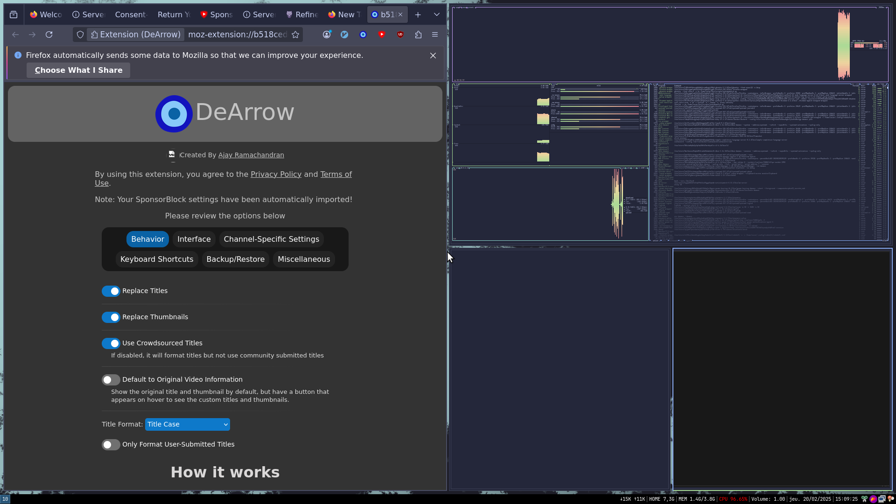

# List of screenshots from the integration tests

## [2025-03-03 17:10:30](https://github.com/Eldolfin/nixos-config/commit/444e33b8b69490d637955d97838eab251c1a6e91)

[login-screen](https://github.com/Eldolfin/nixos-config/blob/444e33b8b69490d637955d97838eab251c1a6e91/tests/login-screen.nix)|[lock-screen](https://github.com/Eldolfin/nixos-config/blob/444e33b8b69490d637955d97838eab251c1a6e91/tests/lock-screen.nix)|[firefox-and-terminals](https://github.com/Eldolfin/nixos-config/blob/444e33b8b69490d637955d97838eab251c1a6e91/tests/firefox-and-terminals.nix)
-|-|-
||

## [2025-03-01 09:53:44](https://github.com/Eldolfin/nixos-config/commit/03281d41821ab5d56e818e2da4f41a4565431e00)

[login-screen](https://github.com/Eldolfin/nixos-config/blob/03281d41821ab5d56e818e2da4f41a4565431e00/tests/login-screen.nix)|[lock-screen](https://github.com/Eldolfin/nixos-config/blob/03281d41821ab5d56e818e2da4f41a4565431e00/tests/lock-screen.nix)|[firefox-and-terminals](https://github.com/Eldolfin/nixos-config/blob/03281d41821ab5d56e818e2da4f41a4565431e00/tests/firefox-and-terminals.nix)
-|-|-
||

## [2025-02-28 14:20:58](https://github.com/Eldolfin/nixos-config/commit/f892dd67905e9fd69604fa7a5b7d8783886c05fb)

[login-screen](https://github.com/Eldolfin/nixos-config/blob/f892dd67905e9fd69604fa7a5b7d8783886c05fb/tests/login-screen.nix)|[lock-screen](https://github.com/Eldolfin/nixos-config/blob/f892dd67905e9fd69604fa7a5b7d8783886c05fb/tests/lock-screen.nix)|[firefox-and-terminals](https://github.com/Eldolfin/nixos-config/blob/f892dd67905e9fd69604fa7a5b7d8783886c05fb/tests/firefox-and-terminals.nix)
-|-|-
||

## [2025-02-27 20:54:58](https://github.com/Eldolfin/nixos-config/commit/81344a30fda8912e27fe52412e7bad00e998574c)

[login-screen](https://github.com/Eldolfin/nixos-config/blob/81344a30fda8912e27fe52412e7bad00e998574c/tests/login-screen.nix)|[lock-screen](https://github.com/Eldolfin/nixos-config/blob/81344a30fda8912e27fe52412e7bad00e998574c/tests/lock-screen.nix)|[firefox-and-terminals](https://github.com/Eldolfin/nixos-config/blob/81344a30fda8912e27fe52412e7bad00e998574c/tests/firefox-and-terminals.nix)
-|-|-
||

## [2025-02-27 19:49:42](https://github.com/Eldolfin/nixos-config/commit/4bb14cc4ccb1f59cf0e36f5140de5f842f52f396)

[login-screen](https://github.com/Eldolfin/nixos-config/blob/4bb14cc4ccb1f59cf0e36f5140de5f842f52f396/tests/login-screen.nix)|[lock-screen](https://github.com/Eldolfin/nixos-config/blob/4bb14cc4ccb1f59cf0e36f5140de5f842f52f396/tests/lock-screen.nix)|[firefox-and-terminals](https://github.com/Eldolfin/nixos-config/blob/4bb14cc4ccb1f59cf0e36f5140de5f842f52f396/tests/firefox-and-terminals.nix)
-|-|-
||

## [2025-02-27 15:37:26](https://github.com/Eldolfin/nixos-config/commit/c6f23979f112644fe7590e53e78c4b4b67d54ead)

[login-screen](https://github.com/Eldolfin/nixos-config/blob/c6f23979f112644fe7590e53e78c4b4b67d54ead/tests/login-screen.nix)|[lock-screen](https://github.com/Eldolfin/nixos-config/blob/c6f23979f112644fe7590e53e78c4b4b67d54ead/tests/lock-screen.nix)|[firefox-and-terminals](https://github.com/Eldolfin/nixos-config/blob/c6f23979f112644fe7590e53e78c4b4b67d54ead/tests/firefox-and-terminals.nix)
-|-|-
||

## [2025-02-27 15:30:07](https://github.com/Eldolfin/nixos-config/commit/c2e56b490b7a76813a97118078fcd694e446eae6)

[login-screen](https://github.com/Eldolfin/nixos-config/blob/c2e56b490b7a76813a97118078fcd694e446eae6/tests/login-screen.nix)|[lock-screen](https://github.com/Eldolfin/nixos-config/blob/c2e56b490b7a76813a97118078fcd694e446eae6/tests/lock-screen.nix)|[firefox-and-terminals](https://github.com/Eldolfin/nixos-config/blob/c2e56b490b7a76813a97118078fcd694e446eae6/tests/firefox-and-terminals.nix)
-|-|-
||

## [2025-02-26 19:57:44](https://github.com/Eldolfin/nixos-config/commit/36aee8cc5c4c962761365477173c5b33bf5c65d5)

[login-screen](https://github.com/Eldolfin/nixos-config/blob/36aee8cc5c4c962761365477173c5b33bf5c65d5/tests/login-screen.nix)|[lock-screen](https://github.com/Eldolfin/nixos-config/blob/36aee8cc5c4c962761365477173c5b33bf5c65d5/tests/lock-screen.nix)|[firefox-and-terminals](https://github.com/Eldolfin/nixos-config/blob/36aee8cc5c4c962761365477173c5b33bf5c65d5/tests/firefox-and-terminals.nix)
-|-|-
||

## [2025-02-25 15:34:36](https://github.com/Eldolfin/nixos-config/commit/2145b8b9faa74f4d0f2c021ea4fbb6af9efb3664)

[login-screen](https://github.com/Eldolfin/nixos-config/blob/2145b8b9faa74f4d0f2c021ea4fbb6af9efb3664/tests/login-screen.nix)|[lock-screen](https://github.com/Eldolfin/nixos-config/blob/2145b8b9faa74f4d0f2c021ea4fbb6af9efb3664/tests/lock-screen.nix)|[firefox-and-terminals](https://github.com/Eldolfin/nixos-config/blob/2145b8b9faa74f4d0f2c021ea4fbb6af9efb3664/tests/firefox-and-terminals.nix)
-|-|-
||

## [2025-02-24 13:54:36](https://github.com/Eldolfin/nixos-config/commit/c3072945f3b66257b2fdf89fedca0d34a8e6c49e)

[login-screen](https://github.com/Eldolfin/nixos-config/blob/c3072945f3b66257b2fdf89fedca0d34a8e6c49e/tests/login-screen.nix)|[lock-screen](https://github.com/Eldolfin/nixos-config/blob/c3072945f3b66257b2fdf89fedca0d34a8e6c49e/tests/lock-screen.nix)|[firefox-and-terminals](https://github.com/Eldolfin/nixos-config/blob/c3072945f3b66257b2fdf89fedca0d34a8e6c49e/tests/firefox-and-terminals.nix)
-|-|-
||

## [2025-02-23 11:15:44](https://github.com/Eldolfin/nixos-config/commit/26219f0453b5b74c9271ce9b46697c748b1a6ae3)

[login-screen](https://github.com/Eldolfin/nixos-config/blob/26219f0453b5b74c9271ce9b46697c748b1a6ae3/tests/login-screen.nix)|[lock-screen](https://github.com/Eldolfin/nixos-config/blob/26219f0453b5b74c9271ce9b46697c748b1a6ae3/tests/lock-screen.nix)|[firefox-and-terminals](https://github.com/Eldolfin/nixos-config/blob/26219f0453b5b74c9271ce9b46697c748b1a6ae3/tests/firefox-and-terminals.nix)
-|-|-
||

## [2025-02-22 19:30:16](https://github.com/Eldolfin/nixos-config/commit/20cad965794f5dacc84fae705d34d26bd1194ca1)

[login-screen](https://github.com/Eldolfin/nixos-config/blob/20cad965794f5dacc84fae705d34d26bd1194ca1/tests/login-screen.nix)|[lock-screen](https://github.com/Eldolfin/nixos-config/blob/20cad965794f5dacc84fae705d34d26bd1194ca1/tests/lock-screen.nix)|[firefox-and-terminals](https://github.com/Eldolfin/nixos-config/blob/20cad965794f5dacc84fae705d34d26bd1194ca1/tests/firefox-and-terminals.nix)
-|-|-
||

## [2025-02-22 18:10:02](https://github.com/Eldolfin/nixos-config/commit/67cec00ce41dc55848892a9d7f02e419f3791dd5)

[login-screen](https://github.com/Eldolfin/nixos-config/blob/67cec00ce41dc55848892a9d7f02e419f3791dd5/tests/login-screen.nix)|[lock-screen](https://github.com/Eldolfin/nixos-config/blob/67cec00ce41dc55848892a9d7f02e419f3791dd5/tests/lock-screen.nix)|[firefox-and-terminals](https://github.com/Eldolfin/nixos-config/blob/67cec00ce41dc55848892a9d7f02e419f3791dd5/tests/firefox-and-terminals.nix)
-|-|-
||

## [2025-02-20 14:22:33](https://github.com/Eldolfin/nixos-config/commit/e98748c9cdd7046eca1baf0b255bbe68331cfa62)

[login-screen](https://github.com/Eldolfin/nixos-config/blob/e98748c9cdd7046eca1baf0b255bbe68331cfa62/tests/login-screen.nix)|[lock-screen](https://github.com/Eldolfin/nixos-config/blob/e98748c9cdd7046eca1baf0b255bbe68331cfa62/tests/lock-screen.nix)|[firefox-and-terminals](https://github.com/Eldolfin/nixos-config/blob/e98748c9cdd7046eca1baf0b255bbe68331cfa62/tests/firefox-and-terminals.nix)
-|-|-
||

## [2025-02-20 14:04:52](https://github.com/Eldolfin/nixos-config/commit/2e69483de3575c40d3cb494d945cd1e63b6816a8)

[login-screen](https://github.com/Eldolfin/nixos-config/blob/2e69483de3575c40d3cb494d945cd1e63b6816a8/tests/login-screen.nix)|[lock-screen](https://github.com/Eldolfin/nixos-config/blob/2e69483de3575c40d3cb494d945cd1e63b6816a8/tests/lock-screen.nix)|[firefox-and-terminals](https://github.com/Eldolfin/nixos-config/blob/2e69483de3575c40d3cb494d945cd1e63b6816a8/tests/firefox-and-terminals.nix)
-|-|-
||

## [2025-02-20 13:54:46](https://github.com/Eldolfin/nixos-config/commit/b118521f24df5071348eaa24d559ea3477811f65)

[login-screen](https://github.com/Eldolfin/nixos-config/blob/b118521f24df5071348eaa24d559ea3477811f65/tests/login-screen.nix)|[lock-screen](https://github.com/Eldolfin/nixos-config/blob/b118521f24df5071348eaa24d559ea3477811f65/tests/lock-screen.nix)|[firefox-and-terminals](https://github.com/Eldolfin/nixos-config/blob/b118521f24df5071348eaa24d559ea3477811f65/tests/firefox-and-terminals.nix)
-|-|-
||

## [2025-02-16 18:58:19](https://github.com/Eldolfin/nixos-config/commit/33656e4b164e2ecf3703eb27abd5a89fa3d949fb)

[login-screen](https://github.com/Eldolfin/nixos-config/blob/33656e4b164e2ecf3703eb27abd5a89fa3d949fb/tests/login-screen.nix)|[lock-screen](https://github.com/Eldolfin/nixos-config/blob/33656e4b164e2ecf3703eb27abd5a89fa3d949fb/tests/lock-screen.nix)|[firefox-and-terminals](https://github.com/Eldolfin/nixos-config/blob/33656e4b164e2ecf3703eb27abd5a89fa3d949fb/tests/firefox-and-terminals.nix)
-|-|-
||

## [2025-02-16 01:30:07](https://github.com/Eldolfin/nixos-config/commit/caf71d3de95d92c6b99a13bd42dca6c0cf8f9f74)

[login-screen](https://github.com/Eldolfin/nixos-config/blob/caf71d3de95d92c6b99a13bd42dca6c0cf8f9f74/tests/login-screen.nix)|[lock-screen](https://github.com/Eldolfin/nixos-config/blob/caf71d3de95d92c6b99a13bd42dca6c0cf8f9f74/tests/lock-screen.nix)|[firefox-and-terminals](https://github.com/Eldolfin/nixos-config/blob/caf71d3de95d92c6b99a13bd42dca6c0cf8f9f74/tests/firefox-and-terminals.nix)
-|-|-
||

## [2025-02-16 00:36:39](https://github.com/Eldolfin/nixos-config/commit/ba860f0ad45f27433519dbf309b1ab64d35f9f97)

[login-screen](https://github.com/Eldolfin/nixos-config/blob/ba860f0ad45f27433519dbf309b1ab64d35f9f97/tests/login-screen.nix)|[lock-screen](https://github.com/Eldolfin/nixos-config/blob/ba860f0ad45f27433519dbf309b1ab64d35f9f97/tests/lock-screen.nix)|[firefox-and-terminals](https://github.com/Eldolfin/nixos-config/blob/ba860f0ad45f27433519dbf309b1ab64d35f9f97/tests/firefox-and-terminals.nix)
-|-|-
||

## [2025-02-15 19:40:29](https://github.com/Eldolfin/nixos-config/commit/1451bc8d9483fdb52bb844b58edf86aef8b5205c)

[login-screen](https://github.com/Eldolfin/nixos-config/blob/1451bc8d9483fdb52bb844b58edf86aef8b5205c/tests/login-screen.nix)|[lock-screen](https://github.com/Eldolfin/nixos-config/blob/1451bc8d9483fdb52bb844b58edf86aef8b5205c/tests/lock-screen.nix)|[firefox-and-terminals](https://github.com/Eldolfin/nixos-config/blob/1451bc8d9483fdb52bb844b58edf86aef8b5205c/tests/firefox-and-terminals.nix)
-|-|-
||

## [2025-02-10 17:45:09](https://github.com/Eldolfin/nixos-config/commit/16e4fa30772e3bdf9e77df8c9ae5bc12813e1467)

[login-screen](https://github.com/Eldolfin/nixos-config/blob/16e4fa30772e3bdf9e77df8c9ae5bc12813e1467/tests/login-screen.nix)|[lock-screen](https://github.com/Eldolfin/nixos-config/blob/16e4fa30772e3bdf9e77df8c9ae5bc12813e1467/tests/lock-screen.nix)|[firefox-and-terminals](https://github.com/Eldolfin/nixos-config/blob/16e4fa30772e3bdf9e77df8c9ae5bc12813e1467/tests/firefox-and-terminals.nix)
-|-|-
||

## [2025-02-07 13:07:58](https://github.com/Eldolfin/nixos-config/commit/e2131c4d4b9134270043337996dff9bb4215d7c1)

[login-screen](https://github.com/Eldolfin/nixos-config/blob/e2131c4d4b9134270043337996dff9bb4215d7c1/tests/login-screen.nix)|[lock-screen](https://github.com/Eldolfin/nixos-config/blob/e2131c4d4b9134270043337996dff9bb4215d7c1/tests/lock-screen.nix)|[firefox-and-terminals](https://github.com/Eldolfin/nixos-config/blob/e2131c4d4b9134270043337996dff9bb4215d7c1/tests/firefox-and-terminals.nix)
-|-|-
||

## [2025-02-06 15:59:59](https://github.com/Eldolfin/nixos-config/commit/4e173013fca09ddb986257ae1b94fc519f417930)

[login-screen](https://github.com/Eldolfin/nixos-config/blob/4e173013fca09ddb986257ae1b94fc519f417930/tests/login-screen.nix)|[lock-screen](https://github.com/Eldolfin/nixos-config/blob/4e173013fca09ddb986257ae1b94fc519f417930/tests/lock-screen.nix)|[firefox-and-terminals](https://github.com/Eldolfin/nixos-config/blob/4e173013fca09ddb986257ae1b94fc519f417930/tests/firefox-and-terminals.nix)
-|-|-
||

## [2025-02-04 21:51:02](https://github.com/Eldolfin/nixos-config/commit/ec254280d052967d25f4a78d68c871c65e8bd7dc)

[login-screen](https://github.com/Eldolfin/nixos-config/blob/ec254280d052967d25f4a78d68c871c65e8bd7dc/tests/login-screen.nix)|[lock-screen](https://github.com/Eldolfin/nixos-config/blob/ec254280d052967d25f4a78d68c871c65e8bd7dc/tests/lock-screen.nix)|[firefox-and-terminals](https://github.com/Eldolfin/nixos-config/blob/ec254280d052967d25f4a78d68c871c65e8bd7dc/tests/firefox-and-terminals.nix)
-|-|-
||

## [2025-02-01 23:19:13](https://github.com/Eldolfin/nixos-config/commit/3fb07966977d2243577dd8a7dfdcb13e436e481f)

[login-screen](https://github.com/Eldolfin/nixos-config/blob/3fb07966977d2243577dd8a7dfdcb13e436e481f/tests/login-screen.nix)|[lock-screen](https://github.com/Eldolfin/nixos-config/blob/3fb07966977d2243577dd8a7dfdcb13e436e481f/tests/lock-screen.nix)|[firefox-and-terminals](https://github.com/Eldolfin/nixos-config/blob/3fb07966977d2243577dd8a7dfdcb13e436e481f/tests/firefox-and-terminals.nix)
-|-|-
||

## [2025-02-01 13:12:54](https://github.com/Eldolfin/nixos-config/commit/f02960bd7ef5a8961c2272aec625a6d7c1890cc0)

[login-screen](https://github.com/Eldolfin/nixos-config/blob/f02960bd7ef5a8961c2272aec625a6d7c1890cc0/tests/login-screen.nix)|[lock-screen](https://github.com/Eldolfin/nixos-config/blob/f02960bd7ef5a8961c2272aec625a6d7c1890cc0/tests/lock-screen.nix)|[firefox-and-terminals](https://github.com/Eldolfin/nixos-config/blob/f02960bd7ef5a8961c2272aec625a6d7c1890cc0/tests/firefox-and-terminals.nix)
-|-|-
||

## [2025-02-01 01:27:33](https://github.com/Eldolfin/nixos-config/commit/6a04ad71451cbabee8380a6479ae5dcc6d1d44cb)

[login-screen](https://github.com/Eldolfin/nixos-config/blob/6a04ad71451cbabee8380a6479ae5dcc6d1d44cb/tests/login-screen.nix)|[lock-screen](https://github.com/Eldolfin/nixos-config/blob/6a04ad71451cbabee8380a6479ae5dcc6d1d44cb/tests/lock-screen.nix)|[firefox-and-terminals](https://github.com/Eldolfin/nixos-config/blob/6a04ad71451cbabee8380a6479ae5dcc6d1d44cb/tests/firefox-and-terminals.nix)
-|-|-
||

## [2025-02-01 00:48:13](https://github.com/Eldolfin/nixos-config/commit/e2d48652de57723efdcd23a128f1c0d9aa0d44eb)

[login-screen](https://github.com/Eldolfin/nixos-config/blob/e2d48652de57723efdcd23a128f1c0d9aa0d44eb/tests/login-screen.nix)|[lock-screen](https://github.com/Eldolfin/nixos-config/blob/e2d48652de57723efdcd23a128f1c0d9aa0d44eb/tests/lock-screen.nix)|[firefox-and-terminals](https://github.com/Eldolfin/nixos-config/blob/e2d48652de57723efdcd23a128f1c0d9aa0d44eb/tests/firefox-and-terminals.nix)
-|-|-
||

## [2025-02-01 00:36:00](https://github.com/Eldolfin/nixos-config/commit/d660262ad6aaa543ebce4f45bcc01828f85381a3)

[login-screen](https://github.com/Eldolfin/nixos-config/blob/d660262ad6aaa543ebce4f45bcc01828f85381a3/tests/login-screen.nix)|[lock-screen](https://github.com/Eldolfin/nixos-config/blob/d660262ad6aaa543ebce4f45bcc01828f85381a3/tests/lock-screen.nix)|[firefox-and-terminals](https://github.com/Eldolfin/nixos-config/blob/d660262ad6aaa543ebce4f45bcc01828f85381a3/tests/firefox-and-terminals.nix)
-|-|-
||

## [2025-02-01 00:13:08](https://github.com/Eldolfin/nixos-config/commit/483ff2291e84d05ef0393f8643b15ac6e3acafc9)

[login-screen](https://github.com/Eldolfin/nixos-config/blob/483ff2291e84d05ef0393f8643b15ac6e3acafc9/tests/login-screen.nix)|[lock-screen](https://github.com/Eldolfin/nixos-config/blob/483ff2291e84d05ef0393f8643b15ac6e3acafc9/tests/lock-screen.nix)|[firefox-and-terminals](https://github.com/Eldolfin/nixos-config/blob/483ff2291e84d05ef0393f8643b15ac6e3acafc9/tests/firefox-and-terminals.nix)
-|-|-
||

## [2025-01-26 03:34:29](https://github.com/Eldolfin/nixos-config/commit/2ec44987b81a99e631044eed167c96a17e081282)

[login-screen](https://github.com/Eldolfin/nixos-config/blob/2ec44987b81a99e631044eed167c96a17e081282/tests/login-screen.nix)|[lock-screen](https://github.com/Eldolfin/nixos-config/blob/2ec44987b81a99e631044eed167c96a17e081282/tests/lock-screen.nix)|[firefox-and-terminals](https://github.com/Eldolfin/nixos-config/blob/2ec44987b81a99e631044eed167c96a17e081282/tests/firefox-and-terminals.nix)
-|-|-
||

## [2025-01-26 03:17:57](https://github.com/Eldolfin/nixos-config/commit/0d473392c92768fc526c5164ea10dd1eba8af8e0)

[login-screen](https://github.com/Eldolfin/nixos-config/blob/0d473392c92768fc526c5164ea10dd1eba8af8e0/tests/login-screen.nix)|[lock-screen](https://github.com/Eldolfin/nixos-config/blob/0d473392c92768fc526c5164ea10dd1eba8af8e0/tests/lock-screen.nix)|[firefox-and-terminals](https://github.com/Eldolfin/nixos-config/blob/0d473392c92768fc526c5164ea10dd1eba8af8e0/tests/firefox-and-terminals.nix)
-|-|-
||

## [2025-01-26 02:22:22](https://github.com/Eldolfin/nixos-config/commit/85f7de80a8c7dc151e0f787f048d73ae3ea6b782)

[login-screen](https://github.com/Eldolfin/nixos-config/blob/85f7de80a8c7dc151e0f787f048d73ae3ea6b782/tests/login-screen.nix)|[lock-screen](https://github.com/Eldolfin/nixos-config/blob/85f7de80a8c7dc151e0f787f048d73ae3ea6b782/tests/lock-screen.nix)|[firefox-and-terminals](https://github.com/Eldolfin/nixos-config/blob/85f7de80a8c7dc151e0f787f048d73ae3ea6b782/tests/firefox-and-terminals.nix)
-|-|-
||

## [2025-01-25 22:51:55](https://github.com/Eldolfin/nixos-config/commit/cd707e8c0aa12d56e930dc9dcbf3453c8cd00b9a)

[login-screen](https://github.com/Eldolfin/nixos-config/blob/cd707e8c0aa12d56e930dc9dcbf3453c8cd00b9a/tests/login-screen.nix)|[lock-screen](https://github.com/Eldolfin/nixos-config/blob/cd707e8c0aa12d56e930dc9dcbf3453c8cd00b9a/tests/lock-screen.nix)|[firefox-and-terminals](https://github.com/Eldolfin/nixos-config/blob/cd707e8c0aa12d56e930dc9dcbf3453c8cd00b9a/tests/firefox-and-terminals.nix)
-|-|-
||

## [2025-01-25 22:20:01](https://github.com/Eldolfin/nixos-config/commit/433541dc8de33e59c3287e9e9eea25db9ed62a5e)

[login-screen](https://github.com/Eldolfin/nixos-config/blob/433541dc8de33e59c3287e9e9eea25db9ed62a5e/tests/login-screen.nix)|[lock-screen](https://github.com/Eldolfin/nixos-config/blob/433541dc8de33e59c3287e9e9eea25db9ed62a5e/tests/lock-screen.nix)|[firefox-and-terminals](https://github.com/Eldolfin/nixos-config/blob/433541dc8de33e59c3287e9e9eea25db9ed62a5e/tests/firefox-and-terminals.nix)
-|-|-
||

## [2025-01-25 20:27:28](https://github.com/Eldolfin/nixos-config/commit/d41e7c14a115690d683289a7e2ce3b85a26c3d4a)

[login-screen](https://github.com/Eldolfin/nixos-config/blob/d41e7c14a115690d683289a7e2ce3b85a26c3d4a/tests/login-screen.nix)|[lock-screen](https://github.com/Eldolfin/nixos-config/blob/d41e7c14a115690d683289a7e2ce3b85a26c3d4a/tests/lock-screen.nix)|[firefox-and-terminals](https://github.com/Eldolfin/nixos-config/blob/d41e7c14a115690d683289a7e2ce3b85a26c3d4a/tests/firefox-and-terminals.nix)
-|-|-
||

## [2025-01-25 19:20:56](https://github.com/Eldolfin/nixos-config/commit/083be78a12da54bb3fc1488ad5b9881e0d8f36c6)

[login-screen](https://github.com/Eldolfin/nixos-config/blob/083be78a12da54bb3fc1488ad5b9881e0d8f36c6/tests/login-screen.nix)|[lock-screen](https://github.com/Eldolfin/nixos-config/blob/083be78a12da54bb3fc1488ad5b9881e0d8f36c6/tests/lock-screen.nix)|[firefox-and-terminals](https://github.com/Eldolfin/nixos-config/blob/083be78a12da54bb3fc1488ad5b9881e0d8f36c6/tests/firefox-and-terminals.nix)
-|-|-
||

## [2025-01-25 19:14:28](https://github.com/Eldolfin/nixos-config/commit/35c64c4af73938af9f1425b53588f586980c1f3c)

[login-screen](https://github.com/Eldolfin/nixos-config/blob/35c64c4af73938af9f1425b53588f586980c1f3c/tests/login-screen.nix)|[lock-screen](https://github.com/Eldolfin/nixos-config/blob/35c64c4af73938af9f1425b53588f586980c1f3c/tests/lock-screen.nix)|[firefox-and-terminals](https://github.com/Eldolfin/nixos-config/blob/35c64c4af73938af9f1425b53588f586980c1f3c/tests/firefox-and-terminals.nix)
-|-|-
||

## [2025-01-25 18:39:03](https://github.com/Eldolfin/nixos-config/commit/f2e120d601f3502432e8f239c4726d348767276e)

[login-screen](https://github.com/Eldolfin/nixos-config/blob/f2e120d601f3502432e8f239c4726d348767276e/tests/login-screen.nix)|[lock-screen](https://github.com/Eldolfin/nixos-config/blob/f2e120d601f3502432e8f239c4726d348767276e/tests/lock-screen.nix)|[firefox-and-terminals](https://github.com/Eldolfin/nixos-config/blob/f2e120d601f3502432e8f239c4726d348767276e/tests/firefox-and-terminals.nix)
-|-|-
||

## [2025-01-25 18:33:40](https://github.com/Eldolfin/nixos-config/commit/5f59ef0cc5f6f322920edbb077ae375720767ad6)

[login-screen](https://github.com/Eldolfin/nixos-config/blob/5f59ef0cc5f6f322920edbb077ae375720767ad6/tests/login-screen.nix)|[lock-screen](https://github.com/Eldolfin/nixos-config/blob/5f59ef0cc5f6f322920edbb077ae375720767ad6/tests/lock-screen.nix)|[firefox-and-terminals](https://github.com/Eldolfin/nixos-config/blob/5f59ef0cc5f6f322920edbb077ae375720767ad6/tests/firefox-and-terminals.nix)
-|-|-
||

## [2025-01-25 18:27:27](https://github.com/Eldolfin/nixos-config/commit/3c84176138864dc88ff5425e3d7cb63cb6839620)

[login-screen](https://github.com/Eldolfin/nixos-config/blob/3c84176138864dc88ff5425e3d7cb63cb6839620/tests/login-screen.nix)|[lock-screen](https://github.com/Eldolfin/nixos-config/blob/3c84176138864dc88ff5425e3d7cb63cb6839620/tests/lock-screen.nix)|[firefox-and-terminals](https://github.com/Eldolfin/nixos-config/blob/3c84176138864dc88ff5425e3d7cb63cb6839620/tests/firefox-and-terminals.nix)
-|-|-
||

## [2025-01-25 15:42:10](https://github.com/Eldolfin/nixos-config/commit/d6bf385a7990f438811a6103eea187aad7e66771)

[login-screen](https://github.com/Eldolfin/nixos-config/blob/d6bf385a7990f438811a6103eea187aad7e66771/tests/login-screen.nix)|[lock-screen](https://github.com/Eldolfin/nixos-config/blob/d6bf385a7990f438811a6103eea187aad7e66771/tests/lock-screen.nix)|[firefox-and-terminals](https://github.com/Eldolfin/nixos-config/blob/d6bf385a7990f438811a6103eea187aad7e66771/tests/firefox-and-terminals.nix)
-|-|-
||

## [2025-01-25 11:17:50](https://github.com/Eldolfin/nixos-config/commit/b0fda76e19301d56defc40fd677452fcb97b900b)

[login-screen](https://github.com/Eldolfin/nixos-config/blob/b0fda76e19301d56defc40fd677452fcb97b900b/tests/login-screen.nix)|[lock-screen](https://github.com/Eldolfin/nixos-config/blob/b0fda76e19301d56defc40fd677452fcb97b900b/tests/lock-screen.nix)|[firefox-and-terminals](https://github.com/Eldolfin/nixos-config/blob/b0fda76e19301d56defc40fd677452fcb97b900b/tests/firefox-and-terminals.nix)
-|-|-
||

## [2025-01-21 21:31:25](https://github.com/Eldolfin/nixos-config/commit/1ac74426b3f6dc299a77d71280bb7b7bed58be23)

[login-screen](https://github.com/Eldolfin/nixos-config/blob/1ac74426b3f6dc299a77d71280bb7b7bed58be23/tests/login-screen.nix)|[lock-screen](https://github.com/Eldolfin/nixos-config/blob/1ac74426b3f6dc299a77d71280bb7b7bed58be23/tests/lock-screen.nix)|[firefox-and-terminals](https://github.com/Eldolfin/nixos-config/blob/1ac74426b3f6dc299a77d71280bb7b7bed58be23/tests/firefox-and-terminals.nix)
-|-|-
||

## [2025-01-19 17:07:17](https://github.com/Eldolfin/nixos-config/commit/3848ec8dcfbd142401e58ea8959f0b012dd20e28)

[login-screen](https://github.com/Eldolfin/nixos-config/blob/3848ec8dcfbd142401e58ea8959f0b012dd20e28/tests/login-screen.nix)|[lock-screen](https://github.com/Eldolfin/nixos-config/blob/3848ec8dcfbd142401e58ea8959f0b012dd20e28/tests/lock-screen.nix)|[firefox-and-terminals](https://github.com/Eldolfin/nixos-config/blob/3848ec8dcfbd142401e58ea8959f0b012dd20e28/tests/firefox-and-terminals.nix)
-|-|-
||

## [2025-01-19 16:13:25](https://github.com/Eldolfin/nixos-config/commit/a536b3dc0e43c200af7749c274436dbd1746411d)

[login-screen](https://github.com/Eldolfin/nixos-config/blob/a536b3dc0e43c200af7749c274436dbd1746411d/tests/login-screen.nix)|[lock-screen](https://github.com/Eldolfin/nixos-config/blob/a536b3dc0e43c200af7749c274436dbd1746411d/tests/lock-screen.nix)|[firefox-and-terminals](https://github.com/Eldolfin/nixos-config/blob/a536b3dc0e43c200af7749c274436dbd1746411d/tests/firefox-and-terminals.nix)
-|-|-
||

## [2025-01-12 16:02:50](https://github.com/Eldolfin/nixos-config/commit/739db13ca273bf3af3fb31f680c0acefd1799e40)

[login-screen](https://github.com/Eldolfin/nixos-config/blob/739db13ca273bf3af3fb31f680c0acefd1799e40/tests/login-screen.nix)|[lock-screen](https://github.com/Eldolfin/nixos-config/blob/739db13ca273bf3af3fb31f680c0acefd1799e40/tests/lock-screen.nix)|[firefox-and-terminals](https://github.com/Eldolfin/nixos-config/blob/739db13ca273bf3af3fb31f680c0acefd1799e40/tests/firefox-and-terminals.nix)
-|-|-
||

## [2025-01-11 03:55:42](https://github.com/Eldolfin/nixos-config/commit/59a23e93e34d9906eca36fdae93dfe852f0d90bf)

[login-screen](https://github.com/Eldolfin/nixos-config/blob/59a23e93e34d9906eca36fdae93dfe852f0d90bf/tests/login-screen.nix)|[lock-screen](https://github.com/Eldolfin/nixos-config/blob/59a23e93e34d9906eca36fdae93dfe852f0d90bf/tests/lock-screen.nix)|[firefox-and-terminals](https://github.com/Eldolfin/nixos-config/blob/59a23e93e34d9906eca36fdae93dfe852f0d90bf/tests/firefox-and-terminals.nix)
-|-|-
||

## [2025-01-04 17:23:43](https://github.com/Eldolfin/nixos-config/commit/8e44ff76b1a1b391d75d9602b1e538892a09b3e8)

[login-screen](https://github.com/Eldolfin/nixos-config/blob/8e44ff76b1a1b391d75d9602b1e538892a09b3e8/tests/login-screen.nix)|[lock-screen](https://github.com/Eldolfin/nixos-config/blob/8e44ff76b1a1b391d75d9602b1e538892a09b3e8/tests/lock-screen.nix)|[firefox-and-terminals](https://github.com/Eldolfin/nixos-config/blob/8e44ff76b1a1b391d75d9602b1e538892a09b3e8/tests/firefox-and-terminals.nix)
-|-|-
||

## [2024-12-31 16:36:09](https://github.com/Eldolfin/nixos-config/commit/fc8a4205601fea33469e57635370ed9fbd638b05)

[login-screen](https://github.com/Eldolfin/nixos-config/blob/fc8a4205601fea33469e57635370ed9fbd638b05/tests/login-screen.nix)|[lock-screen](https://github.com/Eldolfin/nixos-config/blob/fc8a4205601fea33469e57635370ed9fbd638b05/tests/lock-screen.nix)|[firefox-and-terminals](https://github.com/Eldolfin/nixos-config/blob/fc8a4205601fea33469e57635370ed9fbd638b05/tests/firefox-and-terminals.nix)
-|-|-
||

## [2024-12-31 00:02:29](https://github.com/Eldolfin/nixos-config/commit/d6b72789766816a04dd3c6f69666ea68f99e372d)

[login-screen](https://github.com/Eldolfin/nixos-config/blob/d6b72789766816a04dd3c6f69666ea68f99e372d/tests/login-screen.nix)|[lock-screen](https://github.com/Eldolfin/nixos-config/blob/d6b72789766816a04dd3c6f69666ea68f99e372d/tests/lock-screen.nix)|[firefox-and-terminals](https://github.com/Eldolfin/nixos-config/blob/d6b72789766816a04dd3c6f69666ea68f99e372d/tests/firefox-and-terminals.nix)
-|-|-
||

## [2024-12-28 05:04:17](https://github.com/Eldolfin/nixos-config/commit/59d6b99da072d7f3e2b36d07d900c5b43d11ca02)

[login-screen](https://github.com/Eldolfin/nixos-config/blob/59d6b99da072d7f3e2b36d07d900c5b43d11ca02/tests/login-screen.nix)|[lock-screen](https://github.com/Eldolfin/nixos-config/blob/59d6b99da072d7f3e2b36d07d900c5b43d11ca02/tests/lock-screen.nix)|[firefox-and-terminals](https://github.com/Eldolfin/nixos-config/blob/59d6b99da072d7f3e2b36d07d900c5b43d11ca02/tests/firefox-and-terminals.nix)
-|-|-
||

## [2024-12-28 05:01:33](https://github.com/Eldolfin/nixos-config/commit/ac87f4e35997e71b2c4a040e9803c5bd476157dc)

[login-screen](https://github.com/Eldolfin/nixos-config/blob/ac87f4e35997e71b2c4a040e9803c5bd476157dc/tests/login-screen.nix)|[lock-screen](https://github.com/Eldolfin/nixos-config/blob/ac87f4e35997e71b2c4a040e9803c5bd476157dc/tests/lock-screen.nix)|[firefox-and-terminals](https://github.com/Eldolfin/nixos-config/blob/ac87f4e35997e71b2c4a040e9803c5bd476157dc/tests/firefox-and-terminals.nix)
-|-|-
||

## [2024-12-25 16:15:56](https://github.com/Eldolfin/nixos-config/commit/c7c6a45a0daa1c9391e733368b774478720c7105)

[login-screen](https://github.com/Eldolfin/nixos-config/blob/c7c6a45a0daa1c9391e733368b774478720c7105/tests/login-screen.nix)|[lock-screen](https://github.com/Eldolfin/nixos-config/blob/c7c6a45a0daa1c9391e733368b774478720c7105/tests/lock-screen.nix)|[firefox-and-terminals](https://github.com/Eldolfin/nixos-config/blob/c7c6a45a0daa1c9391e733368b774478720c7105/tests/firefox-and-terminals.nix)
-|-|-
||

## [2024-12-22 17:58:46](https://github.com/Eldolfin/nixos-config/commit/a5449cb4676cc76fffb719c6341d5e0ab4fcd23b)

[login-screen](https://github.com/Eldolfin/nixos-config/blob/a5449cb4676cc76fffb719c6341d5e0ab4fcd23b/tests/login-screen.nix)|[lock-screen](https://github.com/Eldolfin/nixos-config/blob/a5449cb4676cc76fffb719c6341d5e0ab4fcd23b/tests/lock-screen.nix)|[firefox-and-terminals](https://github.com/Eldolfin/nixos-config/blob/a5449cb4676cc76fffb719c6341d5e0ab4fcd23b/tests/firefox-and-terminals.nix)
-|-|-
||

## [2024-12-21 17:08:20](https://github.com/Eldolfin/nixos-config/commit/525c7aac5049edde68c2aaed952eccbd61658ad1)

[login-screen](https://github.com/Eldolfin/nixos-config/blob/525c7aac5049edde68c2aaed952eccbd61658ad1/tests/login-screen.nix)|[lock-screen](https://github.com/Eldolfin/nixos-config/blob/525c7aac5049edde68c2aaed952eccbd61658ad1/tests/lock-screen.nix)|[firefox-and-terminals](https://github.com/Eldolfin/nixos-config/blob/525c7aac5049edde68c2aaed952eccbd61658ad1/tests/firefox-and-terminals.nix)
-|-|-
||

## [2024-12-21 16:41:55](https://github.com/Eldolfin/nixos-config/commit/6f79aeb7bc896f0ab31e653498022ccd5e85cf04)

[login-screen](https://github.com/Eldolfin/nixos-config/blob/6f79aeb7bc896f0ab31e653498022ccd5e85cf04/tests/login-screen.nix)|[lock-screen](https://github.com/Eldolfin/nixos-config/blob/6f79aeb7bc896f0ab31e653498022ccd5e85cf04/tests/lock-screen.nix)|[firefox-and-terminals](https://github.com/Eldolfin/nixos-config/blob/6f79aeb7bc896f0ab31e653498022ccd5e85cf04/tests/firefox-and-terminals.nix)
-|-|-
||

## [2024-12-21 16:12:51](https://github.com/Eldolfin/nixos-config/commit/05eb25e087944cf4fd9eac56f7f84053409a986e)

[login-screen](https://github.com/Eldolfin/nixos-config/blob/05eb25e087944cf4fd9eac56f7f84053409a986e/tests/login-screen.nix)|[lock-screen](https://github.com/Eldolfin/nixos-config/blob/05eb25e087944cf4fd9eac56f7f84053409a986e/tests/lock-screen.nix)|[firefox-and-terminals](https://github.com/Eldolfin/nixos-config/blob/05eb25e087944cf4fd9eac56f7f84053409a986e/tests/firefox-and-terminals.nix)
-|-|-
||

## [2024-12-21 14:33:39](https://github.com/Eldolfin/nixos-config/commit/789799b95935554fa957f9bda8843e8d6b3b9747)

[login-screen](https://github.com/Eldolfin/nixos-config/blob/789799b95935554fa957f9bda8843e8d6b3b9747/tests/login-screen.nix)|[lock-screen](https://github.com/Eldolfin/nixos-config/blob/789799b95935554fa957f9bda8843e8d6b3b9747/tests/lock-screen.nix)|[firefox-and-terminals](https://github.com/Eldolfin/nixos-config/blob/789799b95935554fa957f9bda8843e8d6b3b9747/tests/firefox-and-terminals.nix)
-|-|-
||

## [2024-12-21 14:21:55](https://github.com/Eldolfin/nixos-config/commit/11c498d4c4b5163a43b92be167170249be157924)

[login-screen](https://github.com/Eldolfin/nixos-config/blob/11c498d4c4b5163a43b92be167170249be157924/tests/login-screen.nix)|[lock-screen](https://github.com/Eldolfin/nixos-config/blob/11c498d4c4b5163a43b92be167170249be157924/tests/lock-screen.nix)|[firefox-and-terminals](https://github.com/Eldolfin/nixos-config/blob/11c498d4c4b5163a43b92be167170249be157924/tests/firefox-and-terminals.nix)
-|-|-
||

## [2024-12-19 20:51:45](https://github.com/Eldolfin/nixos-config/commit/b43f3bb1ea6035f0840a235a42ac017edddf6949)

[login-screen](https://github.com/Eldolfin/nixos-config/blob/b43f3bb1ea6035f0840a235a42ac017edddf6949/tests/login-screen.nix)|[lock-screen](https://github.com/Eldolfin/nixos-config/blob/b43f3bb1ea6035f0840a235a42ac017edddf6949/tests/lock-screen.nix)|[firefox-and-terminals](https://github.com/Eldolfin/nixos-config/blob/b43f3bb1ea6035f0840a235a42ac017edddf6949/tests/firefox-and-terminals.nix)
-|-|-
||

## [2024-12-17 23:08:46](https://github.com/Eldolfin/nixos-config/commit/567b629d08bdbb8c6680d53f53c7151baf7e04cf)

[login-screen](https://github.com/Eldolfin/nixos-config/blob/567b629d08bdbb8c6680d53f53c7151baf7e04cf/tests/login-screen.nix)|[lock-screen](https://github.com/Eldolfin/nixos-config/blob/567b629d08bdbb8c6680d53f53c7151baf7e04cf/tests/lock-screen.nix)|[firefox-and-terminals](https://github.com/Eldolfin/nixos-config/blob/567b629d08bdbb8c6680d53f53c7151baf7e04cf/tests/firefox-and-terminals.nix)
-|-|-
||

## [2024-12-17 22:53:28](https://github.com/Eldolfin/nixos-config/commit/a6cca5348365830e2ec3602c17766d2270813d0b)

[login-screen](https://github.com/Eldolfin/nixos-config/blob/a6cca5348365830e2ec3602c17766d2270813d0b/tests/login-screen.nix)|[lock-screen](https://github.com/Eldolfin/nixos-config/blob/a6cca5348365830e2ec3602c17766d2270813d0b/tests/lock-screen.nix)|[firefox-and-terminals](https://github.com/Eldolfin/nixos-config/blob/a6cca5348365830e2ec3602c17766d2270813d0b/tests/firefox-and-terminals.nix)
-|-|-
||

## [2024-12-16 19:11:08](https://github.com/Eldolfin/nixos-config/commit/77b549a3f2b60cb82e6bfeb4329ac6deeca2f040)

[login-screen](https://github.com/Eldolfin/nixos-config/blob/77b549a3f2b60cb82e6bfeb4329ac6deeca2f040/tests/login-screen.nix)|[lock-screen](https://github.com/Eldolfin/nixos-config/blob/77b549a3f2b60cb82e6bfeb4329ac6deeca2f040/tests/lock-screen.nix)|[firefox-and-terminals](https://github.com/Eldolfin/nixos-config/blob/77b549a3f2b60cb82e6bfeb4329ac6deeca2f040/tests/firefox-and-terminals.nix)
-|-|-
||

## [2024-12-15 22:19:53](https://github.com/Eldolfin/nixos-config/commit/4936c240e02acd418e83f0d14e322cc9b35939c4)

[login-screen](https://github.com/Eldolfin/nixos-config/blob/4936c240e02acd418e83f0d14e322cc9b35939c4/tests/login-screen.nix)|[lock-screen](https://github.com/Eldolfin/nixos-config/blob/4936c240e02acd418e83f0d14e322cc9b35939c4/tests/lock-screen.nix)|[firefox-and-terminals](https://github.com/Eldolfin/nixos-config/blob/4936c240e02acd418e83f0d14e322cc9b35939c4/tests/firefox-and-terminals.nix)
-|-|-
||

## [2024-11-30 14:50:17](https://github.com/Eldolfin/nixos-config/commit/7aba76ef91974a4e243ef8aaafe37a82f28f93f4)

[login-screen](https://github.com/Eldolfin/nixos-config/blob/7aba76ef91974a4e243ef8aaafe37a82f28f93f4/tests/login-screen.nix)|[lock-screen](https://github.com/Eldolfin/nixos-config/blob/7aba76ef91974a4e243ef8aaafe37a82f28f93f4/tests/lock-screen.nix)|[firefox-and-terminals](https://github.com/Eldolfin/nixos-config/blob/7aba76ef91974a4e243ef8aaafe37a82f28f93f4/tests/firefox-and-terminals.nix)
-|-|-
||

## [2024-11-30 14:46:37](https://github.com/Eldolfin/nixos-config/commit/de2d21d63e697a4adedecc76a6bb1781d064ea96)

[login-screen](https://github.com/Eldolfin/nixos-config/blob/de2d21d63e697a4adedecc76a6bb1781d064ea96/tests/login-screen.nix)|[lock-screen](https://github.com/Eldolfin/nixos-config/blob/de2d21d63e697a4adedecc76a6bb1781d064ea96/tests/lock-screen.nix)|[firefox-and-terminals](https://github.com/Eldolfin/nixos-config/blob/de2d21d63e697a4adedecc76a6bb1781d064ea96/tests/firefox-and-terminals.nix)
-|-|-
||

## [2024-11-30 01:27:29](https://github.com/Eldolfin/nixos-config/commit/f53acdf965445d9dd969d2d3a14ac285215f844e)

[login-screen](https://github.com/Eldolfin/nixos-config/blob/f53acdf965445d9dd969d2d3a14ac285215f844e/tests/login-screen.nix)|[lock-screen](https://github.com/Eldolfin/nixos-config/blob/f53acdf965445d9dd969d2d3a14ac285215f844e/tests/lock-screen.nix)|[firefox-and-terminals](https://github.com/Eldolfin/nixos-config/blob/f53acdf965445d9dd969d2d3a14ac285215f844e/tests/firefox-and-terminals.nix)
-|-|-
||

## [2024-11-29 20:35:08](https://github.com/Eldolfin/nixos-config/commit/aaee8c9cbbc9d90054348eb9e4bf7a6d05b9820f)

[login-screen](https://github.com/Eldolfin/nixos-config/blob/aaee8c9cbbc9d90054348eb9e4bf7a6d05b9820f/tests/login-screen.nix)|[lock-screen](https://github.com/Eldolfin/nixos-config/blob/aaee8c9cbbc9d90054348eb9e4bf7a6d05b9820f/tests/lock-screen.nix)|[firefox-and-terminals](https://github.com/Eldolfin/nixos-config/blob/aaee8c9cbbc9d90054348eb9e4bf7a6d05b9820f/tests/firefox-and-terminals.nix)
-|-|-
||

## [2024-11-29 20:30:59](https://github.com/Eldolfin/nixos-config/commit/0ce035b9df0a100651fdd56754bf8454bdc38893)

[login-screen](https://github.com/Eldolfin/nixos-config/blob/0ce035b9df0a100651fdd56754bf8454bdc38893/tests/login-screen.nix)|[lock-screen](https://github.com/Eldolfin/nixos-config/blob/0ce035b9df0a100651fdd56754bf8454bdc38893/tests/lock-screen.nix)|[firefox-and-terminals](https://github.com/Eldolfin/nixos-config/blob/0ce035b9df0a100651fdd56754bf8454bdc38893/tests/firefox-and-terminals.nix)
-|-|-
||

## [2024-11-26 23:50:24](https://github.com/Eldolfin/nixos-config/commit/6b06eb20c15ade7470ddaa66bc61d3d03f51b04f)

[login-screen](https://github.com/Eldolfin/nixos-config/blob/6b06eb20c15ade7470ddaa66bc61d3d03f51b04f/tests/login-screen.nix)|[lock-screen](https://github.com/Eldolfin/nixos-config/blob/6b06eb20c15ade7470ddaa66bc61d3d03f51b04f/tests/lock-screen.nix)|[firefox-and-terminals](https://github.com/Eldolfin/nixos-config/blob/6b06eb20c15ade7470ddaa66bc61d3d03f51b04f/tests/firefox-and-terminals.nix)
-|-|-
||

## [2024-11-26 23:42:06](https://github.com/Eldolfin/nixos-config/commit/c79ddf1d17ab6e69839e8499204aca55b820b64f)

[login-screen](https://github.com/Eldolfin/nixos-config/blob/c79ddf1d17ab6e69839e8499204aca55b820b64f/tests/login-screen.nix)|[lock-screen](https://github.com/Eldolfin/nixos-config/blob/c79ddf1d17ab6e69839e8499204aca55b820b64f/tests/lock-screen.nix)|[firefox-and-terminals](https://github.com/Eldolfin/nixos-config/blob/c79ddf1d17ab6e69839e8499204aca55b820b64f/tests/firefox-and-terminals.nix)
-|-|-
||

## [2024-11-26 23:05:44](https://github.com/Eldolfin/nixos-config/commit/da48fd79653c3c93583354c871e0aba8581eefc3)

[login-screen](https://github.com/Eldolfin/nixos-config/blob/da48fd79653c3c93583354c871e0aba8581eefc3/tests/login-screen.nix)|[lock-screen](https://github.com/Eldolfin/nixos-config/blob/da48fd79653c3c93583354c871e0aba8581eefc3/tests/lock-screen.nix)|[firefox-and-terminals](https://github.com/Eldolfin/nixos-config/blob/da48fd79653c3c93583354c871e0aba8581eefc3/tests/firefox-and-terminals.nix)
-|-|-
||

## [2024-11-26 22:34:37](https://github.com/Eldolfin/nixos-config/commit/8b92595e5072d00a6346ad6c9d0e9f7be27cc763)

[login-screen](https://github.com/Eldolfin/nixos-config/blob/8b92595e5072d00a6346ad6c9d0e9f7be27cc763/tests/login-screen.nix)|[lock-screen](https://github.com/Eldolfin/nixos-config/blob/8b92595e5072d00a6346ad6c9d0e9f7be27cc763/tests/lock-screen.nix)|[firefox-and-terminals](https://github.com/Eldolfin/nixos-config/blob/8b92595e5072d00a6346ad6c9d0e9f7be27cc763/tests/firefox-and-terminals.nix)
-|-|-
||

## [2024-11-26 22:16:12](https://github.com/Eldolfin/nixos-config/commit/b08c2a863419c4bbee761fbd7bc739c724b341ba)

[login-screen](https://github.com/Eldolfin/nixos-config/blob/b08c2a863419c4bbee761fbd7bc739c724b341ba/tests/login-screen.nix)|[lock-screen](https://github.com/Eldolfin/nixos-config/blob/b08c2a863419c4bbee761fbd7bc739c724b341ba/tests/lock-screen.nix)|[firefox-and-terminals](https://github.com/Eldolfin/nixos-config/blob/b08c2a863419c4bbee761fbd7bc739c724b341ba/tests/firefox-and-terminals.nix)
-|-|-
||

## [2024-11-26 22:01:42](https://github.com/Eldolfin/nixos-config/commit/5ebdfab43bb9517a5903272ec692743cdb48deb6)

[login-screen](https://github.com/Eldolfin/nixos-config/blob/5ebdfab43bb9517a5903272ec692743cdb48deb6/tests/login-screen.nix)|[lock-screen](https://github.com/Eldolfin/nixos-config/blob/5ebdfab43bb9517a5903272ec692743cdb48deb6/tests/lock-screen.nix)|[firefox-and-terminals](https://github.com/Eldolfin/nixos-config/blob/5ebdfab43bb9517a5903272ec692743cdb48deb6/tests/firefox-and-terminals.nix)
-|-|-
||

## [2024-11-26 18:48:28](https://github.com/Eldolfin/nixos-config/commit/004ac766ab786e6b273a21631c376168706c7dc6)

[login-screen](https://github.com/Eldolfin/nixos-config/blob/004ac766ab786e6b273a21631c376168706c7dc6/tests/login-screen.nix)|[lock-screen](https://github.com/Eldolfin/nixos-config/blob/004ac766ab786e6b273a21631c376168706c7dc6/tests/lock-screen.nix)|[firefox-and-terminals](https://github.com/Eldolfin/nixos-config/blob/004ac766ab786e6b273a21631c376168706c7dc6/tests/firefox-and-terminals.nix)
-|-|-
||

## [2024-11-24 20:24:33](https://github.com/Eldolfin/nixos-config/commit/880073faac306fa4517fd2110c8e38f0f04ba9ea)

[login-screen](https://github.com/Eldolfin/nixos-config/blob/880073faac306fa4517fd2110c8e38f0f04ba9ea/tests/login-screen.nix)|[lock-screen](https://github.com/Eldolfin/nixos-config/blob/880073faac306fa4517fd2110c8e38f0f04ba9ea/tests/lock-screen.nix)|[firefox-and-terminals](https://github.com/Eldolfin/nixos-config/blob/880073faac306fa4517fd2110c8e38f0f04ba9ea/tests/firefox-and-terminals.nix)
-|-|-
||

## [2024-11-24 18:01:18](https://github.com/Eldolfin/nixos-config/commit/4170ce292fc666afbb8adf55552bae2d62fb4c8d)

[login-screen](https://github.com/Eldolfin/nixos-config/blob/4170ce292fc666afbb8adf55552bae2d62fb4c8d/tests/login-screen.nix)|[lock-screen](https://github.com/Eldolfin/nixos-config/blob/4170ce292fc666afbb8adf55552bae2d62fb4c8d/tests/lock-screen.nix)|[firefox-and-terminals](https://github.com/Eldolfin/nixos-config/blob/4170ce292fc666afbb8adf55552bae2d62fb4c8d/tests/firefox-and-terminals.nix)
-|-|-
||

## [2024-11-24 17:11:33](https://github.com/Eldolfin/nixos-config/commit/5de519daa256ffc6f565f98c78f477c4105bc398)

[login-screen](https://github.com/Eldolfin/nixos-config/blob/5de519daa256ffc6f565f98c78f477c4105bc398/tests/login-screen.nix)|[lock-screen](https://github.com/Eldolfin/nixos-config/blob/5de519daa256ffc6f565f98c78f477c4105bc398/tests/lock-screen.nix)|[firefox-and-terminals](https://github.com/Eldolfin/nixos-config/blob/5de519daa256ffc6f565f98c78f477c4105bc398/tests/firefox-and-terminals.nix)
-|-|-
||

## [2024-11-24 16:38:03](https://github.com/Eldolfin/nixos-config/commit/efc128b9d98d006914ebbf96b0f9e7bb85ea6a24)

[login-screen](https://github.com/Eldolfin/nixos-config/blob/efc128b9d98d006914ebbf96b0f9e7bb85ea6a24/tests/login-screen.nix)|[lock-screen](https://github.com/Eldolfin/nixos-config/blob/efc128b9d98d006914ebbf96b0f9e7bb85ea6a24/tests/lock-screen.nix)|[firefox-and-terminals](https://github.com/Eldolfin/nixos-config/blob/efc128b9d98d006914ebbf96b0f9e7bb85ea6a24/tests/firefox-and-terminals.nix)
-|-|-
||

## [2024-11-24 16:23:20](https://github.com/Eldolfin/nixos-config/commit/40a047aea8b0e8c8f2009a94bdcef8eb31fd2b0f)

[login-screen](https://github.com/Eldolfin/nixos-config/blob/40a047aea8b0e8c8f2009a94bdcef8eb31fd2b0f/tests/login-screen.nix)|[lock-screen](https://github.com/Eldolfin/nixos-config/blob/40a047aea8b0e8c8f2009a94bdcef8eb31fd2b0f/tests/lock-screen.nix)|[firefox-and-terminals](https://github.com/Eldolfin/nixos-config/blob/40a047aea8b0e8c8f2009a94bdcef8eb31fd2b0f/tests/firefox-and-terminals.nix)
-|-|-
||

## [2024-11-24 14:54:05](https://github.com/Eldolfin/nixos-config/commit/37fa9d7cec3a81d072ff8b1a28b16788f6c8cd42)

[login-screen](https://github.com/Eldolfin/nixos-config/blob/37fa9d7cec3a81d072ff8b1a28b16788f6c8cd42/tests/login-screen.nix)|[lock-screen](https://github.com/Eldolfin/nixos-config/blob/37fa9d7cec3a81d072ff8b1a28b16788f6c8cd42/tests/lock-screen.nix)|[firefox-and-terminals](https://github.com/Eldolfin/nixos-config/blob/37fa9d7cec3a81d072ff8b1a28b16788f6c8cd42/tests/firefox-and-terminals.nix)
-|-|-
||

## [2024-11-24 14:38:56](https://github.com/Eldolfin/nixos-config/commit/0b13126efc25cd4f1017403d6b2a5916fd600331)

[login-screen](https://github.com/Eldolfin/nixos-config/blob/0b13126efc25cd4f1017403d6b2a5916fd600331/tests/login-screen.nix)|[lock-screen](https://github.com/Eldolfin/nixos-config/blob/0b13126efc25cd4f1017403d6b2a5916fd600331/tests/lock-screen.nix)|[firefox-and-terminals](https://github.com/Eldolfin/nixos-config/blob/0b13126efc25cd4f1017403d6b2a5916fd600331/tests/firefox-and-terminals.nix)
-|-|-
||

## [2024-11-24 14:27:18](https://github.com/Eldolfin/nixos-config/commit/55f6882a6516c7c79e68e74cfbb58c0433b6afe6)

[login-screen](https://github.com/Eldolfin/nixos-config/blob/55f6882a6516c7c79e68e74cfbb58c0433b6afe6/tests/login-screen.nix)|[lock-screen](https://github.com/Eldolfin/nixos-config/blob/55f6882a6516c7c79e68e74cfbb58c0433b6afe6/tests/lock-screen.nix)|[firefox-and-terminals](https://github.com/Eldolfin/nixos-config/blob/55f6882a6516c7c79e68e74cfbb58c0433b6afe6/tests/firefox-and-terminals.nix)
-|-|-
||

## [2024-11-24 14:21:20](https://github.com/Eldolfin/nixos-config/commit/2c93c3f89a9e9da6a35eb400446891e069b0b9c3)

[login-screen](https://github.com/Eldolfin/nixos-config/blob/2c93c3f89a9e9da6a35eb400446891e069b0b9c3/tests/login-screen.nix)|[lock-screen](https://github.com/Eldolfin/nixos-config/blob/2c93c3f89a9e9da6a35eb400446891e069b0b9c3/tests/lock-screen.nix)|[firefox-and-terminals](https://github.com/Eldolfin/nixos-config/blob/2c93c3f89a9e9da6a35eb400446891e069b0b9c3/tests/firefox-and-terminals.nix)
-|-|-
||

## [2024-11-24 12:44:39](https://github.com/Eldolfin/nixos-config/commit/763f9d3a652897110d06d90ca0404cdd5c4900e1)

[firefox-and-terminals](https://github.com/Eldolfin/nixos-config/blob/763f9d3a652897110d06d90ca0404cdd5c4900e1/tests/firefox-and-terminals.nix)|[login-screen](https://github.com/Eldolfin/nixos-config/blob/763f9d3a652897110d06d90ca0404cdd5c4900e1/tests/login-screen.nix)|[lock-screen](https://github.com/Eldolfin/nixos-config/blob/763f9d3a652897110d06d90ca0404cdd5c4900e1/tests/lock-screen.nix)
-|-|-
||

## [2024-11-24 12:36:30](https://github.com/Eldolfin/nixos-config/commit/8c204ed3bd0e1dc0bc1c90efb4bb87abaa8daa45)

[firefox-and-terminals](https://github.com/Eldolfin/nixos-config/blob/8c204ed3bd0e1dc0bc1c90efb4bb87abaa8daa45/tests/firefox-and-terminals.nix)|[login-screen](https://github.com/Eldolfin/nixos-config/blob/8c204ed3bd0e1dc0bc1c90efb4bb87abaa8daa45/tests/login-screen.nix)|[lock-screen](https://github.com/Eldolfin/nixos-config/blob/8c204ed3bd0e1dc0bc1c90efb4bb87abaa8daa45/tests/lock-screen.nix)
-|-|-
||

## [2024-11-24 12:17:05](https://github.com/Eldolfin/nixos-config/commit/05fe864a72375dbd1e54cd40cfa6cd7e449c0302)

[firefox-and-terminals](https://github.com/Eldolfin/nixos-config/blob/05fe864a72375dbd1e54cd40cfa6cd7e449c0302/tests/firefox-and-terminals.nix)|[login-screen](https://github.com/Eldolfin/nixos-config/blob/05fe864a72375dbd1e54cd40cfa6cd7e449c0302/tests/login-screen.nix)|[lock-screen](https://github.com/Eldolfin/nixos-config/blob/05fe864a72375dbd1e54cd40cfa6cd7e449c0302/tests/lock-screen.nix)
-|-|-
||

## [2024-11-24 11:15:37](https://github.com/Eldolfin/nixos-config/commit/a1580e1007f93c3d9f504714ba04756553ea14f0)

[firefox-and-terminals](https://github.com/Eldolfin/nixos-config/blob/a1580e1007f93c3d9f504714ba04756553ea14f0/tests/firefox-and-terminals.nix)|[login-screen](https://github.com/Eldolfin/nixos-config/blob/a1580e1007f93c3d9f504714ba04756553ea14f0/tests/login-screen.nix)|[lock-screen](https://github.com/Eldolfin/nixos-config/blob/a1580e1007f93c3d9f504714ba04756553ea14f0/tests/lock-screen.nix)
-|-|-
||

## [2024-11-24 02:28:26](https://github.com/Eldolfin/nixos-config/commit/dcb14fb2b5fe6f596e8ec10c46e99115aeadef88)

[firefox-and-terminals](https://github.com/Eldolfin/nixos-config/blob/dcb14fb2b5fe6f596e8ec10c46e99115aeadef88/tests/firefox-and-terminals.nix)
-

## [2024-11-24 00:33:13](https://github.com/Eldolfin/nixos-config/commit/1772434ec1ee6c7685cd28376ee623327620a780)

[firefox-and-terminals](https://github.com/Eldolfin/nixos-config/blob/1772434ec1ee6c7685cd28376ee623327620a780/tests/firefox-and-terminals.nix)
-

