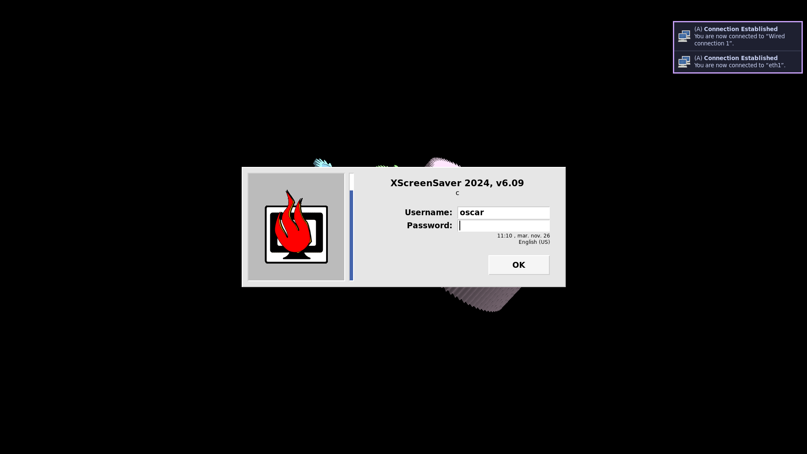

# List of screenshots from the integration tests

## [2024-11-30 14:46:37](https://github.com/Eldolfin/nixos-config/commit/de2d21d63e697a4adedecc76a6bb1781d064ea96)

[firefox-and-terminals](https://github.com/Eldolfin/nixos-config/blob/de2d21d63e697a4adedecc76a6bb1781d064ea96/tests/firefox-and-terminals.nix)|[lock-screen](https://github.com/Eldolfin/nixos-config/blob/de2d21d63e697a4adedecc76a6bb1781d064ea96/tests/lock-screen.nix)|[login-screen](https://github.com/Eldolfin/nixos-config/blob/de2d21d63e697a4adedecc76a6bb1781d064ea96/tests/login-screen.nix)
-|-|-
||

## [2024-11-30 01:27:29](https://github.com/Eldolfin/nixos-config/commit/f53acdf965445d9dd969d2d3a14ac285215f844e)

[firefox-and-terminals](https://github.com/Eldolfin/nixos-config/blob/f53acdf965445d9dd969d2d3a14ac285215f844e/tests/firefox-and-terminals.nix)|[lock-screen](https://github.com/Eldolfin/nixos-config/blob/f53acdf965445d9dd969d2d3a14ac285215f844e/tests/lock-screen.nix)|[login-screen](https://github.com/Eldolfin/nixos-config/blob/f53acdf965445d9dd969d2d3a14ac285215f844e/tests/login-screen.nix)
-|-|-
||

## [2024-11-29 20:35:08](https://github.com/Eldolfin/nixos-config/commit/aaee8c9cbbc9d90054348eb9e4bf7a6d05b9820f)

[firefox-and-terminals](https://github.com/Eldolfin/nixos-config/blob/aaee8c9cbbc9d90054348eb9e4bf7a6d05b9820f/tests/firefox-and-terminals.nix)|[lock-screen](https://github.com/Eldolfin/nixos-config/blob/aaee8c9cbbc9d90054348eb9e4bf7a6d05b9820f/tests/lock-screen.nix)|[login-screen](https://github.com/Eldolfin/nixos-config/blob/aaee8c9cbbc9d90054348eb9e4bf7a6d05b9820f/tests/login-screen.nix)
-|-|-
||

## [2024-11-29 20:30:59](https://github.com/Eldolfin/nixos-config/commit/0ce035b9df0a100651fdd56754bf8454bdc38893)

[firefox-and-terminals](https://github.com/Eldolfin/nixos-config/blob/0ce035b9df0a100651fdd56754bf8454bdc38893/tests/firefox-and-terminals.nix)|[lock-screen](https://github.com/Eldolfin/nixos-config/blob/0ce035b9df0a100651fdd56754bf8454bdc38893/tests/lock-screen.nix)|[login-screen](https://github.com/Eldolfin/nixos-config/blob/0ce035b9df0a100651fdd56754bf8454bdc38893/tests/login-screen.nix)
-|-|-
||

## [2024-11-26 23:50:24](https://github.com/Eldolfin/nixos-config/commit/6b06eb20c15ade7470ddaa66bc61d3d03f51b04f)

[firefox-and-terminals](https://github.com/Eldolfin/nixos-config/blob/6b06eb20c15ade7470ddaa66bc61d3d03f51b04f/tests/firefox-and-terminals.nix)|[lock-screen](https://github.com/Eldolfin/nixos-config/blob/6b06eb20c15ade7470ddaa66bc61d3d03f51b04f/tests/lock-screen.nix)|[login-screen](https://github.com/Eldolfin/nixos-config/blob/6b06eb20c15ade7470ddaa66bc61d3d03f51b04f/tests/login-screen.nix)
-|-|-
||

## [2024-11-26 23:42:06](https://github.com/Eldolfin/nixos-config/commit/c79ddf1d17ab6e69839e8499204aca55b820b64f)

[firefox-and-terminals](https://github.com/Eldolfin/nixos-config/blob/c79ddf1d17ab6e69839e8499204aca55b820b64f/tests/firefox-and-terminals.nix)|[lock-screen](https://github.com/Eldolfin/nixos-config/blob/c79ddf1d17ab6e69839e8499204aca55b820b64f/tests/lock-screen.nix)|[login-screen](https://github.com/Eldolfin/nixos-config/blob/c79ddf1d17ab6e69839e8499204aca55b820b64f/tests/login-screen.nix)
-|-|-
||

## [2024-11-26 23:05:44](https://github.com/Eldolfin/nixos-config/commit/da48fd79653c3c93583354c871e0aba8581eefc3)

[firefox-and-terminals](https://github.com/Eldolfin/nixos-config/blob/da48fd79653c3c93583354c871e0aba8581eefc3/tests/firefox-and-terminals.nix)|[lock-screen](https://github.com/Eldolfin/nixos-config/blob/da48fd79653c3c93583354c871e0aba8581eefc3/tests/lock-screen.nix)|[login-screen](https://github.com/Eldolfin/nixos-config/blob/da48fd79653c3c93583354c871e0aba8581eefc3/tests/login-screen.nix)
-|-|-
||

## [2024-11-26 22:34:37](https://github.com/Eldolfin/nixos-config/commit/8b92595e5072d00a6346ad6c9d0e9f7be27cc763)

[firefox-and-terminals](https://github.com/Eldolfin/nixos-config/blob/8b92595e5072d00a6346ad6c9d0e9f7be27cc763/tests/firefox-and-terminals.nix)|[lock-screen](https://github.com/Eldolfin/nixos-config/blob/8b92595e5072d00a6346ad6c9d0e9f7be27cc763/tests/lock-screen.nix)|[login-screen](https://github.com/Eldolfin/nixos-config/blob/8b92595e5072d00a6346ad6c9d0e9f7be27cc763/tests/login-screen.nix)
-|-|-
||

## [2024-11-26 22:16:12](https://github.com/Eldolfin/nixos-config/commit/b08c2a863419c4bbee761fbd7bc739c724b341ba)

[firefox-and-terminals](https://github.com/Eldolfin/nixos-config/blob/b08c2a863419c4bbee761fbd7bc739c724b341ba/tests/firefox-and-terminals.nix)|[lock-screen](https://github.com/Eldolfin/nixos-config/blob/b08c2a863419c4bbee761fbd7bc739c724b341ba/tests/lock-screen.nix)|[login-screen](https://github.com/Eldolfin/nixos-config/blob/b08c2a863419c4bbee761fbd7bc739c724b341ba/tests/login-screen.nix)
-|-|-
||

## [2024-11-26 22:01:42](https://github.com/Eldolfin/nixos-config/commit/5ebdfab43bb9517a5903272ec692743cdb48deb6)

[firefox-and-terminals](https://github.com/Eldolfin/nixos-config/blob/5ebdfab43bb9517a5903272ec692743cdb48deb6/tests/firefox-and-terminals.nix)|[lock-screen](https://github.com/Eldolfin/nixos-config/blob/5ebdfab43bb9517a5903272ec692743cdb48deb6/tests/lock-screen.nix)|[login-screen](https://github.com/Eldolfin/nixos-config/blob/5ebdfab43bb9517a5903272ec692743cdb48deb6/tests/login-screen.nix)
-|-|-
||

## [2024-11-26 18:48:28](https://github.com/Eldolfin/nixos-config/commit/004ac766ab786e6b273a21631c376168706c7dc6)

[firefox-and-terminals](https://github.com/Eldolfin/nixos-config/blob/004ac766ab786e6b273a21631c376168706c7dc6/tests/firefox-and-terminals.nix)|[lock-screen](https://github.com/Eldolfin/nixos-config/blob/004ac766ab786e6b273a21631c376168706c7dc6/tests/lock-screen.nix)|[login-screen](https://github.com/Eldolfin/nixos-config/blob/004ac766ab786e6b273a21631c376168706c7dc6/tests/login-screen.nix)
-|-|-
||

## [2024-11-24 20:24:33](https://github.com/Eldolfin/nixos-config/commit/880073faac306fa4517fd2110c8e38f0f04ba9ea)

[firefox-and-terminals](https://github.com/Eldolfin/nixos-config/blob/880073faac306fa4517fd2110c8e38f0f04ba9ea/tests/firefox-and-terminals.nix)|[lock-screen](https://github.com/Eldolfin/nixos-config/blob/880073faac306fa4517fd2110c8e38f0f04ba9ea/tests/lock-screen.nix)|[login-screen](https://github.com/Eldolfin/nixos-config/blob/880073faac306fa4517fd2110c8e38f0f04ba9ea/tests/login-screen.nix)
-|-|-
||

## [2024-11-24 18:01:18](https://github.com/Eldolfin/nixos-config/commit/4170ce292fc666afbb8adf55552bae2d62fb4c8d)

[firefox-and-terminals](https://github.com/Eldolfin/nixos-config/blob/4170ce292fc666afbb8adf55552bae2d62fb4c8d/tests/firefox-and-terminals.nix)|[lock-screen](https://github.com/Eldolfin/nixos-config/blob/4170ce292fc666afbb8adf55552bae2d62fb4c8d/tests/lock-screen.nix)|[login-screen](https://github.com/Eldolfin/nixos-config/blob/4170ce292fc666afbb8adf55552bae2d62fb4c8d/tests/login-screen.nix)
-|-|-
||

## [2024-11-24 17:11:33](https://github.com/Eldolfin/nixos-config/commit/5de519daa256ffc6f565f98c78f477c4105bc398)

[firefox-and-terminals](https://github.com/Eldolfin/nixos-config/blob/5de519daa256ffc6f565f98c78f477c4105bc398/tests/firefox-and-terminals.nix)|[lock-screen](https://github.com/Eldolfin/nixos-config/blob/5de519daa256ffc6f565f98c78f477c4105bc398/tests/lock-screen.nix)|[login-screen](https://github.com/Eldolfin/nixos-config/blob/5de519daa256ffc6f565f98c78f477c4105bc398/tests/login-screen.nix)
-|-|-
||

## [2024-11-24 16:38:03](https://github.com/Eldolfin/nixos-config/commit/efc128b9d98d006914ebbf96b0f9e7bb85ea6a24)

[firefox-and-terminals](https://github.com/Eldolfin/nixos-config/blob/efc128b9d98d006914ebbf96b0f9e7bb85ea6a24/tests/firefox-and-terminals.nix)|[lock-screen](https://github.com/Eldolfin/nixos-config/blob/efc128b9d98d006914ebbf96b0f9e7bb85ea6a24/tests/lock-screen.nix)|[login-screen](https://github.com/Eldolfin/nixos-config/blob/efc128b9d98d006914ebbf96b0f9e7bb85ea6a24/tests/login-screen.nix)
-|-|-
||

## [2024-11-24 16:23:20](https://github.com/Eldolfin/nixos-config/commit/40a047aea8b0e8c8f2009a94bdcef8eb31fd2b0f)

[firefox-and-terminals](https://github.com/Eldolfin/nixos-config/blob/40a047aea8b0e8c8f2009a94bdcef8eb31fd2b0f/tests/firefox-and-terminals.nix)|[lock-screen](https://github.com/Eldolfin/nixos-config/blob/40a047aea8b0e8c8f2009a94bdcef8eb31fd2b0f/tests/lock-screen.nix)|[login-screen](https://github.com/Eldolfin/nixos-config/blob/40a047aea8b0e8c8f2009a94bdcef8eb31fd2b0f/tests/login-screen.nix)
-|-|-
||

## [2024-11-24 14:54:05](https://github.com/Eldolfin/nixos-config/commit/37fa9d7cec3a81d072ff8b1a28b16788f6c8cd42)

[firefox-and-terminals](https://github.com/Eldolfin/nixos-config/blob/37fa9d7cec3a81d072ff8b1a28b16788f6c8cd42/tests/firefox-and-terminals.nix)|[lock-screen](https://github.com/Eldolfin/nixos-config/blob/37fa9d7cec3a81d072ff8b1a28b16788f6c8cd42/tests/lock-screen.nix)|[login-screen](https://github.com/Eldolfin/nixos-config/blob/37fa9d7cec3a81d072ff8b1a28b16788f6c8cd42/tests/login-screen.nix)
-|-|-
||

## [2024-11-24 14:38:56](https://github.com/Eldolfin/nixos-config/commit/0b13126efc25cd4f1017403d6b2a5916fd600331)

[firefox-and-terminals](https://github.com/Eldolfin/nixos-config/blob/0b13126efc25cd4f1017403d6b2a5916fd600331/tests/firefox-and-terminals.nix)|[lock-screen](https://github.com/Eldolfin/nixos-config/blob/0b13126efc25cd4f1017403d6b2a5916fd600331/tests/lock-screen.nix)|[login-screen](https://github.com/Eldolfin/nixos-config/blob/0b13126efc25cd4f1017403d6b2a5916fd600331/tests/login-screen.nix)
-|-|-
||

## [2024-11-24 14:27:18](https://github.com/Eldolfin/nixos-config/commit/55f6882a6516c7c79e68e74cfbb58c0433b6afe6)

[firefox-and-terminals](https://github.com/Eldolfin/nixos-config/blob/55f6882a6516c7c79e68e74cfbb58c0433b6afe6/tests/firefox-and-terminals.nix)|[lock-screen](https://github.com/Eldolfin/nixos-config/blob/55f6882a6516c7c79e68e74cfbb58c0433b6afe6/tests/lock-screen.nix)|[login-screen](https://github.com/Eldolfin/nixos-config/blob/55f6882a6516c7c79e68e74cfbb58c0433b6afe6/tests/login-screen.nix)
-|-|-
||

## [2024-11-24 14:21:20](https://github.com/Eldolfin/nixos-config/commit/2c93c3f89a9e9da6a35eb400446891e069b0b9c3)

[firefox-and-terminals](https://github.com/Eldolfin/nixos-config/blob/2c93c3f89a9e9da6a35eb400446891e069b0b9c3/tests/firefox-and-terminals.nix)|[lock-screen](https://github.com/Eldolfin/nixos-config/blob/2c93c3f89a9e9da6a35eb400446891e069b0b9c3/tests/lock-screen.nix)|[login-screen](https://github.com/Eldolfin/nixos-config/blob/2c93c3f89a9e9da6a35eb400446891e069b0b9c3/tests/login-screen.nix)
-|-|-
||

## [2024-11-24 12:44:39](https://github.com/Eldolfin/nixos-config/commit/763f9d3a652897110d06d90ca0404cdd5c4900e1)

[firefox-and-terminals](https://github.com/Eldolfin/nixos-config/blob/763f9d3a652897110d06d90ca0404cdd5c4900e1/tests/firefox-and-terminals.nix)|[login-screen](https://github.com/Eldolfin/nixos-config/blob/763f9d3a652897110d06d90ca0404cdd5c4900e1/tests/login-screen.nix)|[lock-screen](https://github.com/Eldolfin/nixos-config/blob/763f9d3a652897110d06d90ca0404cdd5c4900e1/tests/lock-screen.nix)
-|-|-
||

## [2024-11-24 12:36:30](https://github.com/Eldolfin/nixos-config/commit/8c204ed3bd0e1dc0bc1c90efb4bb87abaa8daa45)

[firefox-and-terminals](https://github.com/Eldolfin/nixos-config/blob/8c204ed3bd0e1dc0bc1c90efb4bb87abaa8daa45/tests/firefox-and-terminals.nix)|[login-screen](https://github.com/Eldolfin/nixos-config/blob/8c204ed3bd0e1dc0bc1c90efb4bb87abaa8daa45/tests/login-screen.nix)|[lock-screen](https://github.com/Eldolfin/nixos-config/blob/8c204ed3bd0e1dc0bc1c90efb4bb87abaa8daa45/tests/lock-screen.nix)
-|-|-
||

## [2024-11-24 12:17:05](https://github.com/Eldolfin/nixos-config/commit/05fe864a72375dbd1e54cd40cfa6cd7e449c0302)

[firefox-and-terminals](https://github.com/Eldolfin/nixos-config/blob/05fe864a72375dbd1e54cd40cfa6cd7e449c0302/tests/firefox-and-terminals.nix)|[login-screen](https://github.com/Eldolfin/nixos-config/blob/05fe864a72375dbd1e54cd40cfa6cd7e449c0302/tests/login-screen.nix)|[lock-screen](https://github.com/Eldolfin/nixos-config/blob/05fe864a72375dbd1e54cd40cfa6cd7e449c0302/tests/lock-screen.nix)
-|-|-
||

## [2024-11-24 11:15:37](https://github.com/Eldolfin/nixos-config/commit/a1580e1007f93c3d9f504714ba04756553ea14f0)

[firefox-and-terminals](https://github.com/Eldolfin/nixos-config/blob/a1580e1007f93c3d9f504714ba04756553ea14f0/tests/firefox-and-terminals.nix)|[login-screen](https://github.com/Eldolfin/nixos-config/blob/a1580e1007f93c3d9f504714ba04756553ea14f0/tests/login-screen.nix)|[lock-screen](https://github.com/Eldolfin/nixos-config/blob/a1580e1007f93c3d9f504714ba04756553ea14f0/tests/lock-screen.nix)
-|-|-
||

## [2024-11-24 02:28:26](https://github.com/Eldolfin/nixos-config/commit/dcb14fb2b5fe6f596e8ec10c46e99115aeadef88)

[firefox-and-terminals](https://github.com/Eldolfin/nixos-config/blob/dcb14fb2b5fe6f596e8ec10c46e99115aeadef88/tests/firefox-and-terminals.nix)
-

## [2024-11-24 00:33:13](https://github.com/Eldolfin/nixos-config/commit/1772434ec1ee6c7685cd28376ee623327620a780)

[firefox-and-terminals](https://github.com/Eldolfin/nixos-config/blob/1772434ec1ee6c7685cd28376ee623327620a780/tests/firefox-and-terminals.nix)
-

